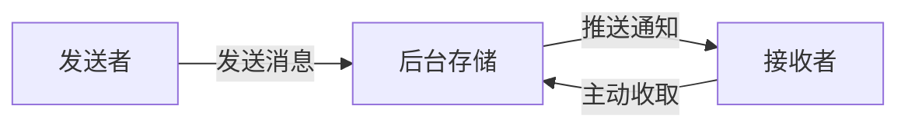
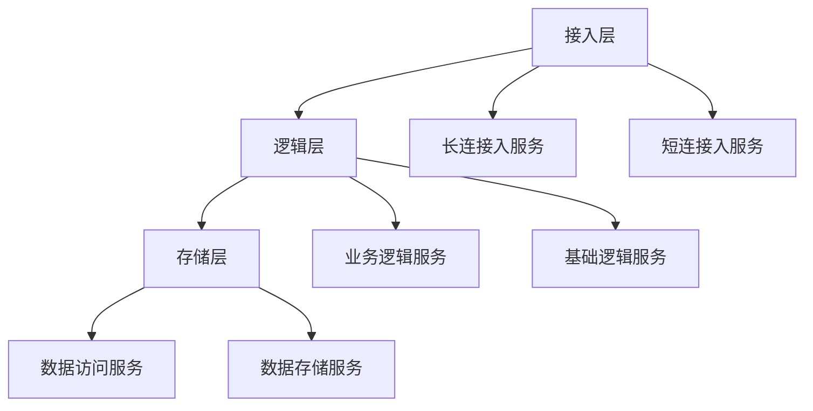
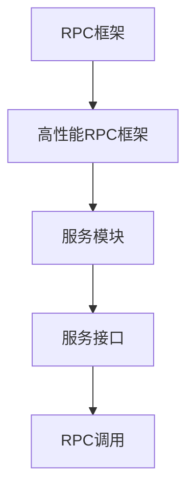
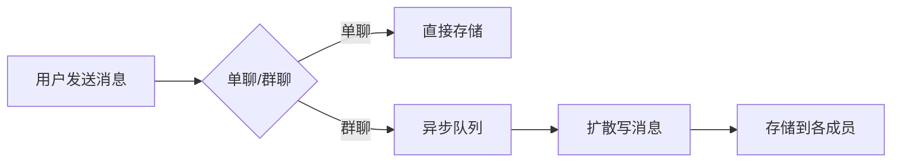
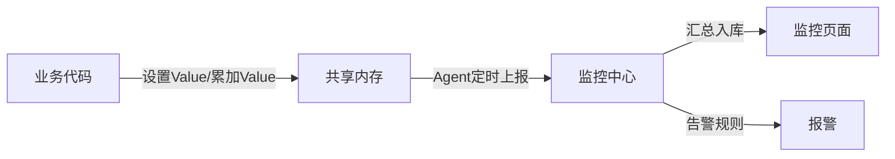
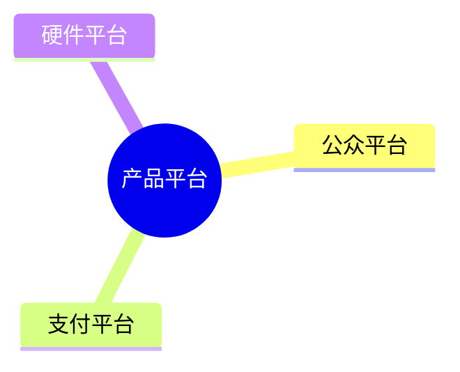
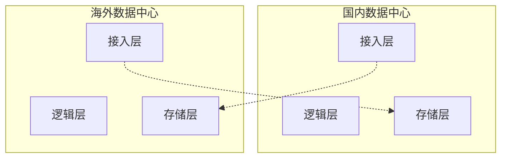
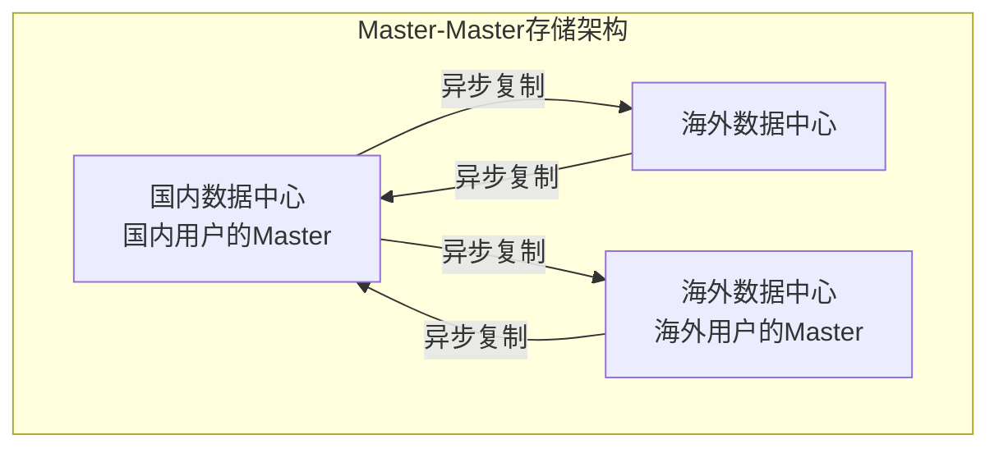

## 后台系统发展历程

本文收录了在产品发展的各个阶段，后台系统的点滴成长。

## 从无到有

产品正式发布。这一天距离项目启动日约为数月。就在这数月里，产品从无都有，大家可能会好奇这期间后台做的最重要的事情是什么？

我想应该是以下三件事：

### 1. 确定了消息模型

产品起初定位是一个通讯工具，作为通讯工具最核心的功能是收发消息。产品团队源于研发团队，消息模型跟邮箱的邮件模型也很有渊源，都是存储转发。

图 1 消息模型

图1展示了这一消息模型，消息被发出后，不论接收者是否在线，都会先在后台落地存储；为使接收者能更快接收到消息，会推送消息通知给接收者；最后客户端主动到服务器收取消息。

### 2. 制定了数据同步协议

由于用户的帐户、联系人和消息等数据都在服务器存储，如何将数据同步到客户端就成了很关键的问题。为简化协议，我们决定通过一个统一的数据同步协议来同步用户所有的基础数据。

最初的方案是客户端记录一个本地数据的快照，需要同步数据时，将Snapshot带到服务器，服务器通过计算Snapshot与服务器数据的差异，将差异数据发给客户端，客户端再保存差异数据完成同步。不过这个方案有两个问题：一是Snapshot会随着客户端数据的增多变得越来越大，同步时流量开销大；二是客户端每次同步都要计算Snapshot，会带来额外的性能开销和实现复杂度。

几经讨论后，方案改为由服务计算Snapshot，在客户端同步数据时跟随数据一起下发给客户端，客户端无需理解Snapshot，只需存储起来，在下次数据同步数据时带上即可。同时，Snapshot被设计得非常精简，是若干个Key-Value的组合，Key代表数据的类型，Value代表给到客户端的数据的最新版本号。Key有三个，分别代表：帐户数据、联系人和消息。这个同步协议的一个额外好处是客户端同步完数据后，不需要额外的ACK协议来确认数据收取成功，同样可以保证不会丢数据：只要客户端拿最新的Snapshot到服务器做数据同步，服务器即可知道上次数据已经成功同步完成。

此后，精简方案、减少流量开销、尽量由服务器完成较复杂的业务逻辑、降低客户端实现的复杂度就作为重要的指导原则，持续影响着后续的产品设计开发。记得有个比较经典的案例是：我们在产品1.x版实现了群聊功能，但为了保证新旧版客户端间的群聊体验，我们通过服务器适配，让初始版本客户端也能参与群聊。

### 3. 定型了后台架构

图 2 后台系统架构

后台使用三层架构：接入层、逻辑层和存储层。

- **接入层**：提供接入服务，包括长连接入服务和短连接入服务。长连接入服务同时支持客户端主动发起请求和服务器主动发起推送；短连接入服务则只支持客户端主动发起请求。

- **逻辑层**：包括业务逻辑服务和基础逻辑服务。业务逻辑服务封装了业务逻辑，是后台提供给客户端调用的API。基础逻辑服务则抽象了更底层和通用的业务逻辑，提供给业务逻辑服务访问。

- **存储层**：包括数据访问服务和数据存储服务。数据存储服务通过MySQL和SDB(早期后台中广泛使用的Key-Value数据存储系统)等底层存储系统来持久化用户数据。数据访问服务适配并路由数据访问请求到不同的底层数据存储服务，面向逻辑层提供结构化的数据服务。比较特别的是，后台每一种不同类型的数据都使用单独的数据访问服务和数据存储服务，例如帐户、消息和联系人等等都是独立的。

后台主要使用C++。后台服务使用RPC框架搭建，服务之间通过同步RPC进行通讯。

图 3 RPC框架

RPC框架是一个早期后台就已经存在的高性能RPC框架，当时尚未广泛使用，但在后台却大放异彩。作为后台基础设施中最重要的一部分，RPC框架这几年一直不断在进化。我们使用RPC框架构建了数千计的服务模块，提供数万计的服务接口，每天RPC调用次数达数万亿计。

这三件事影响深远，乃至于数年后的今天，我们仍继续沿用最初的架构和协议，甚至还可以支持当初初始版本的客户端。

这里有一个经验教训——运营支撑系统真的很重要。第一个版本的后台是仓促完成的，当时只是完成了基础业务功能，并没有配套的业务数据统计等等。我们在开放注册后，一时间竟没有业务监控页面和数据曲线可以看，注册用户数是临时从数据库统计的，在线数是从日志里提取出来的，这些数据通过每个小时运行一次的脚本（这个脚本也是当天临时加的）统计出来，然后自动发邮件到邮件组。还有其他各种业务数据也通过邮件进行发布，可以说邮件是产品初期最重要的数据门户。

产品正式发布当天最高并发在线数是数百，而今天这个数字是数亿。

## 小步慢跑

在产品发布后的数月里，我们经历了发布后火爆注册的惊喜，也经历了随后一直不温不火的困惑。

这一时期，产品做了很多旨在增加用户好友量，让用户聊得起来的功能。打通社交平台私信、群聊、工作邮箱、通讯录好友推荐等等。对于后台而言，比较重要的变化就是这些功能催生了对异步队列的需求。例如，社交平台私信需要跟外部门对接，不同系统间的处理耗时和速度不一样，可以通过队列进行缓冲；群聊是耗时操作，消息发到群后，可以通过异步队列来异步完成消息的扩散写等等。

图 4 单聊和群聊消息发送过程

图4是异步队列在群聊中的应用。产品的群聊是写扩散的，也就是说发到群里的一条消息会给群里的每个人都存一份（消息索引）。为什么不是读扩散呢？有两个原因：

- 群的人数不多，群人数上限是数十（后来逐步加到数百），扩散的成本不是太大，不像社交媒体，有数以万计的粉丝，发一条内容后，每个粉丝都存一份的话，一个是效率太低，另一个存储量也会大很多；
- 消息扩散写到每个人的消息存储（消息收件箱）后，接收者到后台同步数据时，只需要检查自己收件箱即可，同步逻辑跟单聊消息是一致的，这样可以统一数据同步流程，实现起来也会很轻量。

异步队列作为后台数据交互的一种重要模式，成为了同步RPC服务调用之外的有力补充，在后台被大量使用。

## 快速成长

产品的飞速发展是从2.x版开始的，这个版本发布了语音聊天功能。之后产品用户量急速增长，在接下来的数月里，用户量先后突破百万级、千万级、亿级。

伴随着喜人成绩而来的，还有一堆幸福的烦恼。

### 1. 业务快速迭代的压力

产品发布时功能很简单，主要功能就是发消息，不过在发语音之后的几个版本里迅速推出了手机通讯录、即时通讯离线消息、查看附近的人、摇一摇、漂流瓶和朋友圈等等功能。

有个广为流传的关于朋友圈开发的传奇——朋友圈历经数月，前后做了数十个版本迭代才最终成型。其实还有一个鲜为人知的故事——那时候因为人员比较短缺，朋友圈后台长时间只有个位数的开发人员。

### 2. 后台稳定性的要求

用户多了，功能也多了，后台模块数和机器量在不断翻番，紧跟着的还有各种故障。

帮助我们顺利度过这个阶段的，是以下几个举措：

#### ① 极简设计

虽然各种需求扑面而来，但我们每个实现方案都是一丝不苟完成的。实现需求最大的困难不是设计出一个方案并实现出来，而是需要在若干个可能的方案中，甄选出最简单实用的那个。

这中间往往需要经过几轮思考——讨论——推翻的迭代过程，谋定而后动有不少好处，一方面可以避免做出华而不实的过度设计，提升效率；另一方面，通过详尽的讨论出来的看似简单的方案，细节考究，往往是可靠性最好的方案。

#### ② 大系统小做

逻辑层的业务逻辑服务最早只有一个服务模块（我们称之为早期统一服务模块），囊括了所有提供给客户端访问的API，甚至还有一个完整的产品官网。这个模块架构类似Apache，由一个CGI容器和若干CGI组成（每个CGI即为一个API），不同之处在于每个CGI都是一个动态库so，由CGIHost动态加载。

在早期统一服务模块的CGI数量相对较少的时候，这个模块的架构完全能满足要求，但当功能迭代加快，CGI量不断增多之后，开始出现问题：

1. 每个CGI都是动态库，在某些CGI的共用逻辑的接口定义发生变化时，不同时期更新上线的CGI可能使用了不同版本的逻辑接口定义，会导致在运行时出现诡异结果或者进程crash，而且非常难以定位；
2. 所有CGI放在一起，每次大版本发布上线，从测试到灰度到全面部署完毕，都是一个很漫长的过程，几乎所有后台开发人员都会被同时卡在这个环节，非常影响效率；
3. 新增的不太重要的CGI有时稳定性不好，某些异常分支下会crash，导致CGIHost进程无法服务，发消息这些重要CGI受影响没法运行。

于是我们开始尝试使用一种新的CGI架构——逻辑服务模块。

逻辑服务模块基于RPC框架。将RPC框架和CGI逻辑通过静态编译生成可直接使用HTTP访问的逻辑服务模块。我们将早期统一服务模块拆分为多个不同服务模块。拆分原则是：实现不同业务功能的CGI被拆到不同逻辑服务模块，同一功能但是重要程度不一样的也进行拆分。例如，作为核心功能的消息收发逻辑，就被拆为多个服务模块：消息同步、发文本和语音消息、发图片和视频消息。

每个逻辑服务模块都是一个独立的二进制程序，可以分开部署、独立上线。时至今日，后台有数十个逻辑服务模块，提供了数百个CGI服务，部署在数千台服务器上，每日客户端访问量数万亿计。

除了API服务外，其他后台服务模块也遵循"大系统小做"这一实践准则，后台服务模块数从产品发布时的十数个模块，迅速上涨到数百个模块。

#### ③ 业务监控

这一时期，后台故障很多。比故障更麻烦的是，因为监控的缺失，经常有些故障我们没法第一时间发现，造成故障影响面被放大。

监控的缺失一方面是因为在快速迭代过程中，重视功能开发，轻视了业务监控的重要性，有故障一直是兵来将挡水来土掩；另一方面是基础设施对业务逻辑监控的支持度较弱，基础设施提供了机器资源监控和RPC服务运行状态的监控，这个是每台机器、每个服务标配的，无需额外开发，但是业务逻辑的监控就要麻烦得多了。当时的业务逻辑监控是通过业务逻辑统计功能来做的，实现一个监控需要4步：

1. 申请日志上报资源；
2. 在业务逻辑中加入日志上报点，日志会被每台机器上的agent收集并上传到统计中心；
3. 开发统计代码；
4. 实现统计监控页面。

可以想象，这种费时费力的模式会反过来降低开发人员对加入业务监控的积极性。于是有一天，我们去公司内的标杆——即时通讯后台（QQ后台）取经了，发现解决方案出乎意料地简单且强大：

1. **故障报告**

之前每次故障后，是由QA牵头出一份故障报告，着重点是对故障影响的评估和故障定级。新的做法是每个故障不分大小，开发人员需要彻底复盘故障过程，然后商定解决方案，补充出一份详细的技术报告。这份报告侧重于：如何避免同类型故障再次发生、提高故障主动发现能力、缩短故障响应和处理过程。

1. **基于 ID-Value 的业务无关的监控告警体系**

图 5 基于 ID-Value 的监控告警体系

监控体系实现思路非常简单，提供了2个API，允许业务代码在共享内存中对某个监控ID进行设置Value或累加Value的功能。每台机器上的Agent会定时将所有ID-Value上报到监控中心，监控中心对数据汇总入库后就可以通过统一的监控页面输出监控曲线，并通过预先配置的监控规则产生报警。

对于业务代码来说，只需在要被监控的业务流程中调用一下监控API，并配置好告警条件即可。这就极大地降低了开发监控报警的成本，我们补全了各种监控项，让我们能主动及时地发现问题。新开发的功能也会预先加入相关监控项，以便在少量灰度阶段就能直接通过监控曲线了解业务是否符合预期。

#### ④ 分布式存储系统

后台每个存储服务都有自己独立的存储模块，是相互独立的。每个存储服务都有一个业务访问模块和一个底层存储模块组成。业务访问层隔离业务逻辑层和底层存储，提供基于RPC的数据访问接口；底层存储有两类：KV存储SDB和结构化的MySQL存储。

SDB适用于以用户UIN(uint32_t)为Key的数据存储，比方说消息索引和联系人。优点是性能高，在可靠性上，提供基于流水同步的Master-Slave模式，Master故障时，Slave可以提供读数据服务，无法写入新数据。

由于产品账号为字母+数字组合，无法直接作为SDB的Key，所以产品帐号数据并非使用SDB，而是用MySQL存储的。MySQL也使用基于流水复制的Master-Slave模式。

第1版的帐号存储服务使用Master-Slave各1台。Master提供读写功能，Slave不提供服务，仅用于备份。当Master有故障时，人工切读服务到Slave，无法提供写服务。为提升访问效率，我们还在业务访问模块中加入了memcached提供Cache服务，减少对底层存储访问。

第2版的帐号存储服务还是Master-Slave各1台，区别是Slave可以提供读服务，但有可能读到脏数据，因此对一致性要求高的业务逻辑，例如注册和登录逻辑只允许访问Master。当Master有故障时，同样只能提供读服务，无法提供写服务。

第3版的帐号存储服务采用1个Master和多个Slave，解决了读服务的水平扩展能力。

第4版的帐号服务底层存储采用多个Master-Slave组，每组由1个Master和多个Slave组成，解决了写服务能力不足时的水平扩展能力。

最后还有个未解决的问题：单个Master-Slave分组中，Master还是单点，无法提供实时的写容灾，也就意味着无法消除单点故障。另外Master-Slave的流水同步延时对读服务有很大影响，流水出现较大延时会导致业务故障。于是我们寻求一个可以提供高性能、具备读写水平扩展、没有单点故障、可同时具备读写容灾能力、能提供强一致性保证的底层存储解决方案，最终分布式存储系统应运而生。

分布式存储系统使用基于Quorum的分布式数据强一致性算法，提供Key-Table模型的存储服务。传统Quorum算法的性能不高，分布式存储系统创造性地将数据的版本和数据本身做了区分，将Quorum算法应用到数据的版本的协商，再通过基于流水同步的异步数据复制提供了数据强一致性保证和极高的数据写入性能，另外分布式存储系统天然具备数据的Cache能力，可以提供高效的读取性能。

分布式存储系统一举解决了我们当时迫切需要的无单点故障的容灾能力。除了第5版的帐号服务外，很快所有SDB底层存储模块和大部分MySQL底层存储模块都切换到分布式存储系统。随着业务的发展，分布式存储系统也不断在进化着，还配合业务需要衍生出了各种定制版本。现在的分布式存储系统仍然作为核心存储，发挥着举足轻重的作用。

## 平台化

某年某月深圳举行大型活动。产品推出"服务中心"服务号，产品用户可以搜索特定标识将这个服务号加为好友，获取活动相关的资讯。当时后台对该标识做了特殊处理，用户搜索时，会随机返回数十个账号中的1个，每个账号背后都有一个志愿者在服务。不久后，"本地服务"落户产品平台，产品用户可以搜索特定标识加好友，当地市民还可以在"附近的人"看到这个号，我们在后台给这个帐号做了一些特殊逻辑，可以支持后台自动回复用户发的消息。

这种需求越来越多，我们就开始做一个媒体平台，这个平台后来从产品后台分出，演变成了公众平台，独立发展壮大，开始了产品的平台化之路。除公众平台外，产品后台的外围还陆续出现了支付平台、硬件平台等等一系列平台。

图 6 产品平台

## 走出国门

产品走出国门的尝试开始于3.x版本。从这个版本开始，产品逐步支持繁体、英文等多种语言文字。不过，真正标志性的事情是第一个海外数据中心的投入使用。

### 1. 海外数据中心

海外数据中心的定位是一个自治的系统，也就是说具备完整的功能，能够不依赖于国内数据中心独立运作。

#### 1) 多数据中心架构

图 7 多数据中心架构

系统自治对于无状态的接入层和逻辑层来说很简单，所有服务模块在海外数据中心部署一套就行了。

但是存储层就有很大麻烦了——我们需要确保国内数据中心和海外数据中心能独立运作，但不是两套隔离的系统各自部署，各玩各的，而是一套业务功能可以完全互通的系统。因此我们的任务是需要保证两个数据中心的数据一致性，另外Master-Master架构是个必选项，也即两个数据中心都需要可写。

#### 2) Master-Master存储架构

Master-Master架构下数据的一致性是个很大的问题。两个数据中心之间是个高延时的网络，意味着在数据中心之间直接使用Paxos算法、或直接部署基于Quorum的KVSvr等看似一劳永逸的方案不适用。

最终我们选择了跟Yahoo!的PNUTS系统类似的解决方案，需要对用户集合进行切分，国内用户以国内上海数据中心为Master，所有数据写操作必须回到国内数据中心完成；海外用户以海外数据中心为Master，写操作只能在海外数据中心进行。从整体存储上看，这是一个Master-Master的架构，但细到一个具体用户的数据，则是Master-Slave模式，每条数据只能在用户归属的数据中心可写，再异步复制到其他数据中心。

图 8 多数据中心的数据Master-Master架构

#### 3) 数据中心间的数据一致性

这个Master-Master架构可以在不同数据中心间实现数据最终一致性。如何保证业务逻辑在这种数据弱一致性保证下不会出现问题？

这个问题可以被分解为2个子问题：

- **用户访问自己的数据**

用户可以满世界跑，那是否允许用户就近接入数据中心就对业务处理流程有很大影响。如果允许就近接入，同时还要保证数据一致性不影响业务，就意味着要么用户数据的Master需要可以动态的改变；要么需要对所有业务逻辑进行仔细梳理，严格区分本数据中心和跨数据中心用户的请求，将请求路由到正确的数据中心处理。

考虑到上述问题会带来很高昂的实现和维护的复杂度，我们限制了每个用户只能接入其归属数据中心进行操作。如果用户发生漫游，其漫游到的数据中心会自动引导用户重新连回归属数据中心。

这样用户访问自己数据的一致性问题就迎刃而解了，因为所有操作被限制在归属数据中心内，其数据是有强一致性保证的。此外，还有额外的好处：用户自己的数据（如：消息和联系人等）不需要在数据中心间同步，这就大大降低了对数据同步的带宽需求。

- **用户访问其他用户的数据**

由于不同数据中心之间业务需要互通，用户会使用到其他数据中心用户创建的数据。例如，参与其他数据中心用户创建的群聊，查看其他数据中心用户的朋友圈等。

仔细分析后可以发现，大部分场景下对数据一致性要求其实并不高。用户稍迟些才见到自己被加入某个其他数据中心用户建的群、稍迟些才见到某个好友的朋友圈动态更新其实并不会带来什么问题。在这些场景下，业务逻辑直接访问本数据中心的数据。

当然，还是有些场景对数据一致性要求很高。比方说给自己设置账号ID，而账号ID是需要在整个产品帐号体系里保证唯一的。我们提供了全局唯一的账号ID申请服务来解决这一问题，所有数据中心通过这个服务申请账号ID。这种需要特殊处置的场景极少，不会带来太大问题。

#### 4) 可靠的数据同步

数据中心之间有大量的数据同步，数据是否能够达到最终一致，取决于数据同步是否可靠。为保证数据同步的可靠性，提升同步的可用性，我们又开发一个基于Quorum算法的队列组件，这个组件的每一组由3机存储服务组成。与一般队列的不同之处在于，这个组件对队列写入操作进行了大幅简化，3机存储服务不需要相互通讯，每个机器上的数据都是顺序写，执行写操作时在3机能写入成功2份即为写入成功；若失败，则换另外一组再试。因此这个队列可以达到极高的可用性和写入性能。每个数据中心将需要同步的数据写入本数据中心的同步队列后，由其他数据中心的数据重放服务将数据拉走并进行重放，达到数据同步的目的。

### 2. 网络加速

海外数据中心建设周期长，投入大，产品在少数地区设立了海外数据中心。但世界那么大，即便是这些数据中心，也还是没法辐射全球，让各个角落的用户都能享受到畅快的服务体验。

通过在海外实际对比测试发现，产品客户端在发消息等一些主要使用场景与主要竞品有不小的差距。为此，我们跟公司的架构平台部、网络平台部和国际业务部等兄弟部门一起合作，围绕海外数据中心，在世界各地精心选址建设了数十个POP点（包括信令加速点和图片CDN网络）。另外，通过对移动网络的深入分析和研究，我们还对产品的通讯协议做了大幅优化。产品最终在对比测试中赶上并超过了主要的竞品。

## 精耕细作

### 1. 三园区容灾

某年某月产品发生了有史以来最大规模的故障，消息收发和朋友圈等服务出现长达数小时的故障，故障期间消息量跌了一半。故障的起因是上海数据中心一个园区的主光纤被挖断，近数千台服务器不可用，引发整个上海数据中心（当时国内只有这一个数据中心）的服务瘫痪。

故障时，我们曾尝试把接入到故障园区的用户切走，但收效甚微。虽然数百个在线模块都做了容灾和冗余设计，单个服务模块看起来没有单点故障问题，但整体上看无数个服务实例散布在数据中心各个机房的数万台服务器内，各服务RPC调用复杂，呈网状结构，再加上缺乏系统级的规划和容灾验证，最终导致故障无法主动恢复。在此之前，我们知道单个服务出现单机故障不影响系统，但没人知道数千台服务器同时不可用时，整个系统会出现什么不可控的状况。

其实在这个故障发生之前数月，我们已经在着手解决这个问题。当时上海数据中心内网交换机异常，导致产品出现一个出乎意料的故障，在数分钟的时间里，产品消息收发几乎完全不可用。在对故障进行分析时，我们发现一个消息系统里一个核心模块多个互备的服务实例都部署在同一机房。该机房的交换机故障导致这个服务整体不可用，进而消息跌零。这个服务模块是最早期（那个时候后台规模小，大部分后台服务都部署在一个数据园区里）的核心模块，服务基于多机冗余设计，年复一年可靠地运行着，以至于大家都完全忽视了这个问题。

为解决类似问题，三园区容灾应运而生，目标是将上海数据中心的服务均匀部署到3个物理上隔离的数据园区，在任意单一园区整体故障时，产品仍能提供无损服务。

#### 1) 同时服务

传统的数据中心级灾备方案是"两地三中心"，即同城有两个互备的数据中心，异地再建设一个灾备中心，这三个数据中心平时很可能只有一个在提供在线服务，故障时再将业务流量切换到其他数据中心。这里的主要问题是灾备数据中心无实际业务流量，在主数据中心故障时未必能正常切换到灾备中心，并且在平时大量的备份资源不提供服务，也会造成大量的资源浪费。

三园区容灾的核心是三个数据园区同时提供服务，因此即便某个园区整体故障，那另外两个园区的业务流量也只会各增加50%。反过来说，只需让每个园区的服务器资源跑在容量上限的2/3，保留1/3的容量即可提供无损的容灾能力，而传统"两地三中心"则有多得多的服务器资源被闲置。此外，在平时三个园区同时对外服务，因此我们在故障时，需要解决的问题是"怎样把业务流量切到其他数据园区？"，而不是"能不能把业务流量切到其他数据园区？"，前者显然是更容易解决的一个问题。

#### 2) 数据强一致

三园区容灾的关键是存储模块需要把数据均匀分布在3个数据园区，同一份数据要在不同园区有2个以上的一致的副本，这样才能保证任意单一园区出灾后，可以不中断地提供无损服务。由于后台大部分存储模块都使用分布式存储系统，这样解决方案也相对简单高效——将分布式存储系统的每1组机器都均匀部署在3个园区里。

#### 3) 故障时自动切换

三园区容灾的另一个难点是对故障服务的自动屏蔽和自动切换。即要让业务逻辑服务模块能准确识别出某些下游服务实例已经无法访问，然后迅速自动切到其他服务实例，避免被拖死。我们希望每个业务逻辑服务可以在不借助外部辅助信息（如建设中心节点，由中心节点下发各个业务逻辑服务的健康状态）的情况下，能自行决策迅速屏蔽掉有问题的服务实例，自动把业务流量分散切到其他服务实例上。另外，我们还建设了一套手工操作的全局屏蔽系统，可以在大型网络故障时，由人工介入屏蔽掉某个园区所有的机器，迅速将业务流量分散到其他两个数据园区。

#### 4) 容灾效果检验

三园区容灾是否能正常发挥作用还需要进行实际的检验，我们在上海数据中心和海外的香港数据中心完成三园区建设后，进行了数次实战演习，屏蔽单一园区上千台服务，检验容灾效果是否符合预期。特别地，为了避免随着时间的推移某个核心服务模块因为某次更新就不再支持三园区容灾了，我们还搭建了一套容灾拨测系统，每天对所有服务模块选取某个园区的服务主动屏蔽掉，自动检查服务整体失败量是否发生变化，实现对三园区容灾效果的持续检验。

### 2. 性能优化

之前我们在业务迅速发展之时，优先支撑业务功能快速迭代，性能问题无暇兼顾，比较粗放的贯彻了"先扛住再优化"的海量之道。某年开始大幅缩减运营成本，性能优化就被提上了日程。

我们基本上对大部分服务模块的设计和实现都进行了重新review，并进行了有针对性的优化，这还是可以节约出不少机器资源的。但更有效的优化措施是对基础设施的优化，具体的说是对RPC框架的优化。RPC框架被广泛应用到几乎所有服务模块，如果框架层面能把机器资源使用到极致，那肯定是事半功倍的。

结果还真的可以，我们在基础设施里加入了对协程的支持，重点是这个协程组件可以不破坏原来的业务逻辑代码结构，让我们原有代码中使用同步RPC调用的代码不做任何修改，就可以直接通过协程异步化。RPC框架直接集成了这个协程组件，然后美好的事情发生了，原来单实例最多提供数百并发请求处理能力的服务，在重编上线后，转眼间就能提供数千并发请求处理能力。RPC框架的底层实现在这一时期也做了全新的实现，服务的处理能力大幅提高。

### 3. 防雪崩

我们一直以来都不太担心某个服务实例出现故障，导致这个实例完全无法提供服务的问题，这个在后台服务的容灾体系里可以被处理得很好。最担心的是雪崩：某个服务因为某些原因出现过载，导致请求处理时间被大大拉长，于是服务吞吐量下降，大量请求积压在服务的请求队列太长时间了，导致访问这个服务的上游服务出现超时，更倒霉的是上游服务还经常会重试，然后这个过载的服务仅有的一点处理能力都在做无用功（即处理完毕返回结果时，调用端都已超时放弃），终于这个过载的服务彻底雪崩了，最糟糕的情况是上游服务每个请求都耗时那么久，雪崩顺着RPC调用链一级级往上传播，最终单个服务模块的过载会引发大批服务模块的雪崩。

我们在一番勒紧裤腰带节省机器资源、消灭低负载机器后，所有机器的负载都上来了，服务过载变得经常发生了。解决这一问题的有力武器是RPC框架里的具有QoS保障的FastReject机制，可以快速拒绝掉超过服务自身处理能力的请求，即使在过载时，也能稳定地提供有效输出。

### 4. 安全加固

近年，互联网安全事件时有发生，各种拖库层出不穷。为保护用户的隐私数据，我们建设了一套数据保护系统——全程票据系统。其核心方案是，用户登录后，后台会下发一个票据给客户端，客户端每次请求带上票据，请求在后台服务的整个处理链条中，所有对核心数据服务的访问，都会被校验票据是否合法，非法请求会被拒绝，从而保障用户隐私数据只能用户通过自己的客户端发起操作来访问。

## 新的挑战

### 1. 资源调度系统

后台有成千的服务模块，部署在全球数万台的服务器上，一直依靠人工管理。我们正在实验和部署的资源调度系统可以把机器资源的分配和服务的部署自动化，实现了资源的优化配置，在业务对服务资源的需求有变化时，能更及时、更弹性地自动实现服务的重新配置与部署。

### 2. 高可用存储

基于Quorum算法的分布式存储系统已经实现了强一致性、高可用且高性能的Key-Table存储。最近，后台又诞生了基于Paxos算法的另一套存储系统，首先落地的是SQL存储系统，一个支持完整MySQL功能，又同时具备强一致性、高可用和高性能的SQL存储。

---

## 接入层架构

每个互联网应用的后台系统都有一个接入层，产品后台也不例外。本文简单介绍一下承载数以亿计同时在线用户的产品接入层的基本实现。

### 1. 接入架构

#### 1) 网关层

产品接入服务器并不直接部署到外网，基于收敛外网IP以及容灾等方面的考虑，所有接入服务器都接到了网关层。

#### 2) 长连接入

产品客户端是"永远在线"的，除了移动操作系统提供的Push机制外，客户端还可以保持跟服务器的长连接，通过这条长连接来接收推送。此外，长连接是客户端与服务器之间最重要的信令/数据通道，绝大部分的客户端请求通过长连服务器来转发到各个业务逻辑处理模块。

#### 3) 短连接入

在产品早期，为了能让移动网络用户（例如某些只能发起HTTP的短连请求）能顺利使用产品，我们搭建了基于HTTP的短连接入服务器。现在的短连接入主要作用是客户端与服务器之间辅助的信令/数据通道，一些不适合走长连接入的请求会走短连接入；另外产品官网等页面也是通过短连接入。

#### 4) Web接入

Web接入主要是给网页版产品使用的，对比短连接入（短连接入也是HTTP服务器）而言，增加了对HTTPS和Long Polling等机制的支持。

#### 5) 在线状态

客户端连到长连接入，或者网页版使用Web接入的Long Polling时，都会产生在线状态，在线状态是集中管理的，记录了哪个用户连接到哪些接入服务器，在线推送服务可以通过在线状态服务查询用户是否在线，以发送在线推送。

#### 6) 通讯协议

**i) 接入跟客户端的协议**

长短连除了外层协议封装外（长连使用自定义的请求Header，短连使用标准Header），请求的主体内容的格式是一样的，这样客户端可以根据需要选择长连或短连来发送同一请求。例如，长连不通或正被占用时，客户端可以自动改用短连接入来请求。

Web接入跟长短连不同，为方便前端页面JS调用，请求是JSON格式的。

**ii) 接入跟业务逻辑服务的协议**

所有接入都使用统一的协议将客户端请求路由到业务逻辑服务。

长短连模块在保留请求正文不变，仅对请求包的外层封装简单修改后，直接路由给业务逻辑服务。Web接入的请求会通过一个协议适配服务转成相同的请求，再路由给业务逻辑服务。

### 2. 接入实现

这里以长连接入为例，介绍接入模块的基本实现。

长连接入由三部分（3组进程）组成：

#### 1) Proxy

维持了所有长连接，负责跟客户端通讯，处理所有网络IO，把客户端的请求发送给ProxyLogic处理。另外，Proxy中会维护每个连接的一个上下文（例如，连接对应哪个用户等信息），这个上下文可以跟请求一起发送给ProxyLogic，ProxyLogic可以修改，并回传给Proxy保存。

#### 2) ProxyLogic

长连接入的上下线、同步检查、测速、NotifyData和请求路由等逻辑由ProxyLogic进程来处理。

#### 3) ProxyNotify

ProxyNotify监听内网端口，后台需要主动发送数据给客户端时，通过这个进程来发送。

采用三组进程的主要原因是：Proxy需要维持长连接，极少变更重启，尽量保持接入稳定。由于连接相关的上下文都由Proxy管理，ProxyLogic和ProxyNotify可以根据业务需求快速变更重启。

#### 4) 请求路由

ProxyLogic在中转客户端请求时会做以下事情：

**i) 负载均衡**

根据请求的命令号识别出可以处理该请求的LogicSvr，有以下路由策略：

- **按一致性哈希路由**

  这是ProxyLogic最常用的路由方式，将不同用户的请求比较均匀地摊分到各个LogicSvr实例。

- **按号段路由**

  将沙盒号段用户请求路由到指定的沙盒服务器上。

- **按版本号路由**

  将特定版本区间的客户端的请求路由到指定机器，经常用于内测版本客户端或者提交应用商店审核的客户端等。

**ii) 请求重试与故障屏蔽**

ProxyLogic路由请求给某台LogicSvr，但无法被处理时，会自动将请求转给另一LogicSvr。另外，同一LogicSvr错误多次后ProxyLogic会有个策略对其进行屏蔽和解除屏蔽。

### 3. 在线状态

在线状态是按号段集中管理的，采用主备方式实现容灾，主备通过同步队列进行双向同步。长连接入和Web接入会把长连用户上报到在线状态服务。

### 4. 就近接入

产品的接入服务器仅部署在几个大的IDC园区内（国内多个城市及海外地区），全球各地的客户端接入的质量参差不齐。为改善接入质量，提升基础体验，产品使用平台的动态加速点和CDN等服务，提升了接入质量。

#### 1) 动态加速

在基础网络建设比较差等访问海外IDC的链路质量比较的地区，产品部署了平台的动态加速点。

动态加速点经过精心选址，对这些地区国内的不同运营商都有较佳的接入质量。动态加速点同时支持产品长短连协议，可以通过定制的路由和收发包策略，快速稳定地将长短连请求透传给产品接入。

#### 2) 信令/数据分离(CDN)

即使有动态加速，图片和视频等数据量比较大的请求如果要传回国内还是需要不少RTT。例如某地区的用户要发个图片给另外一个用户，发和收双方都需要很长时间才能从海外IDC完成数据传输。为此产品做了胖数据的分离，将图片和视频等胖数据直接保存在就近的CDN节点，双方各自仅需要跟海外IDC进行一次信令交互，上传和下载数据都可以在本地完成。

#### 3) 智能DNS

GSLB可以根据IP段级别实现国内运营商或者较大区域的接入引导，并且因为DNS缓存等原因，生效时间不太好控制。产品实现了智能DNS实现了更精细和更实时的引导，例如：根据用户UIN，客户端的版本号，客户端IP级和海外运营商等级别来引导用户到不同的加速点或直连回接入服务器；甚至可以在出现IDC级别的故障时，引导用户到备用IDC。

## 后记——"信令风暴"

曾经有段时间，"信令风暴"突然变得很热，这里的"信令风暴"实际上是这样的：按现有的移动网络架构，手机如果要进行网络收发，需要跟基站有若干次信令交互，来申请数据通讯的信道，每个基站总的信道量是有限的，为了能更合理利用信道，在信道空闲一段时间后会被回收给其他手机使用。那就可以想象，如果应用需要时不时发个小数据包，那占用的信道和信令量就会比较可观了。

为了减少信令和信道的占用，产品进行了一系列的优化：

### 1. 心跳的优化

产品客户端为维持长连接会定时发送心跳，为了减少心跳，我们跟运营商合作做了一些测试，通过服务器控制客户端的心跳间隔，根据运营商网络的支持状况，把心跳间隔拉长，来减少心跳。

另外，考虑到多款即时通讯产品是大部分智能手机用户的标配，如果多款产品采用相同的时间点来做心跳，也可以减少不少的信道和信令占用，为此我们跟其他即时通讯产品一起做了协调心跳的机制。

### 2. Typing优化

Typing其实就是"正在输入..."，是产品客户端的一个业务特性，由消息发送方发给接收方，提醒其正在输入。

产品的Typing量（上行+下行）甚至比心跳还多，为此我们做了另一个优化，通过服务器控制客户端在收到消息后多长时间内回复才发送。例如：收到消息10s内回复的话，可以发Typing，否则不发。通过这个优化，减少了70%-80%的Typing量。
