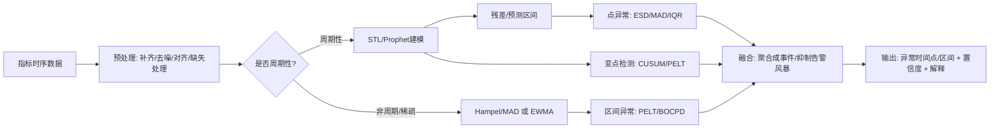

## 实现的优化

### 数据库表按时间分区，注意跨时间分区的处理

变更单的变更时间可能跨天，数据库表按天分区，处理时需注意

### 变更审计

1. 判断已经关单和结单的变更单中哪些是有审批的？是否有关联对应计划链接？
2. 判断上报的变更单有没有执行灰度步骤？
3. 审计后台变更单的发布人是否已经通过了灰度考试？
4. 判断回退的变更单有没有触发变更阻断？
5. 分析变更单变更期间的告警的类型分布，各占比多少？
6. 依据 change_action_type 字段含义（见 变更审计工具设计与实现 ）对数据表中的每条变更操作行为进行重新清洗，生成有业务意义的 change_action_type 编号，对于源数据缺失、无法判定或无法映射 change_action_type 的情况，统一登记并上报。
7. 为消除灰度导致的告警误告，识别变更单处于 调权灰度 的时间段 和 对应变更单时间段处于 调权灰度 时的 IP，从而拦截 调权灰度 时的告警【不需要】。产出字段：灰度模块名、灰度机器 IP 列表、灰度起始时间、灰度结束时间
8. 告警分析维度扩充：在变更告警明细表中新增告警是否在灰度期间触发、是否为首次告警等分析字段，评估按照这两个维度过滤告警是否能较大的减少无用告警【大部分的告警能够自愈，或是可以忽略的无关紧要的告警】，让业务能聚焦于虫咬的告警，减少狼来了情绪【过多的无用告警淹没了真正需要关注的有价值告警，通过告警提前发现问题解决问题的作用被削弱了】
9. 回退的变更单中触发变更阻断的占比
10. 有触发变更阻断的变更单占比
11. 检测出有风险的发布计划中有回退的占比
12. 命中 CPU高负载、现象告警（CGI最终失败）、容量风险 的变更单数量

### 告警数量

1. 现象告警：用例告警，反映真实业务异常
2. 变更模块告警：变更模块自身 + 直接/间接上游
3. 下游资源告警：直接/间接下游模块 + 单机资源

### 为告警事件单增加该告警的模块下的上下游调用的拓扑图、CGI关系拓扑图、用例步骤关系图

1. CGI用例告警

目前的关联链路：用例 → CGI → 模块 → 模块 ……

用例【提供给用户使用的接口，调用链最前面】

一个用例会调用多个CGI

CGI【CGI会一直被带到后面链路中的所有模块中，CGI后面跟着一个模块调用链】

模调接口可以查出模块和CGI之间的关系

有一张表关联用例、用例步骤、CGI【可以用模调API查出模块关联的所有CGI，再根据CGI查出模块关联的所有用例】【根据哪个CGI告警可以确认用例中的哪个用例步骤告警了】

2. API用例告警
3. 用例可用率用例告警 是没有 CGI 的

### 修改拓扑图组件，实现右上角展示徽章，高亮相关链路路径，背景染色，展示Tooltip

### 从 MQ 消息中获取告警的相关数据并落库

可以看看代码分析里面的：

1. 自研任务队列-信号量超时背压滑动窗口
2. 通用消息监听器工厂与动态Handler分发

### 支持按单机维度合并变更告警事件单

告警标题格式（示例）：
xxxxxx247(xx.xx.xxx.xxx) xxxx总使用率 超过阈值上限异常 当前(38) 上限(30)
标题由以下 5 段组成：

1. xxxxxx247(xx.xx.xxx.xxx) -> 主机名(IP地址)
2. xxxx总使用率 -> 监控指标名称
3. 超过阈值上限异常 -> 异常类型描述
4. 当前(38) -> 当前告警值
5. 上限(30) -> 阈值上限

### 增加该告警是否为最近一周首次出现告警的标签

> **注意跨天时间段处理**，要看最近一周该告警的天数不能直接用当前时间戳减去7天时间再算日期，这可能会变成“最近一周告警8天”得到8个日期，需要获取当前日期0点的时间戳再减去6天时间再算日期

通过清洗数据表实现

最近一周内6天出现告警，一周内告警的频率为：7，出现告警的日期为：2026-01-28、2026-01-29、2026-01-30、2026-01-31、2026-02-01、2026-02-02

“最近一周首次出现”： 说明该告警是最近7天首次触发的
“最近一周1天出现”：说明该告警是最近7天内范围内，仅在今天触发的，且在今天非首次触发

### 增加该告警是否在灰度期间触发的标签

通过清洗数据表实现

“灰度期间触发”：在调权灰度开始到调权灰度结束、正式灰度开始到阶段或关单期间产生的告警。
“非灰度期间触发”：上述时段以外产生的告警（包含了调权扩容期间、调权结束到正式开始灰度之前阶段）。

### 调研异常检测算法

对告警时的监控数据进行标记（标记出异常的时间段），用标记好的数据对不同异常检测算法进行测试。要标记的数据太多，最好能自动实现标记。可以尝试：

1. 大模型 + 提示词 + 人工抽查部分标记【使用这个方法】【大模型辅助标注：利用 LLM + 结构化提示词，对大量告警曲线图片进行批量自动标注（异常时间段），大模型识别图片中的异常比识别时间序列数值中的异常准确率会更高】
2. 实际工程应用的异常检测算法直接标记 + 人工复查全部修改标记

#### 指标类型分类

| 类型 | 特征 | 典型例子 |
|---|---|---|
| 周期性指标 | 明显日/周周期，有规律起伏 | 请求量、调用量、流量 |
| 非周期性指标 | 无稳定周期，平稳/接近0或随机波动 | 错误数、异常码计数 |

#### 异常类型体系

| 异常类型 | 典型表现 |
|---|---|
| 单点尖峰/毛刺 | 短促脉冲，高于周边3σ |
| 周期形态异常（幅度变大/波形扭曲） | 周期存在但振幅/基线改变 |
| 基线漂移/趋势突变 | 水平抬升/降低 |
| 阶跃/平台（状态切换） | 突然跳到新水平并持续 |
| 噪声变大（方差异常） | 抖动加剧 |
| 尾部飙升 | 末段快速上升未回落 |

## 需求拆解

需要覆盖两大类数据：

- **周期性指标**：存在明显日周期/周周期（如图1、图2、图5的"每天起伏"）

  - 要能识别：**异常点/异常区间的时间点**（峰值、低谷、形态改变）、**周期形态不再符合历史规律**（幅度变大、基线抬升、周期被破坏）、**结构
br>3. 支持周期性数据 | 日/周周期明显的监控指标（请求量、错误率、延迟等） | 周期性数据首选 | 周期性数据检测 |
| [Microsoft Donut](https://arxiv.org/abs/1802.03915) | Microsoft | VAE + MLE (变分自编码器) | 生成模型学习正常模式分布 | 1. 用VAE自动学习正常KPI的概率分布 2. 通过重构概率判断异常 3. 支持复杂周期形态 | 周期形态复杂、噪声大的KPI，传统统计方法效果不佳 | 复杂周期数据 | 周期性数据检测 |
| [Meta Kats](https://github.com/facebookresearch/Kats) | Meta | Prophet + Holt-Winters + 变点检测 | 集成多种算法工具箱 | 1. 开箱即用的多种算法封装 2. 支持预测、检测、变点检测 3. 可视化分析工具 | 快速原型验证、多方案对比 | 研究验证工具 | 周期性数据检测 研究验证工具 |
| Uber Robust Detection | Uber | 多模型融合 + 自适应阈值 | STL分解 + 移动平均融合 | 1. 多模型投票/融合 2. 处理节假日/活动影响 3. 自适应动态阈值 | 电商、出行等受活动影响明显的业务指标 | 抗干扰方案 | 周期性数据检测 生产环境方案 |
| [Salesforce Merlion](https://github.com/salesforce/Merlion) | Salesforce | 多模型集成框架 | 端到端时间序列异常预测 | 1. 提供完整管道（特征工程→模型→后处理） 2. 支持多模型融合 3. 内置告警抑制
br>3. 支持周期性数据 | 日/周周期明显的监控指标（请求量、错误率、延迟等） | 周期性数据首选 | 周期性数据检测 |
| [Microsoft Donut](https://arxiv.org/abs/1802.03915) | Microsoft | VAE + MLE (变分自编码器) | 生成模型学习正常模式分布 | 1. 用VAE自动学习正常KPI的概率分布 2. 通过重构概率判断异常 3. 支持复杂周期形态 | 周期形态复杂、噪声大的KPI，传统统计方法效果不佳 | 复杂周期数据 | 周期性数据检测 |
| [Meta Kats](https://github.com/facebookresearch/Kats) | Meta | Prophet + Holt-Winters + 变点检测 | 集成多种算法工具箱 | 1. 开箱即用的多种算法封装 2. 支持预测、检测、变点检测 3. 可视化分析工具 | 快速原型验证、多方案对比 | 研究验证工具 | 周期性数据检测 研究验证工具 |
| Uber Robust Detection | Uber | 多模型融合 + 自适应阈值 | STL分解 + 移动平均融合 | 1. 多模型投票/融合 2. 处理节假日/活动影响 3. 自适应动态阈值 | 电商、出行等受活动影响明显的业务指标 | 抗干扰方案 | 周期性数据检测 生产环境方案 |
| [Salesforce Merlion](https://github.com/salesforce/Merlion) | Salesforce | 多模型集成框架 | 端到端时间序列异常预测 | 1. 提供完整管道（特征工程→模型→后处理） 2. 支持多模型融合 3. 内置告警抑制
/合并机制 | 搭建监控平台的PoC和快速落地 | 生产环境完整方案 | 周期性数据检测 非周期性数据检测 生产环境方案 |
| [Isolation Forest](https://cs.nju.edu.cn/zhouzh/zhouzh.files/publication/icdm08b.pdf) | NJU | 随机隔离 + 路径长度 | 二叉树随机切割 | 1. 随机选择特征和分割点 2. 异常点路径更短 3. 无需训练集标注 | 非周期性数据、多维指标、无标签场景 | 无监督通用方案 | 非周期性数据检测 无监督学习 |
| [Amazon RRCF](https://docs.aws.amazon.com/kinesisanalytics/latest/dev/what-is.html) (Robust Random Cut Forest) | Amazon | 随机切分树 + 流式更新 | 随机隔离异常点 | 1. 对数据流动态增删样本 2. 内存效率高 3. 对分布漂移鲁棒 | 实时流监控、需要低延迟检测 | 流式实时检测 | 流式实时检测 高维数据检测 |
| [LinkedIn Real-time Detection](https://engineering.linkedin.com/blog/2020/real-time-anomaly-detection-for-streaming-metrics) | LinkedIn | Holt-Winters + 动态置信区间 | 预测模型 + 统计阈值 | 1. 使用Holt-Winters预测 2. 动态置信区间（3σ） 3. 强调实时性和低延迟 | 高频监控指标、对延迟敏感的场景 | 实时检测方案 | 流式实时检测
 周期性数据检测 |
| [PELT](https://arxiv.org/abs/1101.1438) (Pruned Exact Linear Time) | UCL | 动态规划 + 剪枝 | 最优分割算法 | 1. 动态规划寻找最优变点 2. 剪枝加速至O(n) 3. 精确定位变点 | 检测阶跃变化、平台切换、基线漂移 | 精确变点检测 | 变点检测 非周期性数据检测 |
| [BOCPD](https://arxiv.org/abs/0710.3742) (Bayesian Online CPD) | MIT | 贝叶斯推断 + 在线更新 | 概率变点检测 | 1. 贝叶斯框架计算变点概率 2. 在线更新后验分布 3. 输出概率而非二值结果 | 实时监控、需要持续更新的场景 | 在线变点检测 | 变点检测 流式实时检测 |
| [Numenta NAB](https://github.com/numenta/NAB) | Numenta | HTM + 多算法基准 | 标准化评估框架 | 1. 提供真实业务风格数据集 2. 标准打分规则（早期预警优先） 3. 对比多种算法 | 算法离线评估、对比不同方法 | 评估基准 | 评估基准 数据集 |

| 场景 | 推荐方案 | 公司/来源 | 链接 |
| --- | --- | --- | --- |
| 周期性数据 | Twitter S-H-ESD + PELT变点检测 | Twitter + UCL | [S-H-ESD](https://github.com/twitter/AnomalyDetection) \| [PELT](<https://centre-borelli.github.io/ruptures->
docs/) |
| 非周期性数据 | Hampel/Rolling MAD + PELT变点检测 | 统计方法 + UCL | [Hampel](https://www.mathworks.com/help/signal/ref/hampel.html) \| [PELT](https://centre-borelli.github.io/ruptures-docs/) |

## 异常类型与检测策略映射

| 异常类型 | 典型表现（对应图） | 检测输出 | 常用算法 |
| --- | --- | --- | --- |
| 单点尖峰/毛刺 | 图2、图4、图5 | 返回尖峰时间点、幅度、置信度 | Hampel Robust Z ESD / 预测区间越界 |
| 周期形态异常（幅度变大、波形扭曲） | 图1（后段） | 返回异常发生起点、持续区间、偏离程度 | STL分解残差检测 S-H-ESD Prophet区间 |
| 基线漂移/趋势突变（水平抬升/降低） | 图1（基线抬升） | 返回变点时间点、变点前后均值差 | 变点检测（CUSUM/BOCPD/ruptures）+ 预测残差 |
| 阶跃/平台（状态切换） | 图3 | 返回平台区间起止时间、平台高度 | 变点检测（PELT/Binseg）/ BOCPD |
| 噪声变大（方差异常） | 常见于抖动加剧 | 返回方差突变点 | 方差变点/滚动MAD/IQR |

## 常用算法

### 周期性时间序列异常检测（对应图1、图2）

**STL 分解 + 残差异常检测（IQR / MAD / 3σ / ESD）**

- 思路：`x(t)=trend(t)+season(t)+resid(t)`，对 `resid(t)` 做鲁棒阈值检测
- 适用：日/周周期明显、希望可解释（趋势/季节/残差分开）
- 优点：工程落地快、解释性强；能标出"异常发生的具体时间点"
- 注意：需要周期长度（如 1440 分钟、24 小时等）和窗口策略

**S-H-ESD（Seasonal Hybrid ESD，Twitter/Netflix 使用）**

- 思路：先去季节性（常用 STL/LOESS），再用 ESD 找离群点
- 适用：周期性强、尖峰类异常较多（图2这种很契合）
- 优点：在监控告警领域口碑好、对尖峰敏感
- 局限：对"结构性变化/长期漂移"通常要配合变点检测
**Prophet（预测 + 置信区间越界）**

- 思路：拟合趋势+多季节性，生成预测区间；实际值超出区间判异常
- 适用：多周期叠加（小时+日+周）、缺失值多、希望自动化程度高
- 优点：工程上好用；直接输出"越界时间点"
- 局限：对非常高频/强噪声数据，需要调参（changepoint_prior_scale 等）

**ARIMA/SARIMA / ETS（传统时序预测）**

- 适用：相对平稳、频率不太高的指标；用预测残差做异常
- 优点：成熟、可解释
- 局限：调参成本较高，对复杂非线性周期不如 Prophet/深度模型
**深度学习（LSTM/TCN 自编码器，Transformer 类）**

- 适用：指标形态复杂、周期变化不固定、特征多（多指标联合）
- 优点：上限高，可做多变量（多指标）异常
- 局限：需要较多"正常数据"、训练与维护成本高；线上漂移要处理

### 非周期性/稀疏指标异常检测（对应图3、图4、图5）

**Hampel Filter / Rolling MAD（鲁棒滑窗）**

- 适用：图4这种"平时接近 0，偶发尖峰"非常合适
- 优点：简单、鲁棒、实时性强
- 输出：直接给尖峰时间点
**EWMA / CUSUM（在线偏移检测）**

- 适用：均值缓慢漂移、或突然发生均值变化（也可用于图1基线变化的辅助）
- 优点：可在线、延迟可控（time-to-detect）
- 局限：对复杂季节性需先去季节

**变点检测（Change Point Detection）**：PELT / Binary Segmentation / Window-based / BOCPD

- 适用：图3阶跃平台、图1后段"进入新状态"
- 优点：能输出"异常区间起点/终点"或"状态切换点"
- 常用库：`ruptures`（PELT 等），BOCPD 需要更复杂实现

**无监督异常检测（适合多维/多特征）**：Isolation Forest / LOF / One-Class SVM

- 适用：有多维特征（如同时用 value、diff、rolling_std、小时/星期等特征），或需要统一框架处理不同指标
- 优点：对分布假设少，工程统一性好
- 局限：单变量直接用它们往往不如"时序专用方法"稳；阈值需要校准

## 用图像识别/视觉方法

> **最佳实践**：拿到原始指标时序（时间戳+数值）→ 用时序异常检测（准确、可解释、可定位到时间点）。
>
> **只有截图时**：1、先把图里的曲线"数字化"(chart-to-data) 还原成时序 → 再做时序异常检测。
> 2、直接端到端用 CNN/ViT 从截图判异常也可行，但**很难精确定位异常发生时间点**，且需要大量同风格截图做训练/标注。
>
### 截图 → 曲线数字化 → 时序算法

适用场景：只有截图、拿不到原始指标数据，但仍想定位"异常发生的时间点"。
**流程**

1. 截图裁剪出绘图区域（去掉标题、图例）
2. 按颜色分割提取曲线（比如红线/绿线 HSV 阈值）
3. 对每个 x 像素列找曲线 y 像素（取最上/最下/中值），得到像素序列
4. 用两点标定把像素映射回数值（y轴）与时间（x轴）
5. 得到近似时序后，用 STL/PELT/Hampel 等做检测

**优点**：能回到"时间点级别"的异常输出；不需要训练大量图片。
**缺点**：受分辨率、压缩、曲线遮挡、坐标刻度不清影响；多条线交叉时难度上升。

### 端到端视觉模型（CNN/ViT）直接判异常

适用场景：只想回答"这张图是否异常/异常类型是什么"，**不强要求精确到时间点**，并且有大量同风格截图。
可做的任务：

- 分类：正常、尖峰、阶跃、漂移、周期破坏…
- 弱定位：用 Grad-CAM 给出大概异常区域（不精确到具体时间点）
**优点**：不需要坐标映射，直接使用图片。  
**缺点**：需要大量标注；换一种图表主题/线条颜色/坐标范围就可能不可用；要获取"异常发生的时间点"会比较困难。

---

## 异常检测算法分类

### 基于统计的方法

| 算法 | 原理 | 适用场景 | 优势 | 局限 |
| --- | --- | --- | --- | --- |
| 3σ原则（3-Sigma） | 基于正态分布，数据落在3σ外的概率为0.27% | 符合正态分布的数据，单点异常检测 | 实现简单，计算高效 | 不适用于非正态分布数据 |
| Z-Score | 标准化数据，计算偏离均值的程度 | 数据分布相对稳定的情况 | 可处理不同量级数据 | 对异常值敏感，均值受影响 |
| IQR（四分位距） | 使用中位数和四分位数，检测超出Q1-1.5IQR和Q3+1.5IQR的值 | 非正态分布数据，抗异常值干扰 | 鲁棒性强，不受极端值影响 | 对周期性数据检测效果有限 |
| 移动平均（MA） | 计算滑动窗口内的平均值，检测偏离度 | 短期波动检测，平滑噪声 | 计算简单，适合实时检测 | 对突发变化响应慢，存在滞后 |
| 指数加权移动平均（EWMA） | 对近期数据赋予更高权重 | 有趋势的数据，实时监控 | 对近期变化更敏感 | 参数选择敏感 |

### 基于机器学习的方法

| 算法 | 原理 | 适用场景 | 优势 | 局限 |
| --- | --- | --- | --- | --- |
| 孤立森林 | 随机切割特征空间，异常点容易被孤立 | 高维数据，无需标注 | 线性时间复杂度，适合大数据 | 对局部异常检测不敏感 |
| One-Class SVM | 寻找能包含正常样本的最小超球 | 训练数据主要为正常样本 | 无需负样本，泛化能力强 | 核函数选择敏感，大规模数据慢 |
| KNN/K-Means | 基于距离检测离群点 | 数据分布相对简单 | 实现简单，易于理解 | 计算复杂度高，对参数敏感 |
| 局部异常因子（LOF） | 计算样本的局部密度偏差 | 局部异常，密度不均匀的数据 | 能检测局部异常，不受全局影响 | 计算量大，需要邻居参数 |

### 基于深度学习的方法

| 算法 | 原理 | 适用场景 | 优势 | 局限 |
| --- | --- | --- | --- | --- |
| LSTM自编码器 | 用LSTM编码时间序列，重构误差大的为异常 | 时间序列数据，长时依赖 | 能捕捉时间依赖关系，适合周期数据 | 训练数据需求大，训练耗时 |
| GRU自编码器 | 类似LSTM，但参数更少 | 资源受限场景 | 训练更快，性能接近LSTM | 对非常长序列效果稍逊 |
| VAE（变分自编码器） | 学习数据概率分布，检测异常样本 | 复杂分布数据 | 能生成数据，概率解释性强 | 重构质量可能不如AE |
| GAN（生成对抗网络） | 生成器伪造正常数据，判别器检测异常 | 复杂模式，高质量重构 | 生成能力强，适合复杂数据 | 训练不稳定，调参困难 |

### 时间序列的方法

| 算法 | 原理 | 适用场景 | 优势 | 局限 |
| --- | --- | --- | --- | --- |
| STL分解 | 将序列分解为趋势、季节、残差，检测残差异常 | 明显周期性的时间序列 | 可解释性强，能分离各成分 | 对非周期数据效果差 |
| Prophet | Facebook开源，基于加性模型 | 有趋势和季节性的业务数据 | 对缺失值和异常值鲁棒 | 参数多，需要调优 |
| ARIMA | 自回归移动平均模型 | 平稳时间序列 | 理论成熟，可解释性好 | 不适合非平稳和长序列 |
| Twitter AnomalyDetection | 基于广义极值理论 | 社交媒体、监控指标 | 针对周期性数据优化 | 参数固定，灵活性差 |
| Numenta HTM | 层次时序记忆，模拟大脑皮层 | 实时流数据，在线学习 | 在线学习，适应性强 | 实现复杂，资源消耗大 |

---

## 不同场景的算法

### 周期性数据异常检测

#### STL分解 + 统计阈值

适用场景：有明显周期规律的监控指标（如日周期、周周期）  
优势：可解释性强，能准确识别周期异常点
实现思路：

1. 对时间序列进行STL分解，得到趋势项、季节项、残差项
2. 对残差项应用3σ或IQR检测异常
3. 异常点 = 残差超出阈值的时刻

#### Facebook Prophet

适用场景：业务指标监控，有多重周期（日+周+年）
优势：自动处理节假日、缺失值、趋势变化  
实现思路：

1. 训练Prophet模型拟合历史数据
2. 预测未来窗口及置信区间
3. 实际值超出置信区间则为异常

#### LSTM自编码器

适用场景：复杂周期模式，有长时依赖关系
优势：自动学习周期模式，无需手动特征工程  
实现思路：

1. 用历史正常数据训练LSTM-AE
2. 计算实时数据重构误差
3. 误差超过动态阈值为异常

### 非周期性数据异常检测

#### 孤立森林

适用场景：无明显周期，数据维度较高
优势：无需假设数据分布，适合实时检测  
实现思路：

1. 训练孤立森林模型
2. 计算样本异常分数
3. 分数超过阈值为异常

#### EWMA + 动态阈值

适用场景：实时监控，对异常响应快
优势：计算简单，适合流式数据  
实现思路：

1. 计算EWMA预测值
2. 计算实际值与预测值的偏差
3. 偏差超过动态阈值为异常

#### One-Class SVM

适用场景：训练样本主要为正常值
优势：无需负样本学习  
实现思路：

1. 用正常数据训练OC-SVM
2. 预测新样本，-1为异常

---

## 评估指标

| 指标 | 说明 | 适用场景 |
| --- | --- | --- |
| Precision | 检测出的异常中真正异常的比例 | 关注误报率 |
| Recall | 真正异常被检测出的比例 | 关注漏报率 |
| F1-Score | Precision和Recall的调和平均 | 综合评估 |
| FPR | 假阳性率 | 评估误报 |
| TPR | 真阳性率 | 评估检测能力 |
| AUC-ROC | ROC曲线下面积 | 模型整体能力 |
| Time-to-Detect | 异常发生后多久能检测到 | 实时性要求高的场景 |
| MAD（平均绝对偏差） | 检测时间点与真实异常时间的偏差 | 精度要求高的场景 |
| 数据类型 | 方案 |
| --- | --- |
| 强周期性数据 | Prophet 或 STL分解 |
| 弱周期性数据 | EWMA + 动态阈值 |
| 无周期数据 | Isolation Forest |
| 实时流数据 | EWMA |

- Prophet处理有周期性的指标
- Isolation Forest处理无明显模式的指标
