## 企业监控告警平台

## 1. 背景

随着企业业务的发展，服务实例数不断增长的同时监控数据的类型和数量也呈现爆发式增长的趋势。为了更好地管理这些监控指标数据，我们引入了一个统一监控平台，旨在统一管理各类监控数据指标，包括指标配置、告警订阅、告警通知、数据查看、拓展接入、开放接口等。

通过这个平台，帮助业务更及时、精确地定位和解决问题，提高服务的可用性和稳定性。标准化告警配置与告警口径，降低理解成本，提升效率。

## 2. 监控平台

### 2.1 数据指标

监控平台接入的监控数据分类：

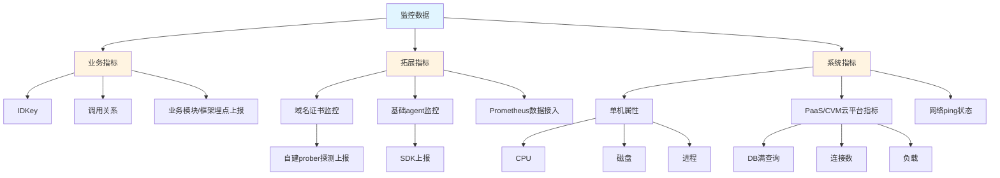

### 2.2 数据应用与自动化

监控数据被广泛应用到各个业务系统：

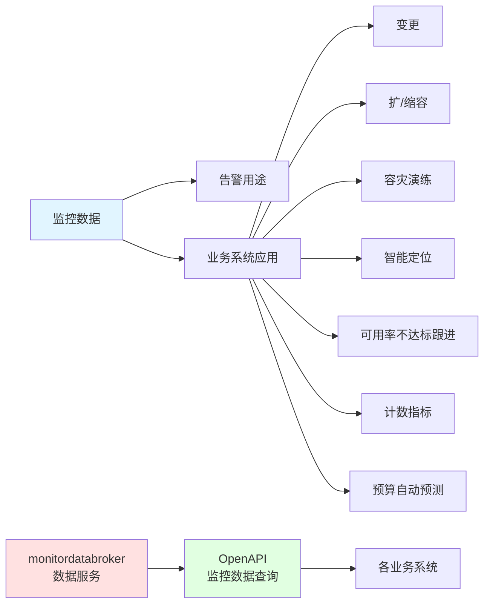

#### 自动化措施

1. **监控项OpenAPI** - 通过接口申请监控上报
2. **告警配置OpenAPI** - 通过接口新增告警配置、调整参数
3. **监控配置模板** - 直接应用模板配置的阈值、算法等参数

#### 应用案例

**案例一：智能语音识别** ——将连续语言快速识别为文字，给应用配上"耳朵"

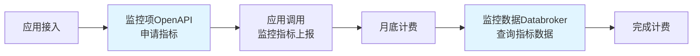

**案例二：可用率系统** ——功能指标可用率计算、不达标跟进

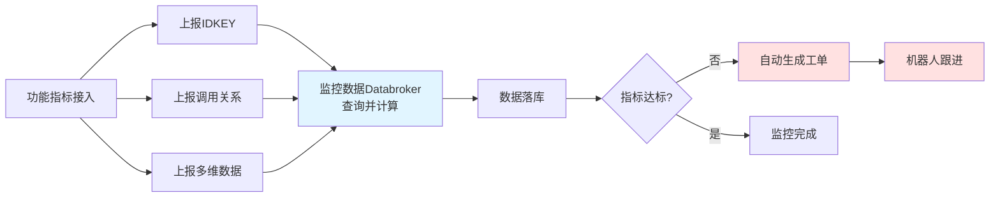

当前可用率系统已有 **4600+** 功能指标接入，覆盖了基础服务、模式识别、开放平台、内容平台、运营系统、安全等产品。

### 2.3 系统架构

监控平台系统架构整体分为6个板块：

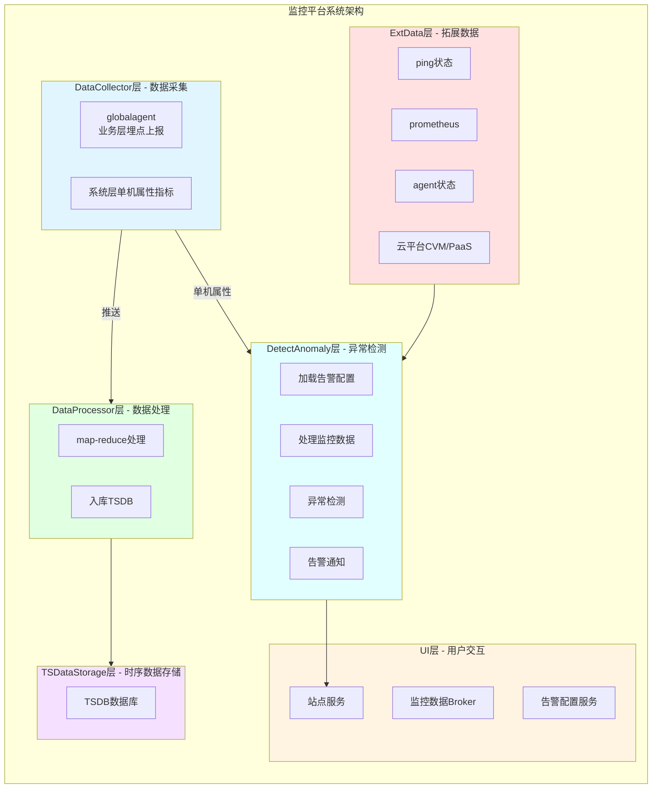

### 2.4 平台功能

常用功能入口：

- **监控门户** —— 可管理告警模板、管理告警配置、管理告警单据、管理订阅等
- **多维监控** —— 支持新增上报多维度的数据，查询数据、配置告警等
- **数据查看** —— 支持配置各个数据源数据面板
- **IDKey管理** —— 新增IDKey上报，管理IDKey元数据信息

---

## 3. 优化与拓展

接下来列举监控平台在"全"、"快"、"准"、"稳"等方面做的优化与拓展。

### 3.1 基础agent监控数据 🌟

企业现网环境的层次结构：

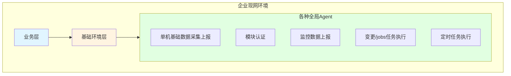

各Agent关键作用：

- **模块认证** 挂了 → 影响模块认证 → 服务调用认证拒绝
- **定时任务执行** 挂了 → 影响定时任务 → 全局保活CK任务失败
- **单机基础数据采集上报** 挂了 → 影响基础数据采集 → 数据缺失无法及时发现问题

**解决方案**：监控平台设计开发了 **agentstat监控**

- agent心跳上报SDK
- 数据存储
- 数据汇聚查询

### 3.2 证书监控 🔄

#### 旧版监控路径

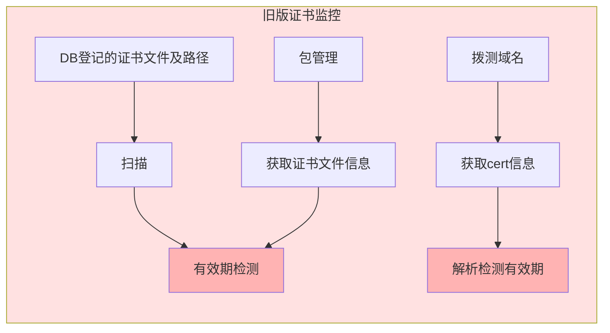

**问题**：

- 包管理形态不再能支持证书监控（上云进程加快）
- 拨测域名解析cert信息存在漏网之鱼
- 发生证书过期故障：
  - 证书文件已更新但无重新加载
  - 邮箱域名证书无登记漏监控

#### 新版监控路径

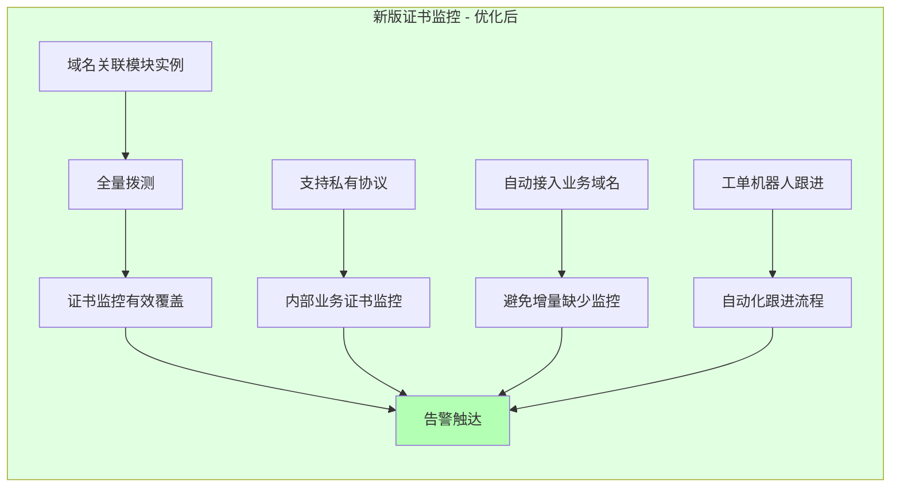

**优化亮点**：

1. ✅ 增加域名关联模块实例的全量拨测
2. ✅ 支持私有协议，满足内部业务证书监控需求
3. ✅ 自动接入业务域名，避免增量缺少监控
4. ✅ 工单机器人跟进，自动化跟进流程

**成果**：自上线以后，接入证书监控后相关的故障不再发生。

### 3.3 异常检测链路重构 ⚡

#### 旧架构问题

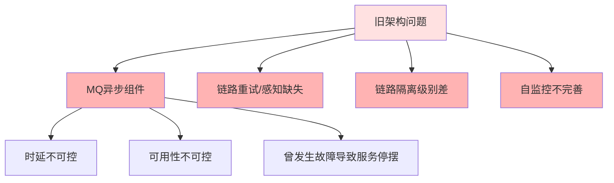

#### 重构方案

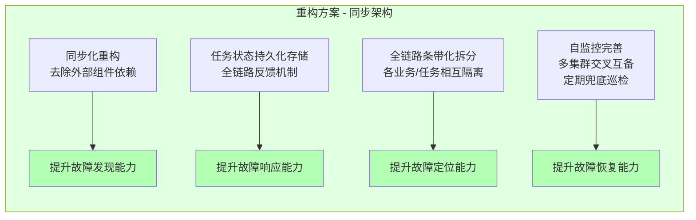

#### 优化成果

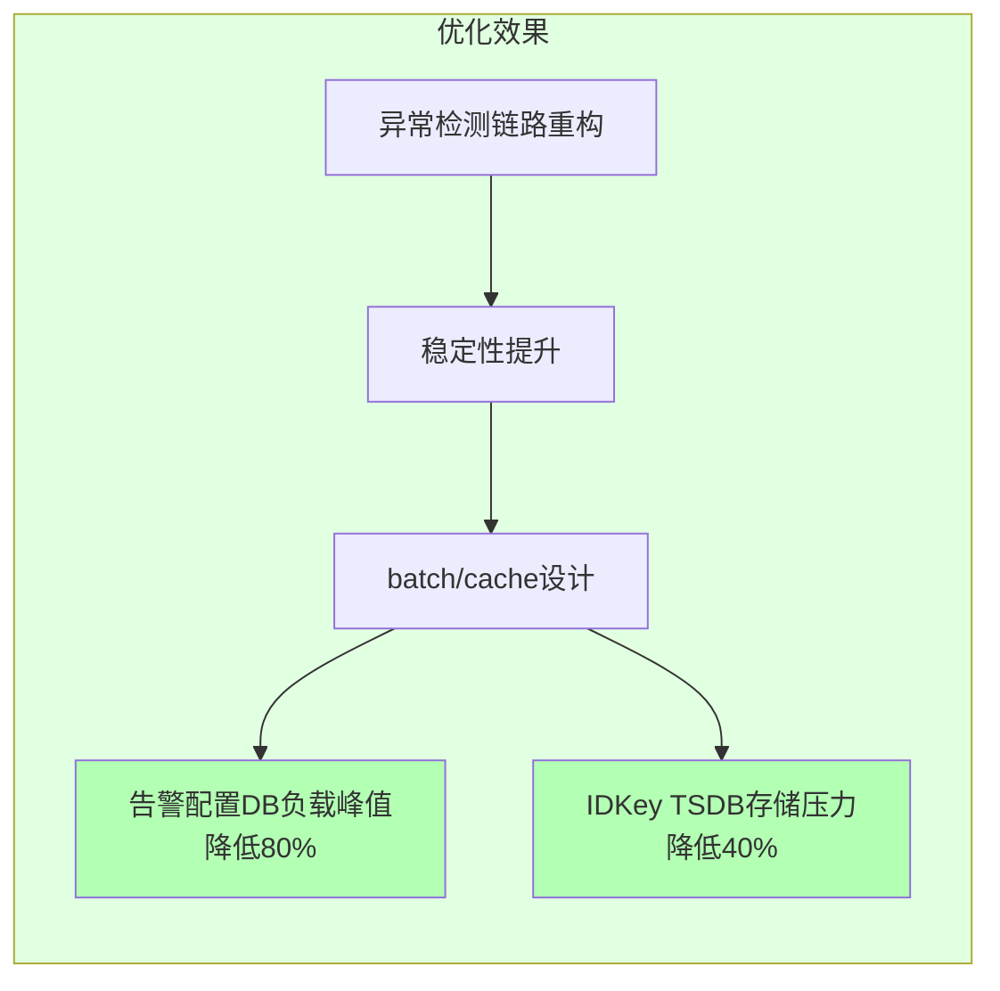

### 3.4 推拉组合监控 🎯

#### 单机属性监控指标

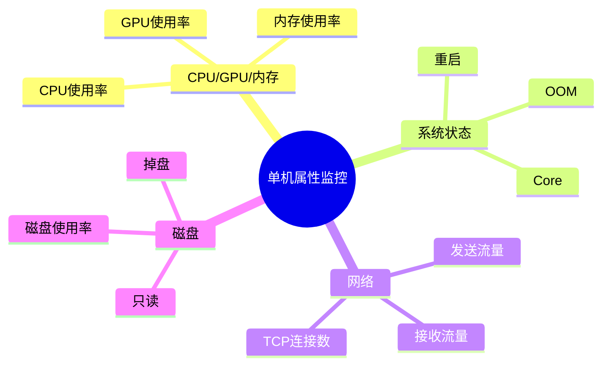

#### 拉模式 vs 推模式

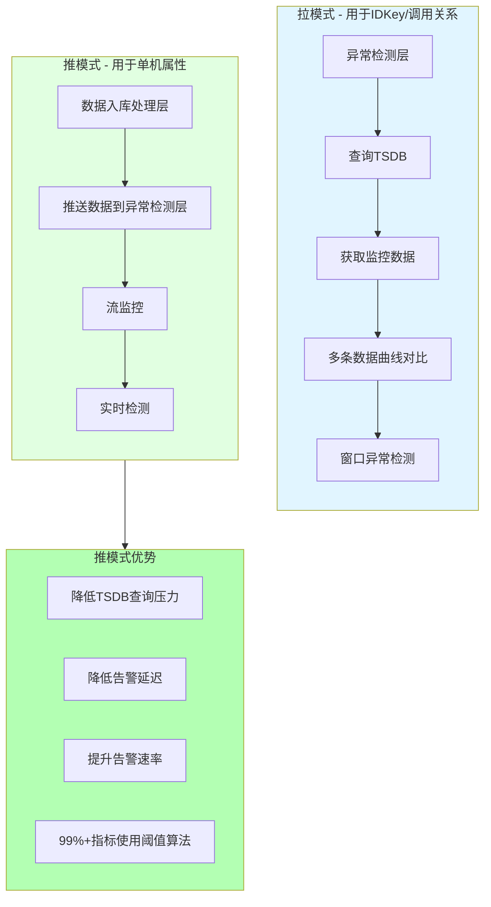

#### 问题与解决

| 问题 | 原因 | 解决方案 | 效果 |
| ------ | ------ | ---------- | ------ |
| 数据查询失败 | 单机属性数据属于明细数据，展开维度高达3kw | 推模式 - 流监控 | 日均检测异常告警项1.2w左右 |
| TSDB高负载 | 拉模式对TSDB查询压力过大 | 数据入库层直接推送到异常检测层 | 全链路可用率99.99%+ |

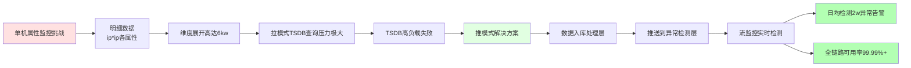

### 3.5 数据入库检测 ✅

#### 问题：误告导致"狼来了效应"

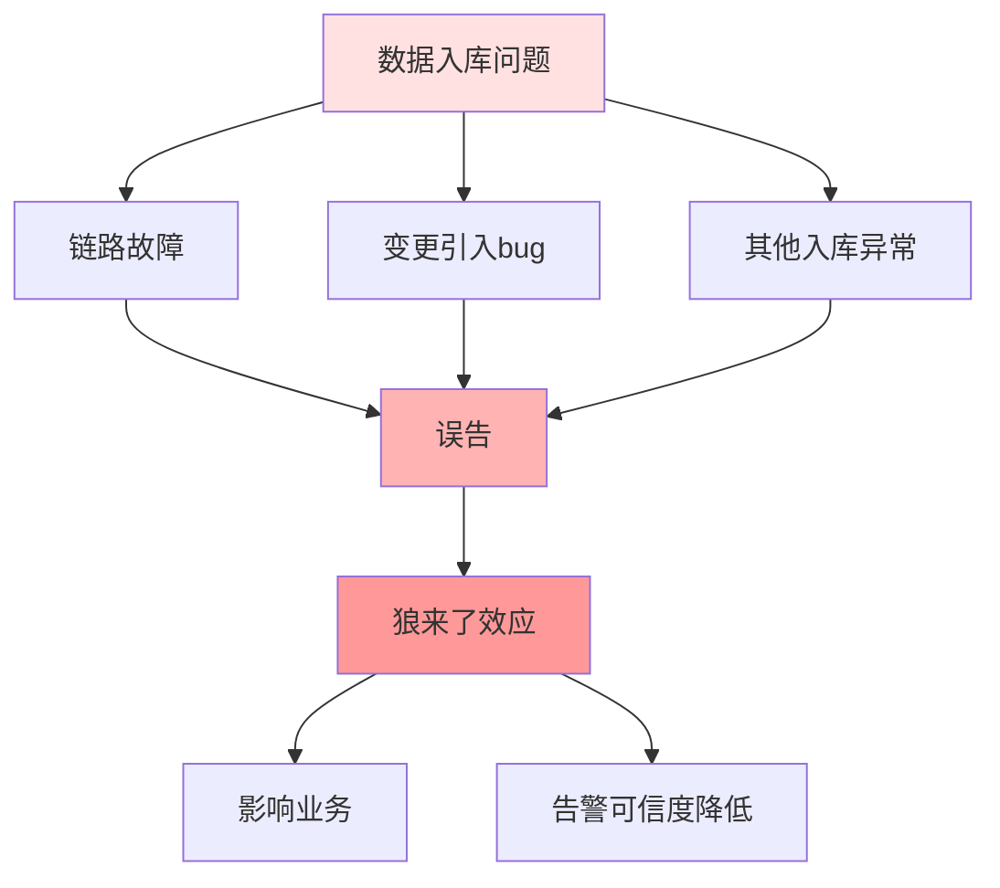

#### 解决方案

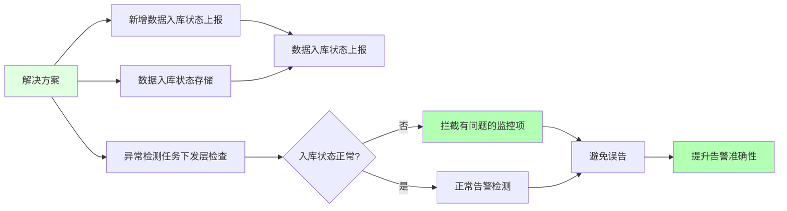

---

## 4. 结语

本文从监控平台的数据源、数据应用与自动化、系统架构、平台功能做全景解读，列举了监控平台在"全"、"快"、"稳"、"准"方面做的一部分优化拓展并展示了落地的成果。

### 优化成果总结

| 维度 | 优化内容 | 核心成果 |
| ------ | ---------- | ---------- |
| **全** | 基础agent监控 | 接入15w+实例，覆盖各类agent |
| **全** | 证书监控 | 域名关联模块全量拨测，杜绝过期故障 |
| **稳** | 异常检测链路重构 | 可用率99.99%+，DB负载降低80% |
| **快** | 推拉组合监控 | 日均检测1.2w异常，告警延迟降低 |
| **准** | 数据入库检测 | 避免误告，提升准确性 |

### 未来规划

后续监控平台将继续完善：

- ✨ 数据的全面性
- ⚡ 告警的低时延
- 🧠 定位的智能化
- 🤖 流程的自动化
- 🎛️ 配置的灵活性
