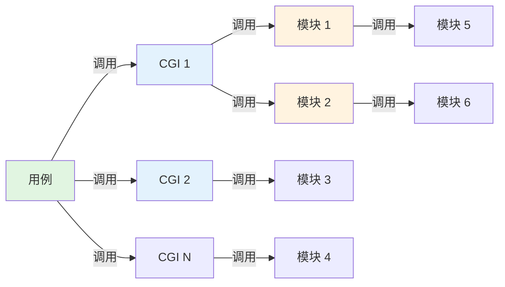

## 告警查找链路分析

## 一、链路结构概述

### 1.1 核心实体

```
用例 → CGI → 模块 → 模块 → ……
```

| 实体 | 说明 | 特点 |
|------|------|------|
| **用例** | 提供给用户使用的接口 | 调用链的最前面，用户可直接感知 |
| **CGI** | 通用网关接口 | 一个用例会调用多个CGI，会被传递到后续所有模块中 |
| **模块** | 具体的功能处理单元 | CGI后面跟着一个模块调用链 |

### 1.2 实体关系图



## 二、数据关联关系

### 2.1 关键关联表

**用例-用例步骤-CGI 关联表**

| 字段 | 说明 |
|------|------|
| 用例ID | 用例的唯一标识 |
| 用例步骤ID | 用例执行步骤的唯一标识 |
| CGI | 该步骤调用的CGI |

### 2.2 新模调接口能力

- **正向查询**：通过模块ID查询该模块关联的所有CGI
- **反向推导**：通过CGI查询该CGI关联的所有用例

### 2.3 完整关联网络

```
用例  ←→  用例步骤  ←→  CGI  ←→  模块
  ↑                              ↓
  └────  告警信息（含用例ID）  ─────┘
```

## 三、告警查找链路

### 3.1 正向查找链路（从告警到根因）

```
告警信息
  ↓ (包含用例ID)
用例
  ↓ (查询用例步骤表)
用例步骤
  ↓ (获取步骤对应的CGI)
CGI
  ↓ (通过新模调接口查询)
模块
  ↓ (继续追踪)
模块调用链
  ↓
根因定位
```

### 3.2 反向查找链路（从模块到影响范围）

```
告警模块
  ↓ (通过新模调接口查询)
关联的所有CGI
  ↓ (反向查询用例步骤表)
关联的所有用例步骤
  ↓
关联的所有用例
  ↓
影响范围评估
```

### 3.3 精准定位链路

```
告警信息 → 用例ID → 用例步骤 → CGI → 确认哪个用例步骤告警
```

## 四、告警查找链路的价值

### 4.1 核心价值

| 价值维度 | 具体体现 |
|---------|---------|
| **快速定位根因** | 从告警快速追溯到具体模块，缩短故障排查时间 |
| **精准影响范围** | 从模块反向推导受影响的用例，了解业务影响面 |
| **用户感知管理** | 明确哪些用户使用的哪些用例受到影响，提升用户沟通效率 |
| **步骤级监控** | 可以精确到用例步骤级别定位问题，提升监控粒度 |

### 4.2 运维价值

1. **故障排查效率提升**
   - 告警发生后，可快速定位到具体的用例步骤
   - 通过模块调用链追踪，找到真正的故障点
   - 减少大海捞针式的排查过程

2. **影响评估**
   - 从模块告警快速知道影响哪些用例
   - 评估受影响的用户群体和业务场景
   - 支持制定针对性的降级或回滚策略

3. **监控优化**
   - 支持步骤级别的监控告警
   - 可根据用例的重要程度设置不同的告警级别
   - 提升监控系统的可观测性

### 4.3 业务价值

1. **用户体验保障**
   - 快速告知用户具体哪个功能受影响
   - 精准定位问题，减少误报和漏报
   - 提升故障响应速度

2. **服务质量提升**
   - 通过完整的链路追踪，确保服务质量
   - 支持服务质量指标（SLA）的监控和保障
   - 提升系统的可靠性和稳定性

3. **数据驱动优化**
   - 通过告警数据分析，发现系统瓶颈
   - 识别高频故障的用例和模块
   - 指导系统优化和重构决策

### 4.4 开发价值

1. **问题定位便利**
   - 开发人员可快速定位到问题代码所在的模块
   - 清晰了解用例到模块的完整调用链路
   - 减少问题复现和调试时间

2. **链路可视化**
   - 支持构建完整的调用链路图
   - 便于理解系统架构和模块依赖关系
   - 辅助代码审查和架构优化

3. **测试用例完善**
   - 根据告警频率，完善测试用例覆盖
   - 重点测试高频故障模块
   - 提升测试效率和质量

## 五、典型应用场景

### 5.1 场景一：用户反馈问题

```
用户反馈：XX功能无法使用
  ↓
根据用户使用的用例ID
  ↓
查询该用例的所有CGI和模块调用链
  ↓
结合告警信息，快速定位故障模块
  ↓
问题解决
```

### 5.2 场景二：模块告警处理

```
收到模块告警
  ↓
查询该模块关联的所有CGI
  ↓
反向查询受影响的所有用例
  ↓
评估业务影响范围
  ↓
制定修复和通知策略
```

### 5.3 场景三：性能问题分析

```
发现某个用例响应慢
  ↓
追踪该用例的CGI调用链
  ↓
分析每个模块的执行时间
  ↓
定位性能瓶颈模块
  ↓
性能优化
```

## 六、总结

告警查找链路的建立，实现了从**用户视角**（用例）到**系统视角**（模块）的完整映射，构建了双向可追溯的监控体系。这不仅能快速定位问题根因，还能准确评估业务影响，是保障系统稳定运行、提升运维效率的重要基础设施。

**核心价值一句话总结**：
> 将告警从"哪里出问题了"提升到"影响了谁、影响多大、如何快速修复"，实现故障处理的全链路闭环。
