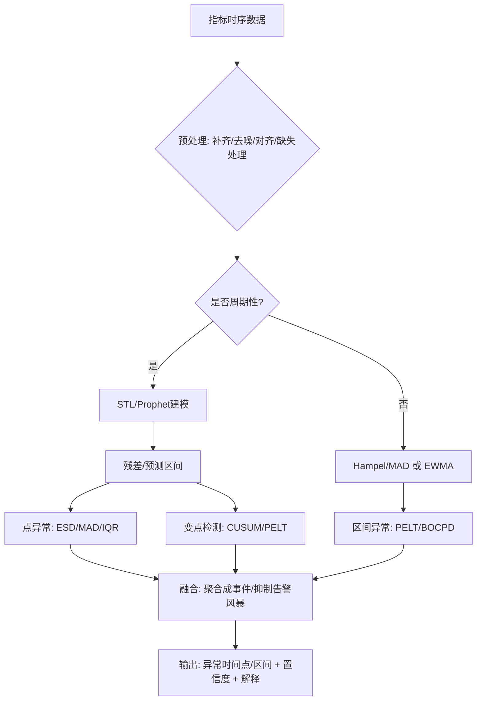

## 时间序列异常检测完整方案指南

## 一、需求拆解

### 1.1 需要覆盖的数据类型

#### 周期性指标

**特征**：存在明显日周期/周周期（如图1、图2、图5的"每天起伏"）

**需要识别的异常**：

- 异常点/异常区间的时间点（峰值、低谷、形态改变）
- 周期形态不再符合历史规律（幅度变大、基线抬升、周期被破坏）
- 结构性变化（整体进入新水平）

#### 非周期性指标

**特征**：没有稳定周期（如图3、图4的"突发/阶跃"）

**需要识别的异常**：

- 突发尖峰/脉冲
- 阶跃/平台
- 突然归零/持续低值
- 方差变大/噪声变大

### 1.2 图片理解

| 图号 | 特征描述 | 异常类型 |
|------|----------|----------|
| 图1 | 整体周期性很强，但在后段（约03-20后）波动幅度与基线都明显上升 | 周期存在但形态/水平改变（漂移+放大） |
| 图2 | 周期性日波动为主，出现一次非常突出的尖峰（约03-27） | 周期背景上的尖峰异常 |
| 图3 | 典型阶跃+平台（突然上升保持一段再回落） | 非周期的区间异常/状态切换 |
| 图4 | 整体接近0，仅在某时刻出现极窄脉冲尖峰 | 稀疏脉冲异常 |
| 图5 | 稀疏事件计数/速率类指标，平时低，偶发尖峰 | 稀疏尖峰 + 事件聚合 |

---

## 二、实际工程应用的异常检测论文和案例

### 2.1 论文/项目汇总表

| 论文/项目名称 | 公司/机构 | 关键算法 | 核心方法 | 方法要点 | 典型适用场景 | 方案分类 |
|--------------|----------|---------|---------|---------|-------------|---------|
| Twitter AnomalyDetection (S-H-ESD) | Twitter | S-H-ESD (Seasonal Hybrid ESD) | STL分解 + ESD统计检验 | 1. 使用STL分解分离趋势/季节性/残差<br>2. 对残差做广义极值学生化偏差检验<br>3. 支持周期性数据 | 日/周周期明显的监控指标（请求量、错误率、延迟等） | 周期性数据检测 |
| Microsoft Donut | Microsoft | VAE + MLE (变分自编码器) | 生成模型学习正常模式分布 | 1. 用VAE自动学习正常KPI的概率分布<br>2. 通过重构概率判断异常<br>3. 支持复杂周期形态 | 周期形态复杂、噪声大的KPI，传统统计方法效果不佳 | 复杂周期数据 |
| Meta Kats | Meta | Prophet + Holt-Winters + 变点检测 | 集成多种算法工具箱 | 1. 开箱即用的多种算法封装<br>2. 支持预测、检测、变点检测<br>3. 可视化分析工具 | 快速原型验证、多方案对比 | 研究验证工具 |
| Uber Robust Detection | Uber | 多模型融合 + 自适应阈值 | STL分解 + 移动平均融合 | 1. 多模型投票/融合<br>2. 处理节假日/活动影响<br>3. 自适应动态阈值 | 电商、出行等受活动影响明显的业务指标 | 抗干扰方案 |
| Salesforce Merlion | Salesforce | 多模型集成框架 | 端到端时间序列异常预测 | 1. 提供完整管道（特征工程→模型→后处理）<br>2. 支持多模型融合<br>3. 内置告警抑制/合并机制 | 搭建监控平台的PoC和快速落地 | 生产环境完整方案 |
| Isolation Forest | NJU | 随机隔离 + 路径长度 | 二叉树随机切割 | 1. 随机选择特征和分割点<br>2. 异常点路径更短<br>3. 无需训练集标注 | 非周期性数据、多维指标、无标签场景 | 无监督通用方案 |
| Amazon RRCF (Robust Random Cut Forest) | Amazon | 随机切分树 + 流式更新 | 随机隔离异常点 | 1. 对数据流动态增删样本<br>2. 内存效率高<br>3. 对分布漂移鲁棒 | 实时流监控、需要低延迟检测 | 流式实时检测 |
| LinkedIn Real-time Detection | LinkedIn | Holt-Winters + 动态置信区间 | 预测模型 + 统计阈值 | 1. 使用Holt-Winters预测<br>2. 动态置信区间（3σ）<br>3. 强调实时性和低延迟 | 高频监控指标、对延迟敏感的场景 | 实时检测方案 |
| PELT (Pruned Exact Linear Time) | UCL | 动态规划 + 剪枝 | 最优分割算法 | 1. 动态规划寻找最优变点<br>2. 剪枝加速至O(n)<br>3. 精确定位变点 | 检测阶跃变化、平台切换、基线漂移 | 精确变点检测 |
| BOCPD (Bayesian Online CPD) | MIT | 贝叶斯推断 + 在线更新 | 概率变点检测 | 1. 贝叶斯框架计算变点概率<br>2. 在线更新后验分布<br>3. 输出概率而非二值结果 | 实时监控、需要持续更新的场景 | 在线变点检测 |
| Numenta NAB | Numenta | HTM + 多算法基准 | 标准化评估框架 | 1. 提供真实业务风格数据集<br>2. 标准打分规则（早期预警优先）<br>3. 对比多种算法 | 算法离线评估、对比不同方法 | 评估基准 |

### 2.2 场景推荐方案

| 场景 | 推荐方案 | 公司/来源 | 链接 |
|------|---------|----------|------|
| 周期性数据 | Twitter S-H-ESD + PELT变点检测 | Twitter + UCL | [S-H-ESD](https://github.com/twitter/AnomalyDetection) \| [PELT](https://centre-borelli.github.io/ruptures-docs/) |
| 非周期性数据 | Hampel/Rolling MAD + PELT变点检测 | 统计方法 + UCL | [Hampel](https://docs.scipy.org/doc/scipy/reference/generated/scipy.signal.medfilt.html) \| [PELT](https://centre-borelli.github.io/ruptures-docs/) |

---

## 三、异常类型与检测策略映射

| 异常类型 | 典型表现（对应图） | 检测输出 | 常用算法 |
|---------|------------------|---------|---------|
| 单点尖峰/毛刺 | 图2、图4、图5 | 返回尖峰时间点、幅度、置信度 | Hampel / Robust Z / ESD / 预测区间越界 |
| 周期形态异常（幅度变大、波形扭曲） | 图1（后段） | 返回异常发生起点、持续区间、偏离程度 | STL分解残差检测 / S-H-ESD / Prophet区间 |
| 基线漂移/趋势突变（水平抬升/降低） | 图1（基线抬升） | 返回变点时间点、变点前后均值差 | 变点检测（CUSUM/BOCPD/ruptures）+ 预测残差 |
| 阶跃/平台（状态切换） | 图3 | 返回平台区间起止时间、平台高度 | 变点检测（PELT/Binseg）/ BOCPD |
| 噪声变大（方差异常） | 常见于抖动加剧 | 返回方差突变点 | 方差变点 / 滚动MAD / IQR |

---

## 四、常用算法详解

### 4.1 周期性时间序列异常检测（对应图1、图2）

#### 1. STL 分解 + 残差异常检测（IQR / MAD / 3σ / ESD）

**思路**：`x(t) = trend(t) + season(t) + resid(t)`，对 `resid(t)` 做鲁棒阈值检测

**适用场景**：日/周周期明显、希望可解释（趋势/季节/残差分开）

**优点**：

- 工程落地快、解释性强
- 能标出"异常发生的具体时间点"

**注意**：需要周期长度（如 1440 分钟、24 小时等）和窗口策略

#### 2. S-H-ESD（Seasonal Hybrid ESD，Twitter/Netflix 使用）

**思路**：先去季节性（常用 STL/LOESS），再用 ESD 找离群点

**适用场景**：周期性强、尖峰类异常较多（图2这种很契合）

**优点**：在监控告警领域口碑好、对尖峰敏感

**局限**：对"结构性变化/长期漂移"通常要配合变点检测

#### 3. Prophet（预测 + 置信区间越界）

**思路**：拟合趋势+多季节性，生成预测区间；实际值超出区间判异常

**适用场景**：多周期叠加（小时+日+周）、缺失值多、希望自动化程度高

**优点**：工程上好用；直接输出"越界时间点"

**局限**：对非常高频/强噪声数据，需要调参（changepoint_prior_scale 等）

#### 4. ARIMA/SARIMA / ETS（传统时序预测）

**适用场景**：相对平稳、频率不太高的指标；用预测残差做异常

**优点**：成熟、可解释

**局限**：调参成本较高，对复杂非线性周期不如 Prophet/深度模型

#### 5. 深度学习（LSTM/TCN 自编码器，Transformer 类）

**适用场景**：指标形态复杂、周期变化不固定、特征多（多指标联合）

**优点**：上限高，可做多变量（多指标）异常

**局限**：需要较多"正常数据"、训练与维护成本高；线上漂移要处理

### 4.2 非周期性/稀疏指标异常检测（对应图3、图4、图5）

#### 1. Hampel Filter / Rolling MAD（鲁棒滑窗）

**适用场景**：图4这种"平时接近 0，偶发尖峰"非常合适

**优点**：简单、鲁棒、实时性强

**输出**：直接给尖峰时间点

#### 2. EWMA / CUSUM（在线偏移检测）

**适用场景**：均值缓慢漂移、或突然发生均值变化（也可用于图1基线变化的辅助）

**优点**：可在线、延迟可控（time-to-detect）

**局限**：对复杂季节性需先去季节

#### 3. 变点检测（Change Point Detection）

**方法**：PELT / Binary Segmentation / Window-based / BOCPD

**适用场景**：图3阶跃平台、图1后段"进入新状态"

**优点**：能输出"异常区间起点/终点"或"状态切换点"

**常用库**：ruptures（PELT 等），BOCPD 需要更复杂实现

#### 4. 无监督异常检测（适合多维/多特征）

**算法**：Isolation Forest / LOF / One-Class SVM

**适用场景**：有多维特征（如同时用 value、diff、rolling_std、小时/星期等特征），或需要统一框架处理不同指标

**优点**：对分布假设少，工程统一性好

**局限**：单变量直接用它们往往不如"时序专用方法"稳；阈值需要校准

---

## 五、异常检测流程图



---

## 六、图像识别/视觉方法

### 6.1 最佳实践

**拿到原始指标时序（时间戳+数值）** → 用时序异常检测（准确、可解释、可定位到时间点）

### 6.2 只有截图时的处理方法

#### 方法1：截图 → 曲线数字化 → 时序算法

**适用场景**：只有截图、拿不到原始指标数据，但仍想定位"异常发生的时间点"

**流程**：

1. 截图裁剪出绘图区域（去掉标题、图例）
2. 按颜色分割提取曲线（比如红线/绿线 HSV 阈值）
3. 对每个 x 像素列找曲线 y 像素（取最上/最下/中值），得到像素序列
4. 用两点标定把像素映射回数值（y轴）与时间（x轴）
5. 得到近似时序后，用 STL/PELT/Hampel 等做检测

**优点**：能回到"时间点级别"的异常输出；不需要训练大量图片

**缺点**：受分辨率、压缩、曲线遮挡、坐标刻度不清影响；多条线交叉时难度上升

#### 方法2：端到端视觉模型（CNN/ViT）直接判异常

**适用场景**：只想回答"这张图是否异常/异常类型是什么"，不强要求精确到时间点，并且有大量同风格截图

**可做的任务**：

- 分类：正常、尖峰、阶跃、漂移、周期破坏…
- 弱定位：用 Grad-CAM 给出大概异常区域（不精确到具体时间点）

**优点**：不需要坐标映射，直接使用图片

**缺点**：需要大量标注；换一种图表主题/线条颜色/坐标范围就可能不可用；要获取"异常发生的时间点"会比较困难

---

## 七、异常检测算法分类

### 7.1 基于统计的方法

| 算法 | 原理 | 适用场景 | 优势 | 局限 |
|------|------|---------|------|------|
| 3σ原则（3-Sigma） | 基于正态分布，数据落在3σ外的概率为0.27% | 符合正态分布的数据，单点异常检测 | 实现简单，计算高效 | 不适用于非正态分布数据 |
| Z-Score | 标准化数据，计算偏离均值的程度 | 数据分布相对稳定的情况 | 可处理不同量级数据 | 对异常值敏感，均值受影响 |
| IQR（四分位距） | 使用中位数和四分位数，检测超出Q1-1.5IQR和Q3+1.5IQR的值 | 非正态分布数据，抗异常值干扰 | 鲁棒性强，不受极端值影响 | 对周期性数据检测效果有限 |
| 移动平均（MA） | 计算滑动窗口内的平均值，检测偏离度 | 短期波动检测，平滑噪声 | 计算简单，适合实时检测 | 对突发变化响应慢，存在滞后 |
| 指数加权移动平均（EWMA） | 对近期数据赋予更高权重 | 有趋势的数据，实时监控 | 对近期变化更敏感 | 参数选择敏感 |

### 7.2 基于机器学习的方法

| 算法 | 原理 | 适用场景 | 优势 | 局限 |
|------|------|---------|------|------|
| 孤立森林（Isolation Forest） | 随机切割特征空间，异常点容易被孤立 | 高维数据，无需标注 | 线性时间复杂度，适合大数据 | 对局部异常检测不敏感 |
| One-Class SVM | 寻找能包含正常样本的最小超球 | 训练数据主要为正常样本 | 无需负样本，泛化能力强 | 核函数选择敏感，大规模数据慢 |
| KNN/K-Means | 基于距离检测离群点 | 数据分布相对简单 | 实现简单，易于理解 | 计算复杂度高，对参数敏感 |
| 局部异常因子（LOF） | 计算样本的局部密度偏差 | 局部异常，密度不均匀的数据 | 能检测局部异常，不受全局影响 | 计算量大，需要邻居参数 |

### 7.3 基于深度学习的方法

| 算法 | 原理 | 适用场景 | 优势 | 局限 |
|------|------|---------|------|------|
| LSTM自编码器 | 用LSTM编码时间序列，重构误差大的为异常 | 时间序列数据，长时依赖 | 能捕捉时间依赖关系，适合周期数据 | 训练数据需求大，训练耗时 |
| GRU自编码器 | 类似LSTM，但参数更少 | 资源受限场景 | 训练更快，性能接近LSTM | 对非常长序列效果稍逊 |
| VAE（变分自编码器） | 学习数据概率分布，检测异常样本 | 复杂分布数据 | 能生成数据，概率解释性强 | 重构质量可能不如AE |
| GAN（生成对抗网络） | 生成器伪造正常数据，判别器检测异常 | 复杂模式，高质量重构 | 生成能力强，适合复杂数据 | 训练不稳定，调参困难 |

### 7.4 时间序列专用方法

| 算法 | 原理 | 适用场景 | 优势 | 局限 |
|------|------|---------|------|------|
| STL分解 | 将序列分解为趋势、季节、残差，检测残差异常 | 明显周期性的时间序列 | 可解释性强，能分离各成分 | 对非周期数据效果差 |
| Prophet | Facebook开源，基于加性模型 | 有趋势和季节性的业务数据 | 对缺失值和异常值鲁棒 | 参数多，需要调优 |
| ARIMA | 自回归移动平均模型 | 平稳时间序列 | 理论成熟，可解释性好 | 不适合非平稳和长序列 |
| Twitter AnomalyDetection | 基于广义极值理论 | 社交媒体、监控指标 | 针对周期性数据优化 | 参数固定，灵活性差 |
| Numenta HTM | 层次时序记忆，模拟大脑皮层 | 实时流数据，在线学习 | 在线学习，适应性强 | 实现复杂，资源消耗大 |

---

## 八、不同场景的算法推荐

### 8.1 周期性数据异常检测

#### 方案1：STL分解 + 统计阈值

**适用场景**：有明显周期规律的监控指标（如日周期、周周期）

**优势**：可解释性强，能准确识别周期异常点

**实现思路**：

```python
# 1. 对时间序列进行STL分解，得到趋势项、季节项、残差项
# 2. 对残差项应用3σ或IQR检测异常
# 3. 异常点 = 残差超出阈值的时刻
```

#### 方案2：Facebook Prophet

**适用场景**：业务指标监控，有多重周期（日+周+年）

**优势**：自动处理节假日、缺失值、趋势变化

**实现思路**：

```python
# 1. 训练Prophet模型拟合历史数据
# 2. 预测未来窗口及置信区间
# 3. 实际值超出置信区间则为异常
```

#### 方案3：LSTM自编码器

**适用场景**：复杂周期模式，有长时依赖关系

**优势**：自动学习周期模式，无需手动特征工程

**实现思路**：

```python
# 1. 用历史正常数据训练LSTM-AE
# 2. 计算实时数据重构误差
# 3. 误差超过动态阈值为异常
```

### 8.2 非周期性数据异常检测

#### 方案1：孤立森林

**适用场景**：无明显周期，数据维度较高

**优势**：无需假设数据分布，适合实时检测

**实现思路**：

```python
# 1. 训练孤立森林模型
# 2. 计算样本异常分数
# 3. 分数超过阈值为异常
```

#### 方案2：EWMA + 动态阈值

**适用场景**：实时监控，对异常响应快

**优势**：计算简单，适合流式数据

**实现思路**：

```python
# 1. 计算EWMA预测值
# 2. 计算实际值与预测值的偏差
# 3. 偏差超过动态阈值为异常
```

#### 方案3：One-Class SVM

**适用场景**：训练样本主要为正常值

**优势**：无需负样本学习

**实现思路**：

```python
# 1. 用正常数据训练OC-SVM
# 2. 预测新样本，-1为异常
```

---

## 九、评估指标

| 指标 | 说明 | 适用场景 |
|------|------|---------|
| Precision | 检测出的异常中真正异常的比例 | 关注误报率 |
| Recall | 真正异常被检测出的比例 | 关注漏报率 |
| F1-Score | Precision和Recall的调和平均 | 综合评估 |
| FPR | 假阳性率 | 评估误报 |
| TPR | 真阳性率 | 评估检测能力 |
| AUC-ROC | ROC曲线下面积 | 模型整体能力 |
| Time-to-Detect | 异常发生后多久能检测到 | 实时性要求高的场景 |
| MAD（平均绝对偏差） | 检测时间点与真实异常时间的偏差 | 精度要求高的场景 |

---

## 十、数据类型与方案对照表

| 数据类型 | 推荐方案 | 适用算法 |
|---------|---------|---------|
| 强周期性数据 | Prophet 或 STL分解 | Prophet / STL / S-H-ESD |
| 弱周期性数据 | EWMA + 动态阈值 | EWMA / CUSUM |
| 无周期数据 | Isolation Forest | Isolation Forest / LOF / One-Class SVM |
| 实时流数据 | EWMA | EWMA / RRCF |
| 稀疏数据 | Hampel / Rolling MAD | Hampel / MAD |
| 阶跃/平台 | 变点检测 | PELT / BOCPD / CUSUM |

---

## 十一、快速选择指南

### 根据数据特征选择算法

```
是否周期性？
├─ 是 → 周期性算法
│   ├─ 单周期 → STL分解 + ESD
│   ├─ 多周期 → Prophet
│   └─ 复杂周期 → LSTM自编码器 / Donut
│
└─ 否 → 非周期性算法
    ├─ 实时检测 → EWMA / Isolation Forest
    ├─ 阶跃/平台 → PELT / BOCPD
    └─ 稀疏尖峰 → Hampel / Rolling MAD
```

### 根据场景需求选择方案

```
场景需求？
├─ 快速原型 → Meta Kats / Prophet
├─ 生产环境 → Merlion / Twitter S-H-ESD
├─ 实时监控 → EWMA / RRCF / LinkedIn方案
├─ 高精度 → PELT / BOCPD
└─ 无标注数据 → Isolation Forest / One-Class SVM
```

---

## 参考文献

1. Twitter AnomalyDetection: <https://github.com/twitter/AnomalyDetection>
2. Facebook Prophet: <https://github.com/facebook/prophet>
3. Microsoft Donut: <https://github.com/microsoft/AnomalyDetection>
4. Salesforce Merlion: <https://github.com/salesforce/Merlion>
5. Numenta NAB: <https://github.com/numenta/NAB>
6. ruptures (PELT): <https://centre-borelli.github.io/ruptures-docs/>
