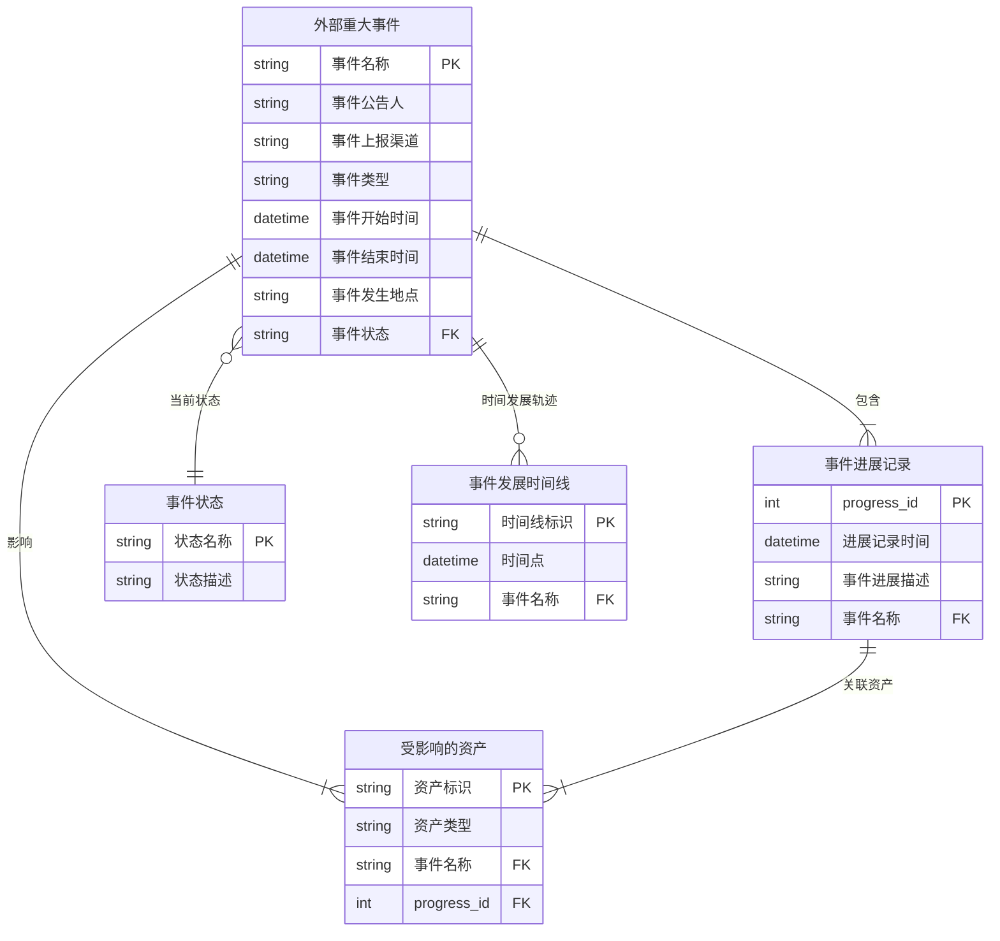

## 外部重大事件信息同步-方案设计

## 1. 项目目标

### 核心目标
满足公司合规与风险管理的规范要求，感知外部重大事件最新进展，分析对xxxx组内部服务的影响

### 具体目标
- **感知进展**：记录外部重大事件的最新进展
- **分析影响**：分析外部重大事件对部门内的影响

---

## 2. 外部重大事件要素模型

### 2.1 外部重大事件公告例子

事件分类与级别：公告类型是【故障公告】公告级别是【重大事件】，即：重大事件的故障公告

事件详细内容：
提取出以下字段：
- 公告编号：
- 公告标题：
- 公告类型：故障公告（唯一取值）
- 公告级别：重大事件（唯一取值）
- 关联单号：
- 公告接受人：
- 公告内容：17:13 现场反馈：所有演练范围机架已恢复供电
- 发生地点：
- 开始时间：
- 结束时间：
- 影响范围：50+ping告警，无高温告警
- 影响描述：
  - 10:44 收到50+服务器ping告警，联系现场跟进处理中
  - 10:50 现场反馈：正在配合xxxx进行断电演练
  - 12:20 现场反馈：所有演练范围机架已断电完成，预计17:00开始恢复机架供电
  - 16:59 现场反馈：开始恢复机架供电
  - 17:13 现场反馈：所有演练范围机架已恢复供电

对公告内关键信息的分析提炼：

从公告内容来看，一个外部重大事件可以由这些核心信息进行总结描述

- 事件开始时间
- 事件发生地点
- 事件影响的资产编号
- 事件的进展信息
- 事件的结束时间

### 2.2 核心要素

| 要素 | 说明 | 备注 |
|------|------|------|
| 事件名称 | 如：`【xxxxx故障】xxx机房收到50+服务器ping告警` | 长度不超过255字符 |
| 事件开始时间 | 格式：`YYYY-MM-DD HH:MM:SS` | 需精确到秒 |
| 事件类型 | 枚举值：`演练`、`故障` | 唯一取值 |
| 事件公告人（或接口人） | 如：`sanzhang` | |
| 事件上报渠道 | 如：`xxx组-xx平台部` | 接入时约定 |
| 事件状态 | 枚举值：`事件发生`、`事件处理中`、`事件结束` | |
| 事件发生地点 | 如：`xxxxx` | 涉及物理位置时必填 |
| 事件结束时间 | 格式：`YYYY-MM-DD HH:MM:SS` | 事件结束时必填 |

### 2.3 事件进展时间线（Event Progress）

每个进展记录包含：
- **进展记录时间**：`YYYY-MM-DD HH:MM:SS`【需要精确到秒，精度不足时补0】
- **进展描述**：具体的进展内容
- **受影响的资产**：
  - 资产标识：多个资产使用英文分号`;`分隔
  - 资产类型：受影响的资产类型如`CVM`、`CDN`、`机架`等

### 2.4外部重大事件管理 - 实体关系图



#### 关系说明

- **外部重大事件 → 事件进展记录**：一对多关系，一个事件有多个进展记录
- **外部重大事件 → 受影响的资产**：一对多关系，一个事件可能影响多个资产
- **外部重大事件 → 事件状态**：多对一关系，事件有且只有一个当前状态
- **外部重大事件 → 事件发展时间线**：一对多关系，一个事件有一条时间发展轨迹
- **事件进展记录 → 受影响的资产**：一对多关系，一个进展记录可能关联多个受影响的资产


---

## 3. xxxx组依赖的资产类型

| 基础设施产品 | 类别 | 说明 |
|-------------|------|------|
| CVM | 计算资源 | 云服务器 |
| EKS | 计算资源 | 弹性容器服务 |
| COS | 存储服务 | 对象存储 |
| VPC | 网络服务 | 私有网络 |
| CDN | 网络服务 | 内容分发网络 |
| EIP | 网络服务 | 弹性公网IP |
| NAT | 网络服务 | NAT网关 |
| DNS | 域名服务 | 域名解析 |
| CKAFKA | 中间件 | 消息队列Kafka |
| CAM | 安全服务 | 访问管理 |
| CSM | 安全服务 | 凭据管理系统 |
| KMS | 安全服务 | 密钥管理系统 |
| CKV | 存储服务 | 云缓存 |
| 机架 | 计算服务 | 标准设备柜 |

---

## 4. 上报接口协议

### 4.1 接口参数结构

#### 主参数
```json
{
  "event_id": "事件ID（由上报方自行定义，参数为仅允许使用英文字母（A–Z，a–z）、数字（0–9）、英文连字符（-）和下划线（_）的字符串类型，不得包含其他特殊字符）",
  "event_name": "事件名称（可以使用中文、英文、数字、标点符号，总长度不超过255个字符）",
  "event_type": "事件类型：枚举值（演练/故障）",
  "event_start_time": "开始时间：YYYY-MM-DD HH:MM:SS",
  "event_end_time": "结束时间：YYYY-MM-DD HH:MM:SS（可选，事件结束时必须上报事件结束时间）",
  "event_location": "发生地点（可选，若故障涉及具体物理位置（如机房故障），必须填写该字段；对于不涉及物理设备的逻辑故障（如NAT故障），该字段可留空）",
  "event_reporter": "事件公告人（或事件接口人）",
  "event_report_channel": "上报渠道",
  "event_stage": "事件状态：枚举值（事件发生/事件处理中/事件结束）",
  "event_progress": [] // 事件的进展信息数组
}
```

#### event_progress 数组项
```json
{
  "progress_id": 0, // 进展记录序号（可选）
  "progress_time": "事件进展记录时间 YYYY-MM-DD HH:MM:SS",
  "progress_description": "进展描述",
  "affected_asset": [] // 事件影响的资产的数组
}
```

#### affected_asset 数组项
```json
{
  "affected_asset_id": "资产1;资产2;资产3", // 受影响的资产标识，同类型资产用分号分隔
  "affected_asset_type": "资产类型（枚举值：CVM、CDN、机架等）"
}
```

### 4.2 上报方式

#### 方式一：增量上报
每次事件有新进展时，只上报最新进展

#### 方式二：全量上报
每次事件有新进展时，上报最新进展和事件历史发展信息

> 注意：一件重大事件只能使用一种上报方式，不能混合使用

---

## 5. 关键规则

### 5.1 资产上报规则
- **同类型资产**：放在一起，标识使用英文分号`;`分隔
- **不同类型资产**：使用不同的JSON对象存储

### 5.2 事件ID规则
- 只能使用英文字母（A-Z，a-z）
- 数字（0-9）
- 英文连字符（-）
- 下划线（_）
- **不得包含其他特殊字符**

### 5.3 时间格式规则
- 统一格式：`YYYY-MM-DD HH:MM:SS`
- 需精确到秒
- 精度不足时补0

## 6. 影响关联关系

```
外部重大事件
    ↓ 影响到
受影响资产（CVM、CDN、机架等）
    ↓ 被使用于
xxxx服务模块
    ↓ 导致
服务影响
```

---

## 总结

本项目通过定义完整的外部重大事件上报接口协议，实现：

1. **实时感知**：通过接口实时上报事件进展
2. **影响分析**：基于资产依赖关系分析对xxxx的影响
3. **标准化**：统一的事件数据格式和上报规范
4. **灵活性**：支持增量/全量两种上报方式
