## 拓扑图组件技术文档

## 一、组件概述

- **技术栈**：TypeScript + Konva + ELK
- **核心功能**：架构图的拓扑可视化渲染套件

### 视图模式

- 模块调用图（Module Call Graph）
- 模块接口调用图（Module Interface Call Graph）

---

## 二、核心功能

### 2.1 图渲染能力

- ✅ **自动布局**：基于ELK布局算法，自动计算节点位置
- ✅ **画布缩放**：支持滚轮缩放，缩放范围可配置
- ✅ **画布拖拽**：支持鼠标拖拽平移视图
- ✅ **视图自适应**：自动适配容器大小，支持居中显示
- ✅ **节点聚焦**：双击节点自动聚焦并居中显示
- ✅ **节点高亮**：支持高亮显示选中的节点及其关联节点/边
- ✅ **小地图**：提供全局视图导航，快速定位

### 2.2 节点功能

- ✅ **模块节点**：渲染系统模块，显示模块名称
- ✅ **接口节点**：渲染接口定义，显示接口签名
- ✅ **边界节点**：支持边界条件节点渲染
- ✅ **Tooltip提示**：鼠标悬停显示详细信息
- ✅ **右键菜单**：提供节点操作快捷菜单
- ✅ **徽章显示**：支持节点状态徽章

### 2.3 边功能

- ✅ **接口调用关系线**：渲染模块间/接口间调用关系
- ✅ **边标签**：显示调用关系信息
- ✅ **虚线样式**：支持虚线/实线两种边样式
- ✅ **高亮效果**：支持边的选中和高亮状态

### 2.4 交互功能

- ✅ **节点点击事件**：触发选中回调
- ✅ **边点击事件**：触发选中回调
- ✅ **滚轮缩放**：缩放视图并保持鼠标位置不变
- ✅ **动态更新**：支持数据动态更新和重新渲染

---

## 三、核心代码流程

### 3.1 初始化流程

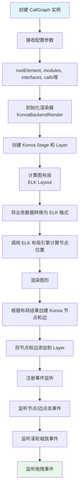
```mermaid
flowchart TD
    A[创建 CallGraph 实例] --> B[接收配置参数]
    B --> B1[rootElement, modules, interfaces, calls等]
    
    B1 --> C[初始化渲染器<br/>KonvaBackendRender]
    C --> C1[创建 Konva Stage 和 Layer]
    
    C1 --> D[计算图布局<br/>ELK Layout]
    D --> D1[将业务数据转换为 ELK 格式]
    D1 --> D2[调用 ELK 布局引擎计算节点位置]
    
    D2 --> E[渲染图形]
    E --> E1[根据布局结果创建 Konva 节点和边]
    E1 --> E2[将节点和边添加到 Layer]
    
    E2 --> F[注册事件监听]
    F --> F1[监听节点/边点击事件]
    F1 --> F2[监听滚轮缩放事件]
    F2 --> F3[监听拖拽事件]
    
    style A fill:#e1f5ff
    style F3 fill:#e8f5e9
```

### 3.2 数据流转

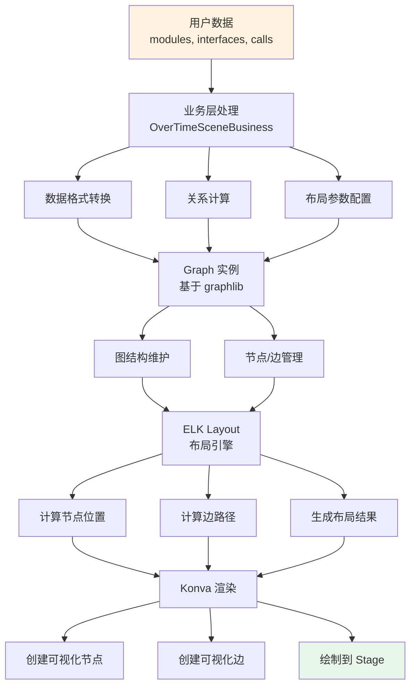
```mermaid
flowchart TD
    A[用户数据<br/>modules, interfaces, calls] --> B[业务层处理<br/>OverTimeSceneBusiness]
    
    B --> B1[数据格式转换]
    B --> B2[关系计算]
    B --> B3[布局参数配置]
    
    B1 --> C[Graph 实例<br/>基于 graphlib]
    B2 --> C
    B3 --> C
    
    C --> C1[图结构维护]
    C --> C2[节点/边管理]
    
    C1 --> D[ELK Layout<br/>布局引擎]
    C2 --> D
    
    D --> D1[计算节点位置]
    D --> D2[计算边路径]
    D --> D3[生成布局结果]
    
    D1 --> E[Konva 渲染]
    D2 --> E
    D3 --> E
    
    E --> E1[创建可视化节点]
    E --> E2[创建可视化边]
    E --> E3[绘制到 Stage]
    
    style A fill:#fff3e0
    style E3 fill:#e8f5e9
```

### 3.3 事件处理

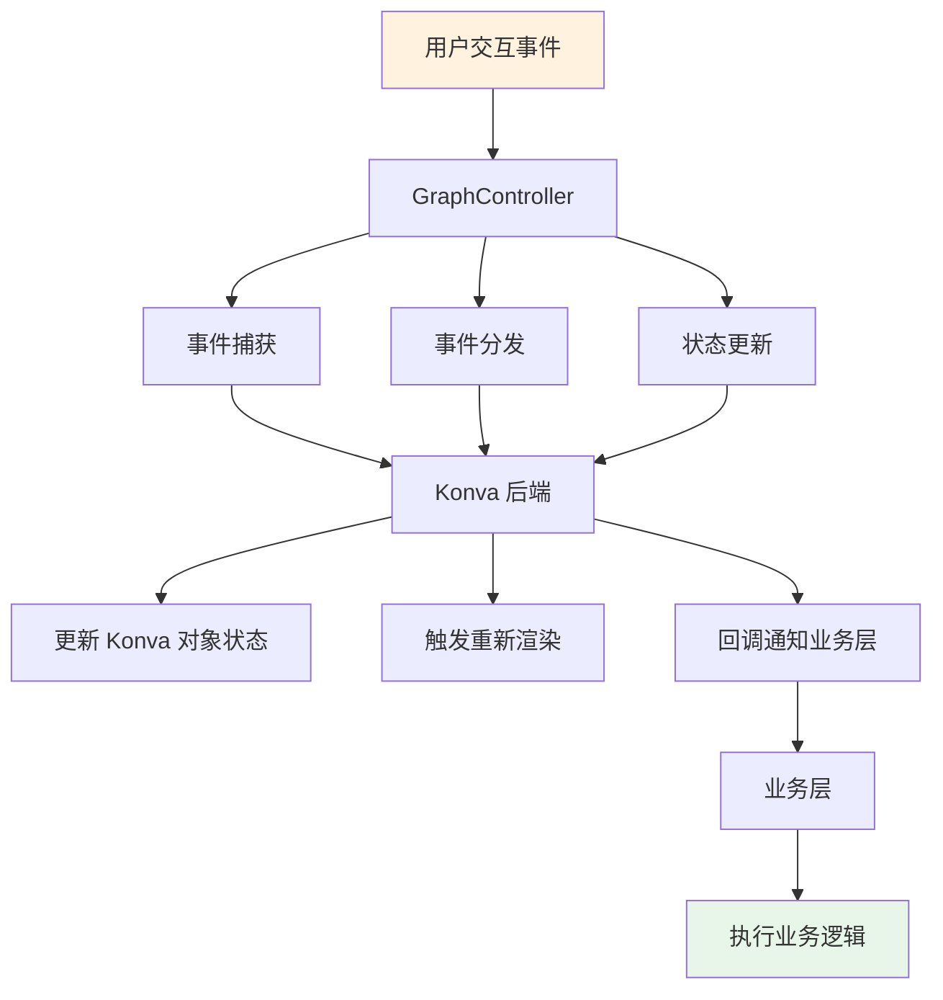
```mermaid
flowchart TD
    A[用户交互事件] --> B[GraphController]
    
    B --> B1[事件捕获]
    B --> B2[事件分发]
    B --> B3[状态更新]
    
    B1 --> C[Konva 后端]
    B2 --> C
    B3 --> C
    
    C --> C1[更新 Konva 对象状态]
    C --> C2[触发重新渲染]
    C --> C3[回调通知业务层]
    
    C3 --> D[业务层]
    D --> D1[执行业务逻辑]
    
    style A fill:#fff3e0
    style D1 fill:#e8f5e9
```

---

## 四、核心组件架构

### 4.1 架构分层

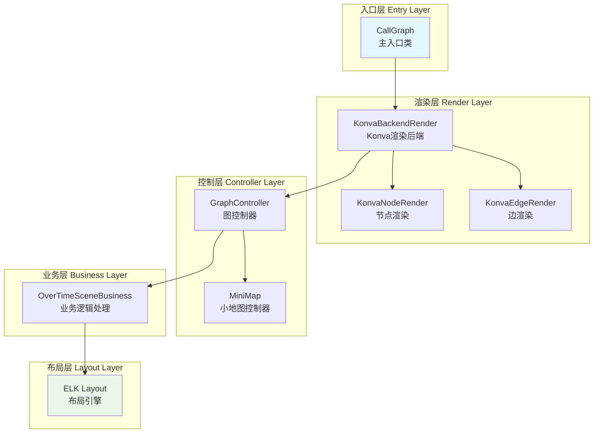
```mermaid
graph TB
    subgraph Layer1[入口层 Entry Layer]
        A[CallGraph<br/>主入口类]
    end
    
    subgraph Layer2[渲染层 Render Layer]
        B[KonvaBackendRender<br/>Konva渲染后端]
        B1[KonvaNodeRender<br/>节点渲染]
        B2[KonvaEdgeRender<br/>边渲染]
    end
    
    subgraph Layer3[控制层 Controller Layer]
        C[GraphController<br/>图控制器]
        C1[MiniMap<br/>小地图控制器]
    end
    
    subgraph Layer4[业务层 Business Layer]
        D[OverTimeSceneBusiness<br/>业务逻辑处理]
    end
    
    subgraph Layer5[布局层 Layout Layer]
        E[ELK Layout<br/>布局引擎]
    end
    
    A --> B
    B --> B1
    B --> B2
    B --> C
    C --> C1
    C --> D
    D --> E
    
    style A fill:#e1f5ff
    style E fill:#e8f5e9
```

### 4.2 核心类说明

| 类名 | 文件路径 | 职责 |
| ------ | --------- | ------ |
| `CallGraph` | `src/call-graph.ts` | 主入口类，协调各组件完成图的渲染 |
| `KonvaBackendRender` | `src/scene/call-graph/render/konva/index.ts` | Konva渲染后端，管理Stage和Layer |
| `GraphController` | `src/scene/call-graph/controller/graph.ts` | 图控制器，管理节点/边的交互 |
| `OverTimeSceneBusiness` | `src/scene/call-graph/business/over-time-scene-business.ts` | 业务逻辑处理，数据转换 |
| `MiniMap` | `src/scene/call-graph/render/konva/minimap/minimap.ts` | 小地图控制器 |
| `ELKLayout` | `src/scene/call-graph/layout/elk.ts` | ELK布局引擎封装 |

---

## 五、核心API接口

### 5.1 CallGraph 构造函数

```typescript
new CallGraph({
  rootElement: HTMLElement,           // 根容器元素
  modules: Module[],                  // 模块数组
  interfaces: Interface[],            // 接口数组
  calls: Call[],                      // 调用关系数组
  miniMapElement?: HTMLElement,       // 小地图容器（可选）
  sceneType?: 'module' | 'interface', // 场景类型
  config?: CallGraphConfig,           // 配置项
})
```

### 5.2 主要方法

| 方法名 | 参数 | 返回值 | 说明 |
| -------- | ------ | -------- | ------ |
| `render()` | - | `Promise<void>` | 渲染拓扑图 |
| `update()` | - | `Promise<void>` | 更新拓扑图（数据变更后） |
| `focusNode(nodeId)` | `string` | `void` | 聚焦到指定节点 |
| `highlightNode(nodeId)` | `string` | `void` | 高亮指定节点 |
| `resetView()` | - | `void` | 重置视图到初始状态 |
| `zoomIn()` | - | `void` | 放大视图 |
| `zoomOut()` | - | `void` | 缩小视图 |
| `getGraphData()` | - | `GraphData` | 获取当前图数据 |

---

## 六、数据结构

### 6.1 Module（模块）

```typescript
interface Module {
  id: string;              // 模块ID
  name: string;            // 模块名称
  type?: string;           // 模块类型
  metadata?: Record<string, any>;  // 元数据
}
```

### 6.2 Interface（接口）

```typescript
interface Interface {
  id: string;              // 接口ID
  name: string;            // 接口名称
  moduleId?: string;       // 所属模块ID
  signature?: string;      // 接口签名
  metadata?: Record<string, any>;  // 元数据
}
```

### 6.3 Call（调用关系）

```typescript
interface Call {
  id: string;              // 关系ID
  source: string;          // 源节点ID
  target: string;          // 目标节点ID
  type?: 'sync' | 'async'; // 调用类型
  metadata?: Record<string, any>;  // 元数据
}
```

---

## 七、技术栈与依赖

### 7.1 核心依赖

| 包名 | 版本 | 用途 |
| ------ | ------ | ------ |
| `konva` | latest | 2D Canvas渲染库 |
| `elkjs` | latest | 图布局算法 |
| `graphlib` | latest | 图数据结构 |
| `lodash` | latest | 工具函数库 |
| `typescript` | latest | 类型定义 |

### 7.2 架构特点

- **分层架构**：清晰的分层设计，易于维护和扩展
- **多渲染器支持**：支持切换不同的渲染后端（目前支持Konva）
- **类型安全**：完整的TypeScript类型定义
- **可配置性强**：支持丰富的配置项定制
- **事件驱动**：基于事件的交互机制

---

## 八、使用示例

### 8.1 基础使用

```typescript
// 准备数据
const modules = [
  { id: 'm1', name: '用户服务' },
  { id: 'm2', name: '订单服务' },
  { id: 'm3', name: '支付服务' },
];

const interfaces = [
  { id: 'i1', name: 'getUserInfo', moduleId: 'm1' },
  { id: 'i2', name: 'createOrder', moduleId: 'm2' },
  { id: 'i3', name: 'processPayment', moduleId: 'm3' },
];

const calls = [
  { id: 'c1', source: 'i1', target: 'i2' },
  { id: 'c2', source: 'i2', target: 'i3' },
];

// 创建拓扑图实例
const graph = new CallGraph({
  rootElement: document.getElementById('graph-container'),
  modules,
  interfaces,
  calls,
  sceneType: 'interface',
});

// 渲染拓扑图
await graph.render();

// 聚焦到指定节点
graph.focusNode('m2');
```

### 8.2 带小地图的完整示例

```html
<template>
  <div class="graph-container">
    <div id="graph-container" ref="graphRef"></div>
    <div id="minimap-container" ref="minimapRef"></div>
  </div>
</template>

<script setup lang="ts">
import { ref, onMounted } from 'vue';
import { CallGraph } from '@tencent/wxpay-topology-diagram-vue3';

const graphRef = ref<HTMLElement>();
const minimapRef = ref<HTMLElement>();

onMounted(async () => {
  const graph = new CallGraph({
    rootElement: graphRef.value!,
    modules: [...],
    interfaces: [...],
    calls: [...],
    miniMapElement: minimapRef.value!,
    sceneType: 'interface',
  });

  await graph.render();
});
</script>

<style scoped>
.graph-container {
  display: flex;
  position: relative;
}

#graph-container {
  width: 800px;
  height: 600px;
  border: 1px solid #ddd;
}

#minimap-container {
  width: 200px;
  height: 150px;
  border: 1px solid #ccc;
  position: absolute;
  right: 10px;
  top: 10px;
}
</style>
```

---

## 九、性能优化措施

### 9.1 渲染优化

- **虚拟化渲染**：只渲染可视区域内的节点和边
- **层级优化**：使用Konva的Layer机制，减少重绘范围
- **批量更新**：多个状态变更合并为一次渲染

### 9.2 布局优化

- **增量布局**：数据变更时只计算受影响的部分
- **布局缓存**：相同配置的布局结果缓存复用

### 9.3 交互优化

- **节流处理**：高频事件（如缩放）进行节流
- **懒加载**：Tooltip等延迟加载

---

## 十、扩展性说明

### 10.1 自定义节点渲染

可以通过继承 `KonvaNodeRender` 类实现自定义节点样式：

```typescript
class CustomNodeRender extends KonvaNodeRender {
  renderNode(node: Node): Konva.Group {
    // 自定义渲染逻辑
  }
}
```

### 10.2 自定义边渲染

可以通过继承 `KonvaEdgeRender` 类实现自定义边样式：

```typescript
class CustomEdgeRender extends KonvaEdgeRender {
  renderEdge(edge: Edge): Konva.Line {
    // 自定义渲染逻辑
  }
}
```

### 10.3 自定义布局

可以实现自定义的布局算法：

```typescript
class CustomLayout implements LayoutEngine {
  layout(graph: Graph): LayoutResult {
    // 自定义布局逻辑
  }
}
```

---

## 十一、注意事项

1. **数据一致性**：确保 `modules`、`interfaces`、`calls` 之间的引用关系正确
2. **ID唯一性**：所有节点ID必须唯一
3. **容器尺寸**：确保 `rootElement` 有明确的宽高
4. **性能考虑**：大规模图（节点数 > 1000）建议开启虚拟化渲染
5. **内存管理**：组件销毁时调用 `dispose()` 方法释放资源

## 节点与边构建流程详解

## 一、流程概述

拓扑图的构建过程采用**分层架构**，从用户数据到最终渲染经历了以下关键阶段：

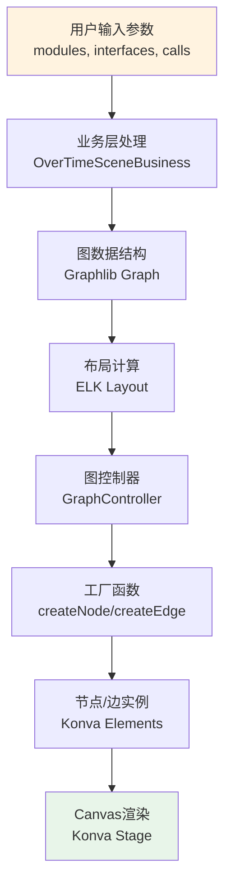
```mermaid
graph TB
    A[用户输入参数<br/>modules, interfaces, calls] --> B[业务层处理<br/>OverTimeSceneBusiness]
    B --> C[图数据结构<br/>Graphlib Graph]
    C --> D[布局计算<br/>ELK Layout]
    D --> E[图控制器<br/>GraphController]
    E --> F[工厂函数<br/>createNode/createEdge]
    F --> G[节点/边实例<br/>Konva Elements]
    G --> H[Canvas渲染<br/>Konva Stage]
    
    style A fill:#fff3e0
    style H fill:#e8f5e9
```

---

## 二、入口参数结构

### 2.1 完整参数列表

```typescript
interface CallGraphOptions {
  rootElement: HTMLElement;           // 根容器元素
  modules?: ModuleInterface[];        // 模块数组
  interfaces: ModuleInterfaceInterface[]; // 接口数组
  calls: ModuleInterfaceCallEdge[];   // 调用关系数组
  callGraphType: CallGraphEnum;       // 图类型
  showInterfaces?: boolean;           // 是否显示接口（默认true）
  miniMapElement?: HTMLElement;       // 小地图容器（可选）
}
```

### 2.2 数据类型定义

```typescript
// 模块定义
interface ModuleInterface {
  moduleName: string;                 // 模块名称
  boundaryName?: string;              // 所属边界名称
  showModuleBadge?: boolean;          // 是否显示徽章
  badgeCount?: number;                // 徽章数字
  backgroundColor?: string;           // 背景颜色
  enableTooltip?: boolean;            // 是否启用Tooltip
  data?: Record<string, any>;         // 自定义数据
}

// 接口定义
interface ModuleInterfaceInterface {
  moduleName: string;                 // 所属模块名称
  interfaceName: string;              // 接口名称
  inDegreeCounts?: number;            // 入度数量
  outDegreeCounts?: number;           // 出度数量
  backgroundColor?: string;           // 背景颜色
  badgeCount?: number;                // 徽章数字
  extentionData?: any[];              // 扩展数据
  contextMenu?: any[];                // 右键菜单
  data?: Record<string, any>;         // 自定义数据
}

// 调用关系定义
interface ModuleInterfaceCallEdge {
  id?: string;                        // 关系ID
  from: {
    moduleName: string;               // 源模块名称
    interfaceName?: string;           // 源接口名称
    idc?: string;                     // 数据中心标识
  };
  to: {
    moduleName: string;               // 目标模块名称
    interfaceName?: string;           // 目标接口名称
    idc?: string;                     // 数据中心标识
  };
  labels?: Array<{                    // 边标签
    text: string;
    width?: number;
    height?: number;
  }>;
  tooltip?: any;                      // Tooltip配置
  data?: Record<string, any>;         // 自定义数据
}
```

---

## 三、业务层处理流程

### 3.1 整体处理流程

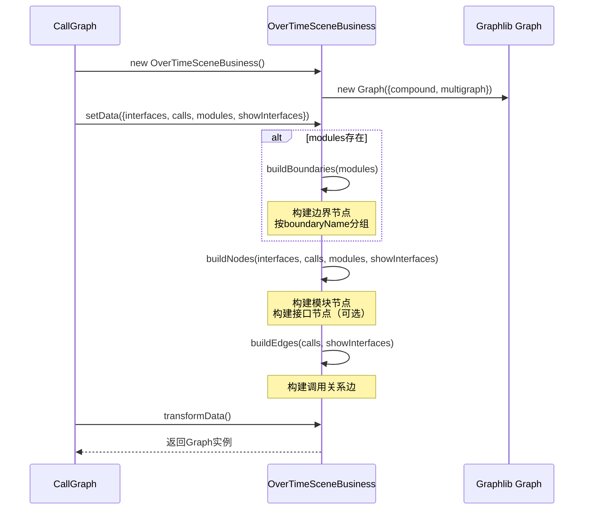
```mermaid
sequenceDiagram
    participant CG as CallGraph
    participant OTSB as OverTimeSceneBusiness
    participant Graph as Graphlib Graph
    
    CG->>OTSB: new OverTimeSceneBusiness()
    OTSB->>Graph: new Graph({compound, multigraph})
    
    CG->>OTSB: setData({interfaces, calls, modules, showInterfaces})
    
    alt modules存在
        OTSB->>OTSB: buildBoundaries(modules)
        Note over OTSB: 构建边界节点<br/>按boundaryName分组
    end
    
    OTSB->>OTSB: buildNodes(interfaces, calls, modules, showInterfaces)
    Note over OTSB: 构建模块节点<br/>构建接口节点（可选）
    
    OTSB->>OTSB: buildEdges(calls, showInterfaces)
    Note over OTSB: 构建调用关系边
    
    CG->>OTSB: transformData()
    OTSB-->>CG: 返回Graph实例
```

### 3.2 边界节点构建（buildBoundaries）

```mermaid
flowchart TD
    A[开始 buildBoundaries] --> B[按 boundaryName 分组模块]
    B --> C{遍历每个边界}
    
    C --> D[创建边界节点]
    D --> D1[id: boundary-{boundaryName}]
    D --> D2[type: boundary]
    D --> D3[layoutOptions: 边距配置]
    
    D1 --> E[设置边界节点到Graph]
    E --> F[遍历边界内的模块]
    F --> G[设置模块的父节点为边界]
    G --> C
    
    C --> H[结束]
    
    style A fill:#fff3e0
    style H fill:#e8f5e9
```

**代码实现**：

```typescript
public buildBoundaries(modules: ModuleInterface[]) {
  // 1. 按 boundaryName 分组
  const modulesGroupedByBoundary = _.groupBy(modules, 'boundaryName');

  // 2. 遍历每个边界
  _.keys(modulesGroupedByBoundary).forEach((boundaryKey) => {
    if (!boundaryKey || boundaryKey === 'undefined') return;

    const boundaryModules = modulesGroupedByBoundary[boundaryKey];
    const boundaryId = `boundary-${boundaryKey}`;

    // 3. 创建边界节点
    this.graph.setNode(boundaryId, {
      id: boundaryId,
      type: 'boundary',
      nodeData: { boundaryName: boundaryKey },
      layoutOptions: {
        'elk.partitioning.activate': true,
        ...DEFAULT_BOUNDARY_PADDING,
      },
    });

    // 4. 设置父子关系
    boundaryModules.forEach((boundaryModule) => {
      this.graph.setParent(boundaryModule.moduleName, boundaryId);
    });
  });
}
```

### 3.3 节点构建（buildNodes）

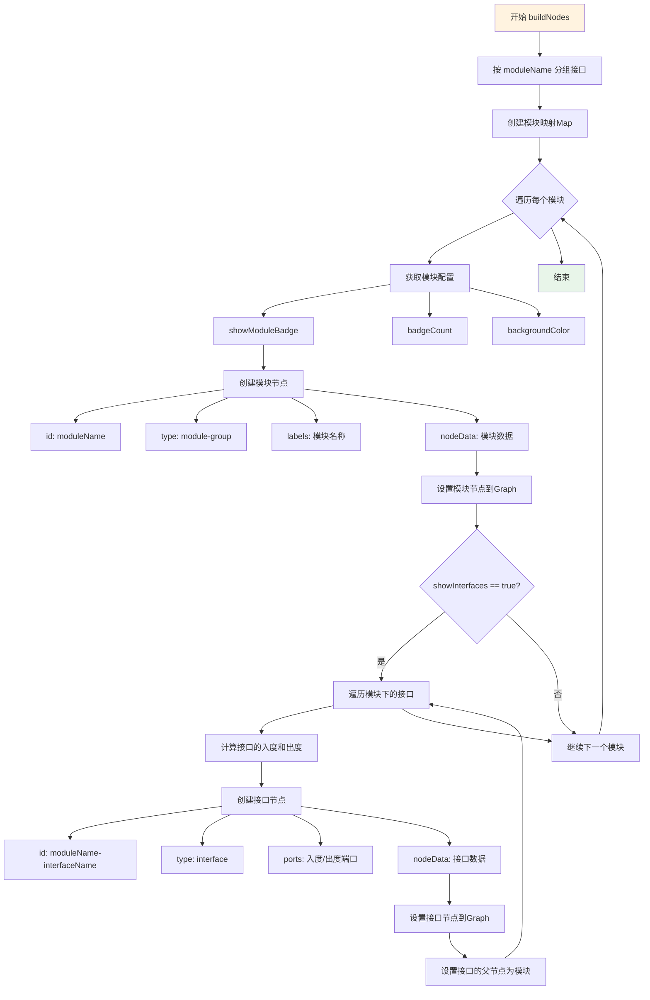
```mermaid
flowchart TD
    A[开始 buildNodes] --> B[按 moduleName 分组接口]
    B --> C[创建模块映射Map]
    
    C --> D{遍历每个模块}
    
    D --> E[获取模块配置]
    E --> E1[showModuleBadge]
    E --> E2[badgeCount]
    E --> E3[backgroundColor]
    
    E1 --> F[创建模块节点]
    F --> F1[id: moduleName]
    F --> F2[type: module-group]
    F --> F3[labels: 模块名称]
    F --> F4[nodeData: 模块数据]
    
    F4 --> G[设置模块节点到Graph]
    
    G --> H{showInterfaces == true?}
    
    H -->|是| I[遍历模块下的接口]
    I --> J[计算接口的入度和出度]
    J --> K[创建接口节点]
    
    K --> K1[id: moduleName-interfaceName]
    K --> K2[type: interface]
    K --> K3[ports: 入度/出度端口]
    K --> K4[nodeData: 接口数据]
    
    K4 --> L[设置接口节点到Graph]
    L --> M[设置接口的父节点为模块]
    M --> I
    
    I --> N[继续下一个模块]
    H -->|否| N
    
    N --> D
    D --> O[结束]
    
    style A fill:#fff3e0
    style O fill:#e8f5e9
```

**代码实现**：

```typescript
private buildNodes(
  interfacesGroupedByModule: _.Dictionary<ModuleInterfaceInterface[]>,
  calls: ModuleInterfaceCallEdge[],
  modules?: ModuleInterface[],
  showInterfaces: boolean = true,
) {
  const moduleMap = new Map<string, ModuleInterface>();
  if (modules) {
    modules.forEach((module) => {
      moduleMap.set(module.moduleName, module);
    });
  }

  // 1. 遍历每个模块
  _.keys(interfacesGroupedByModule).map((moduleName) => {
    const moduleData = moduleMap.get(moduleName);
    const showModuleBadge = moduleData?.showModuleBadge || false;
    const badgeCount = moduleData?.badgeCount || 0;
    const backgroundColor = moduleData?.backgroundColor;

    // 2. 创建模块节点
    const moduleNode = {
      type: 'module-group',
      id: moduleName,
      labels: [{ text: moduleName }],
      layoutOptions: {
        'elk.partitioning.activate': true,
        ...DEFAULT_INTERFACE_MODULE_PADDING,
      },
      nodeData: {
        moduleName,
        showModuleBadge,
        badgeCount,
        backgroundColor,
      },
      data: {
        ...moduleData?.data,
        enableTooltip: moduleData?.enableTooltip,
      },
      width: 180,
      height: 50,
    };

    this.graph.setNode(moduleName, moduleNode);

    // 3. 如果显示接口，创建接口节点
    if (showInterfaces) {
      interfacesGroupedByModule[moduleName].map((moduleInterface) => {
        const { moduleName, interfaceName } = moduleInterface;

        // 计算入度和出度
        const outCallEdges = calls.filter(call => 
          call.from.moduleName === moduleName && 
          call.from.interfaceName === interfaceName
        );
        const inCallEdges = calls.filter(call => 
          call.to.moduleName === moduleName && 
          call.to.interfaceName === interfaceName
        );

        const inCallIdcs = _.uniq(inCallEdges.map(call => call.to.idc));
        const outCallIdcs = _.uniq(outCallEdges.map(call => call.from.idc));

        const nodeId = `${moduleName}-${interfaceName}`;

        // 创建接口节点
        const childInterfaceNode = {
          type: 'interface',
          id: nodeId,
          labels: [{ text: interfaceName }],
          inIdcs: inCallIdcs,
          outIdcs: outCallIdcs,
          ports: [
            ...inCallIdcs.map(idc => ({
              id: `${nodeId}-in-${idc}`,
              width: 7,
              height: 7,
              labels: [{ text: idc, width: 40, height: 20 }],
              layoutOptions: { 'port.side': 'NORTH' },
            })),
            ...outCallIdcs.map(idc => ({
              id: `${nodeId}-out-${idc}`,
              width: 7,
              height: 7,
              labels: [{ text: idc, width: 40, height: 20 }],
              layoutOptions: { 'port.side': 'SOUTH' },
            })),
          ],
          layoutOptions: {
            'elk.partitioning.activate': true,
            portConstraints: 'FIXED_ORDER',
            ...DEFAULT_INTERFACE_PADDING,
          },
          nodeData: {
            moduleName,
            interfaceName,
            extentionData: moduleInterface.extentionData || [],
            contextMenu: moduleInterface.contextMenu || [],
            inDegreeCount: moduleInterface.inDegreeCounts,
            outDegreeCount: moduleInterface.outDegreeCounts,
            backgroundColor: moduleInterface.backgroundColor,
            badgeCount: moduleInterface.badgeCount,
          },
          data: moduleInterface.data || {},
          ...DEFAULT_INTERFACE_SIZE,
        };

        this.graph.setNode(nodeId, childInterfaceNode);
        this.graph.setParent(nodeId, moduleName);
      });
    }
  });
}
```

### 3.4 边构建（buildEdges）

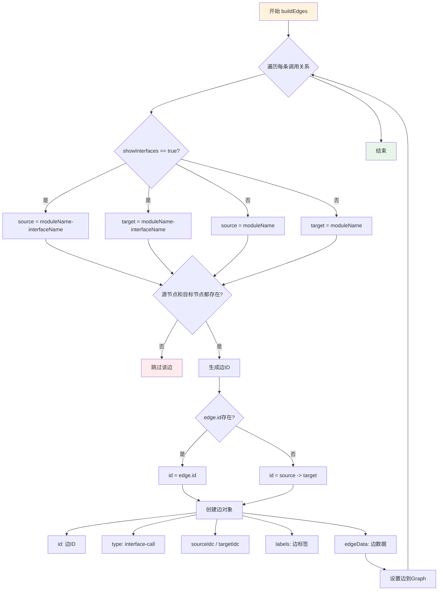
```mermaid
flowchart TD
    A[开始 buildEdges] --> B{遍历每条调用关系}
    
    B --> C{showInterfaces == true?}
    
    C -->|是| D[source = moduleName-interfaceName]
    C -->|是| E[target = moduleName-interfaceName]
    
    C -->|否| F[source = moduleName]
    C -->|否| G[target = moduleName]
    
    D --> H{源节点和目标节点都存在?}
    E --> H
    F --> H
    G --> H
    
    H -->|否| I[跳过该边]
    H -->|是| J[生成边ID]
    
    J --> J1{edge.id存在?}
    J1 -->|是| K[id = edge.id]
    J1 -->|否| L[id = source -> target]
    
    K --> M[创建边对象]
    L --> M
    
    M --> M1[id: 边ID]
    M --> M2[type: interface-call]
    M --> M3[sourceIdc / targetIdc]
    M --> M4[labels: 边标签]
    M --> M5[edgeData: 边数据]
    
    M5 --> N[设置边到Graph]
    N --> B
    
    B --> O[结束]
    
    style A fill:#fff3e0
    style O fill:#e8f5e9
    style I fill:#ffebee
```

**代码实现**：

```typescript
private buildEdges(calls: ModuleInterfaceCallEdge[], showInterfaces: boolean = true) {
  calls.forEach((edge) => {
    let source: string;
    let target: string;

    // 根据 showInterfaces 决定边的源和目标
    if (showInterfaces) {
      // 显示接口：使用接口节点 ID
      source = `${edge.from.moduleName}-${edge.from.interfaceName}`;
      target = `${edge.to.moduleName}-${edge.to.interfaceName}`;
    } else {
      // 不显示接口：使用模块节点 ID
      source = edge.from.moduleName;
      target = edge.to.moduleName;
    }

    // 如果边的源头和目标不存在，则放弃创建边
    if (!this.graph.hasNode(source)) return;
    if (!this.graph.hasNode(target)) return;

    // 生成边ID
    let id: string;
    if (edge.id) {
      id = edge.id;
    } else if (showInterfaces) {
      id = `${edge.from.moduleName}:${edge.from.interfaceName}->${edge.to.moduleName}:${edge.to.interfaceName}`;
    } else {
      id = `${edge.from.moduleName}->${edge.to.moduleName}`;
    }

    // 设置边
    this.graph.setEdge(source, target, {
      id,
      type: 'interface-call',
      source,
      target,
      sourceIdc: edge.from.idc || '',
      targetIdc: edge.to.idc || '',
      labels: edge.labels?.map(label => ({
        text: label.text,
        width: label.width || DEFAULT_LABEL_WIDTH,
        height: label.height || DEFAULT_LABEL_HEIGHT,
      })),
      data: edge.data || {},
      edgeData: {
        id: edge.id,
        tooltip: edge.tooltip,
        srcModuleName: edge.from.moduleName,
        srcInterfaceName: edge.from.interfaceName,
        dstModuleName: edge.to.moduleName,
        dstInterfaceName: edge.to.interfaceName,
      },
    }, id);
  });
}
```

---

## 四、图数据结构

### 4.1 Graphlib Graph 结构

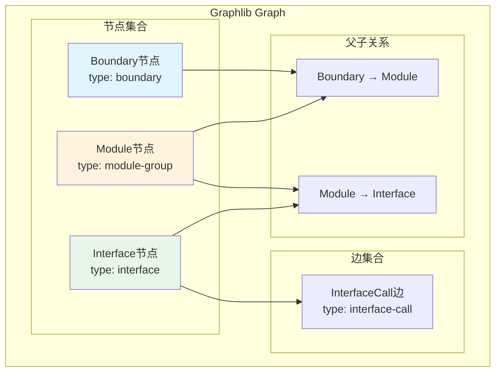
```mermaid
graph TB
    subgraph Graph[Graphlib Graph]
        subgraph Nodes[节点集合]
            B1[Boundary节点<br/>type: boundary]
            B2[Module节点<br/>type: module-group]
            B3[Interface节点<br/>type: interface]
        end
        
        subgraph Edges[边集合]
            E1[InterfaceCall边<br/>type: interface-call]
        end
        
        subgraph ParentChild[父子关系]
            P1[Boundary → Module]
            P2[Module → Interface]
        end
    end
    
    B1 --> P1
    B2 --> P1
    B2 --> P2
    B3 --> P2
    B3 --> E1
    
    style B1 fill:#e1f5ff
    style B2 fill:#fff3e0
    style B3 fill:#e8f5e9
```

### 4.2 节点数据结构

```typescript
// 节点通用结构
interface GraphNode {
  id: string;                         // 节点ID
  type: string;                       // 节点类型
  labels?: Array<{ text: string }>;   // 标签
  layoutOptions?: object;             // 布局选项
  nodeData?: object;                  // 节点数据
  data?: object;                      // 自定义数据
  width?: number;                     // 宽度
  height?: number;                    // 高度
  ports?: Port[];                     // 端口（接口节点）
  children?: GraphNode[];             // 子节点（树形结构）
}

// 边数据结构
interface GraphEdge {
  id: string;                         // 边ID
  type: string;                       // 边类型
  source: string;                     // 源节点ID
  target: string;                     // 目标节点ID
  sourceIdc?: string;                 // 源数据中心
  targetIdc?: string;                 // 目标数据中心
  labels?: Label[];                   // 边标签
  data?: object;                      // 自定义数据
  edgeData?: object;                  // 边元数据
  layout?: {                          // 布局信息（ELK计算后）
    points: number[];                 // 路径点
    labels: Label[];                  // 标签位置
  };
}
```

---

## 五、布局计算流程

### 5.1 ELK布局计算

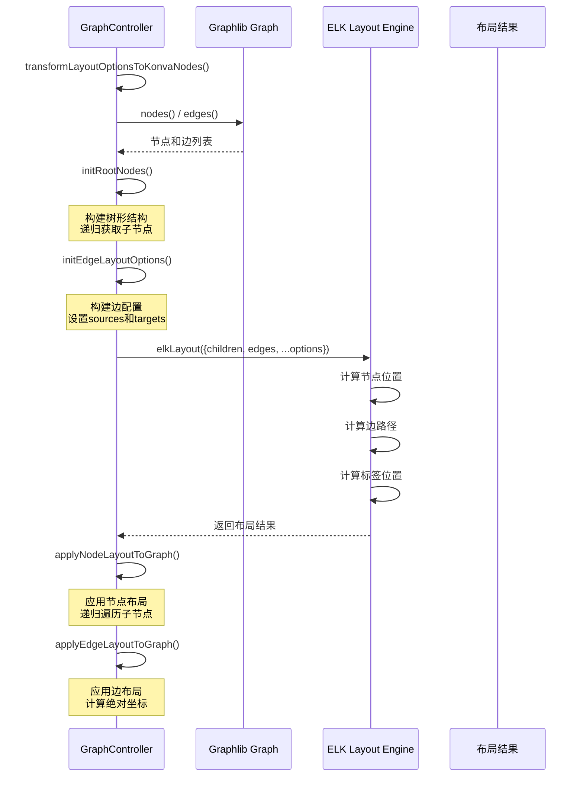
```mermaid
sequenceDiagram
    participant GC as GraphController
    participant G as Graphlib Graph
    participant ELK as ELK Layout Engine
    participant Result as 布局结果
    
    GC->>GC: transformLayoutOptionsToKonvaNodes()
    
    GC->>G: nodes() / edges()
    G-->>GC: 节点和边列表
    
    GC->>GC: initRootNodes()
    Note over GC: 构建树形结构<br/>递归获取子节点
    
    GC->>GC: initEdgeLayoutOptions()
    Note over GC: 构建边配置<br/>设置sources和targets
    
    GC->>ELK: elkLayout({children, edges, ...options})
    ELK->>ELK: 计算节点位置
    ELK->>ELK: 计算边路径
    ELK->>ELK: 计算标签位置
    
    ELK-->>GC: 返回布局结果
    
    GC->>GC: applyNodeLayoutToGraph()
    Note over GC: 应用节点布局<br/>递归遍历子节点
    
    GC->>GC: applyEdgeLayoutToGraph()
    Note over GC: 应用边布局<br/>计算绝对坐标
```

### 5.2 布局结果应用

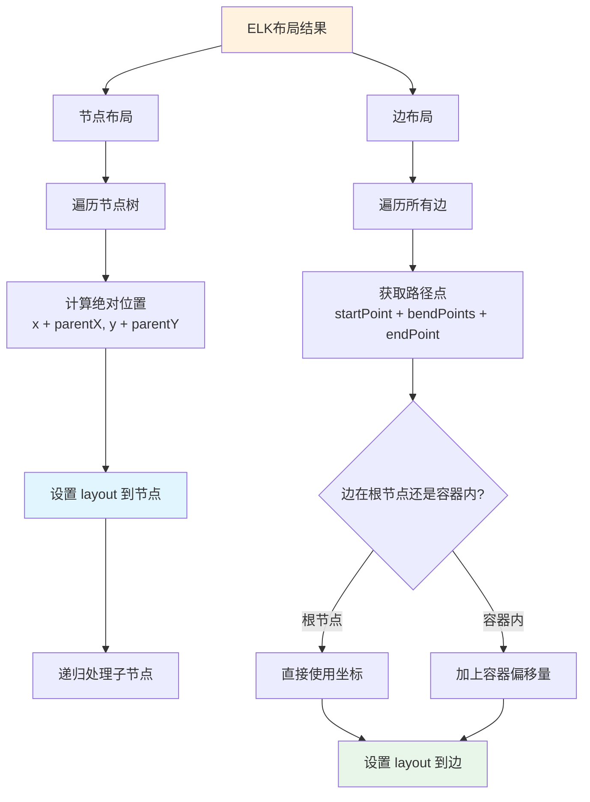
```mermaid
flowchart TD
    A[ELK布局结果] --> B[节点布局]
    A --> C[边布局]
    
    B --> B1[遍历节点树]
    B1 --> B2[计算绝对位置<br/>x + parentX, y + parentY]
    B2 --> B3[设置 layout 到节点]
    B3 --> B4[递归处理子节点]
    
    C --> C1[遍历所有边]
    C1 --> C2[获取路径点<br/>startPoint + bendPoints + endPoint]
    C2 --> C3{边在根节点还是容器内?}
    
    C3 -->|根节点| C4[直接使用坐标]
    C3 -->|容器内| C5[加上容器偏移量]
    
    C4 --> C6[设置 layout 到边]
    C5 --> C6
    
    style A fill:#fff3e0
    style B3 fill:#e1f5ff
    style C6 fill:#e8f5e9
```

---

## 六、渲染流程

### 6.1 整体渲染流程

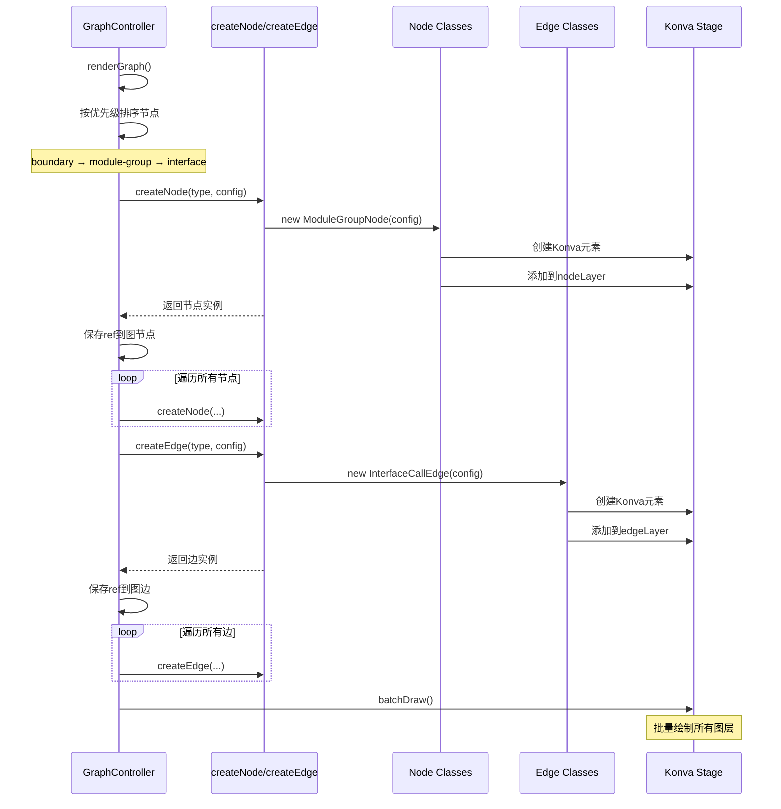
```mermaid
sequenceDiagram
    participant GC as GraphController
    participant Factory as createNode/createEdge
    participant Node as Node Classes
    participant Edge as Edge Classes
    participant Konva as Konva Stage
    
    GC->>GC: renderGraph()
    
    GC->>GC: 按优先级排序节点
    Note over GC: boundary → module-group → interface
    
    GC->>Factory: createNode(type, config)
    Factory->>Node: new ModuleGroupNode(config)
    Node->>Konva: 创建Konva元素
    Node->>Konva: 添加到nodeLayer
    
    Factory-->>GC: 返回节点实例
    GC->>GC: 保存ref到图节点
    
    loop 遍历所有节点
        GC->>Factory: createNode(...)
    end
    
    GC->>Factory: createEdge(type, config)
    Factory->>Edge: new InterfaceCallEdge(config)
    Edge->>Konva: 创建Konva元素
    Edge->>Konva: 添加到edgeLayer
    
    Factory-->>GC: 返回边实例
    GC->>GC: 保存ref到图边
    
    loop 遍历所有边
        GC->>Factory: createEdge(...)
    end
    
    GC->>Konva: batchDraw()
    Note over Konva: 批量绘制所有图层
```

### 6.2 工厂函数

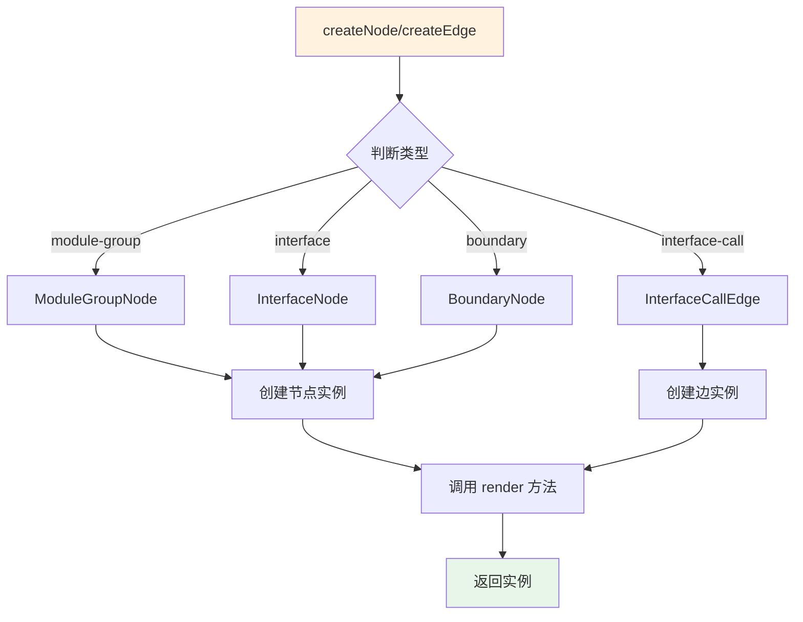
```mermaid
flowchart TD
    A[createNode/createEdge] --> B{判断类型}
    
    B -->|module-group| C[ModuleGroupNode]
    B -->|interface| D[InterfaceNode]
    B -->|boundary| E[BoundaryNode]
    B -->|interface-call| F[InterfaceCallEdge]
    
    C --> G[创建节点实例]
    D --> G
    E --> G
    F --> H[创建边实例]
    
    G --> I[调用 render 方法]
    H --> I
    
    I --> J[返回实例]
    
    style A fill:#fff3e0
    style J fill:#e8f5e9
```

**工厂函数实现**：

```typescript
// 节点类型映射
export const NODE_FACTORY_REF_MAP = {
  'module-group': ModuleGroupNode,
  'interface': InterfaceNode,
  'boundary': BoundaryNode,
};

// 边类型映射
export const EDGE_FACTORY_REF_MAP = {
  'interface-call': InterfaceCallEdge,
};

// 节点渲染优先级（越早出现越优先渲染）
export const NODE_RENDER_PRIORITY = [
  'boundary',      // 边界节点最先渲染
  'module-group',  // 模块节点其次
  'interface',     // 接口节点最后
];

// 节点工厂函数
export const createNode = (type: string, config: NodeFactoryConfig) => 
  new NODE_FACTORY_REF_MAP[type](config);

// 边工厂函数
export const createEdge = (type: string, config: EdgeFactoryConfig) => 
  new EDGE_FACTORY_REF_MAP[type](config);
```

---

## 七、节点渲染详解

### 7.1 ModuleGroupNode 渲染流程

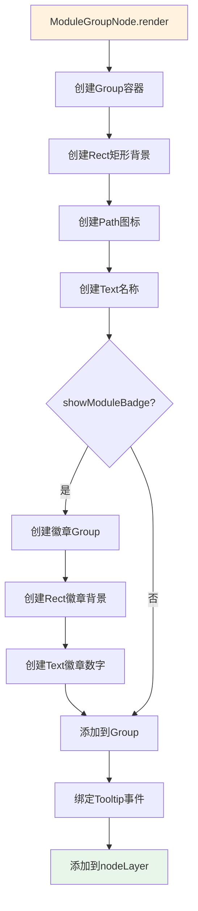
```mermaid
flowchart TD
    A[ModuleGroupNode.render] --> B[创建Group容器]
    B --> C[创建Rect矩形背景]
    C --> D[创建Path图标]
    D --> E[创建Text名称]
    
    E --> F{showModuleBadge?}
    F -->|是| G[创建徽章Group]
    G --> G1[创建Rect徽章背景]
    G1 --> G2[创建Text徽章数字]
    G2 --> H[添加到Group]
    
    F -->|否| H
    
    H --> I[绑定Tooltip事件]
    I --> J[添加到nodeLayer]
    
    style A fill:#fff3e0
    style J fill:#e8f5e9
```

**关键配置**：

```typescript
// 模块节点配置
public get moduleWrapperNodeConfig() {
  const fillColor = this.customBackgroundColor || '#f5f6fa';

  return {
    x: this.x,
    y: this.y,
    width: this.width,
    height: this.height,
    fill: fillColor,          // 背景色
    stroke: '#5F95FF',        // 边框色
    strokeWidth: 1,
    name: 'module-node',
    perfectDrawEnabled: false,
  };
}

// 徽章配置
public badgeFactory() {
  const badgeText = String(this.badgeCount);
  const isLongText = badgeText.length > 2;
  const badgeWidth = isLongText ? 24 : 18;
  const badgeHeight = 18;

  const badge = new Konva.Rect({
    x: -badgeWidth / 2,
    y: -badgeHeight / 2,
    width: badgeWidth,
    height: badgeHeight,
    cornerRadius: badgeHeight / 2,  // 圆角
    fill: '#FF4D4F',                // 红色
    name: 'module-node__badge-bg',
  });

  const text = new Konva.Text({
    text: badgeText,
    fontSize: 12,
    fill: '#FFFFFF',
    align: 'center',
    verticalAlign: 'middle',
  });
}
```

### 7.2 InterfaceNode 渲染流程

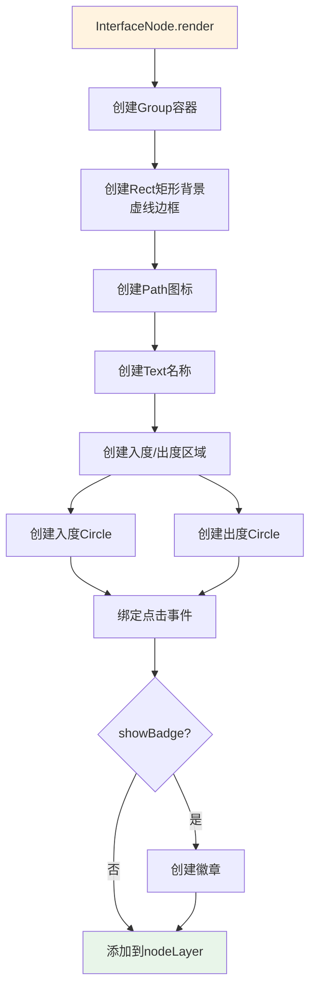
```mermaid
flowchart TD
    A[InterfaceNode.render] --> B[创建Group容器]
    B --> C[创建Rect矩形背景<br/>虚线边框]
    C --> D[创建Path图标]
    D --> E[创建Text名称]
    
    E --> F[创建入度/出度区域]
    F --> F1[创建入度Circle]
    F --> F2[创建出度Circle]
    
    F1 --> G[绑定点击事件]
    F2 --> G
    
    G --> H{showBadge?}
    H -->|是| I[创建徽章]
    H -->|否| J[添加到nodeLayer]
    
    I --> J
    
    style A fill:#fff3e0
    style J fill:#e8f5e9
```

### 7.3 BoundaryNode 渲染流程

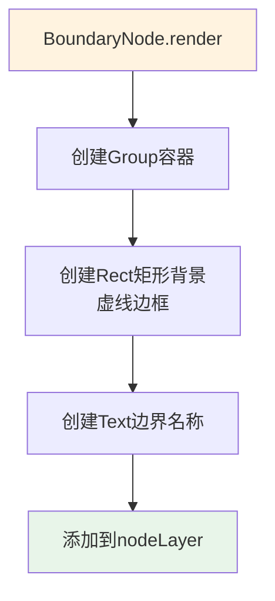
```mermaid
flowchart TD
    A[BoundaryNode.render] --> B[创建Group容器]
    B --> C[创建Rect矩形背景<br/>虚线边框]
    C --> D[创建Text边界名称]
    D --> E[添加到nodeLayer]
    
    style A fill:#fff3e0
    style E fill:#e8f5e9
```

---

## 八、边渲染详解

### 8.1 InterfaceCallEdge 渲染流程

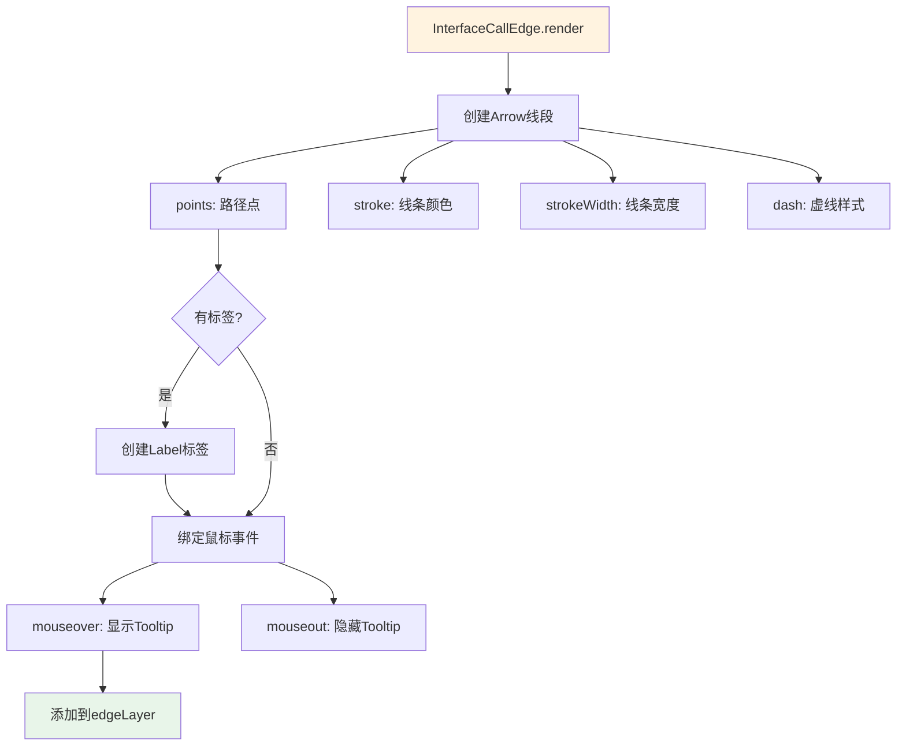
```mermaid
flowchart TD
    A[InterfaceCallEdge.render] --> B[创建Arrow线段]
    B --> B1[points: 路径点]
    B --> B2[stroke: 线条颜色]
    B --> B3[strokeWidth: 线条宽度]
    B --> B4[dash: 虚线样式]
    
    B1 --> C{有标签?}
    C -->|是| D[创建Label标签]
    D --> E[绑定鼠标事件]
    C -->|否| E
    
    E --> E1[mouseover: 显示Tooltip]
    E --> E2[mouseout: 隐藏Tooltip]
    
    E1 --> F[添加到edgeLayer]
    
    style A fill:#fff3e0
    style F fill:#e8f5e9
```

**关键配置**：

```typescript
public get arrorLineConfig() {
  const isBridged = this.data?.isBridged || false;

  return {
    points: this.points,           // ELK计算的路径点
    pointerAtEnding: true,         // 显示箭头
    stroke: '#A2B1C3',             // 默认灰色
    strokeWidth: 2,
    fill: '#A2B1C3',
    name: 'interface-call-edge',
    // 桥接边使用虚线
    dash: isBridged ? [5, 5] : undefined,
  };
}
```

---

## 九、完整流程总览

### 9.1 从参数到渲染的完整链路

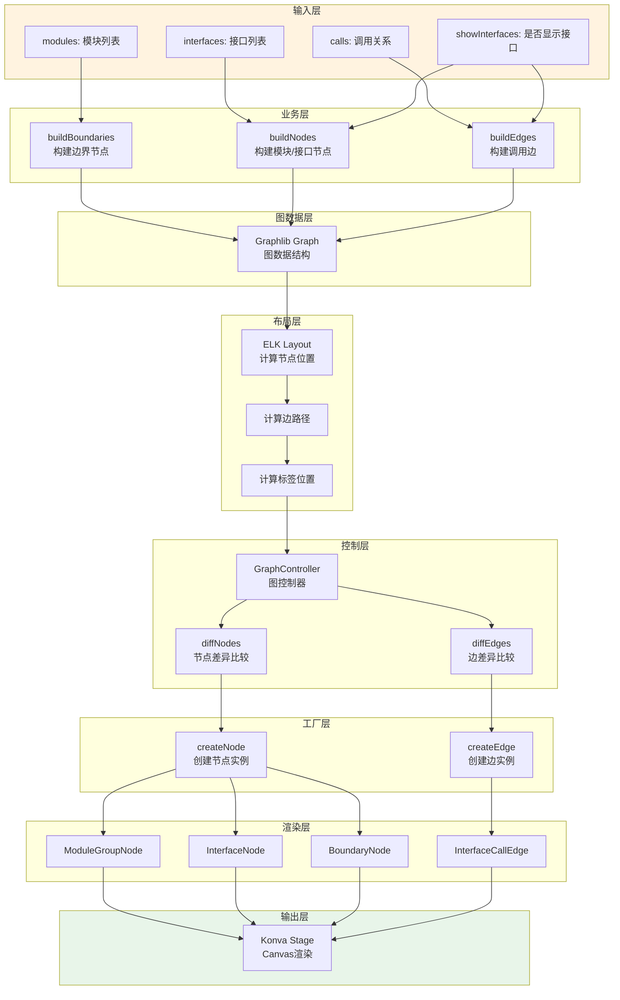
```mermaid
graph TB
    subgraph Input[输入层]
        A1[modules: 模块列表]
        A2[interfaces: 接口列表]
        A3[calls: 调用关系]
        A4[showInterfaces: 是否显示接口]
    end
    
    subgraph Business[业务层]
        B1[buildBoundaries<br/>构建边界节点]
        B2[buildNodes<br/>构建模块/接口节点]
        B3[buildEdges<br/>构建调用边]
    end
    
    subgraph Graph[图数据层]
        C1[Graphlib Graph<br/>图数据结构]
    end
    
    subgraph Layout[布局层]
        D1[ELK Layout<br/>计算节点位置]
        D2[计算边路径]
        D3[计算标签位置]
    end
    
    subgraph Controller[控制层]
        E1[GraphController<br/>图控制器]
        E2[diffNodes<br/>节点差异比较]
        E3[diffEdges<br/>边差异比较]
    end
    
    subgraph Factory[工厂层]
        F1[createNode<br/>创建节点实例]
        F2[createEdge<br/>创建边实例]
    end
    
    subgraph Render[渲染层]
        G1[ModuleGroupNode]
        G2[InterfaceNode]
        G3[BoundaryNode]
        G4[InterfaceCallEdge]
    end
    
    subgraph Output[输出层]
        H1[Konva Stage<br/>Canvas渲染]
    end
    
    A1 --> B1
    A2 --> B2
    A3 --> B3
    A4 --> B2
    A4 --> B3
    
    B1 --> C1
    B2 --> C1
    B3 --> C1
    
    C1 --> D1
    D1 --> D2
    D2 --> D3
    
    D3 --> E1
    E1 --> E2
    E1 --> E3
    
    E2 --> F1
    E3 --> F2
    
    F1 --> G1
    F1 --> G2
    F1 --> G3
    F2 --> G4
    
    G1 --> H1
    G2 --> H1
    G3 --> H1
    G4 --> H1
    
    style Input fill:#fff3e0
    style Output fill:#e8f5e9
```

### 9.2 核心类职责

| 类名 | 文件路径 | 核心职责 |
|------|---------|---------|
| `CallGraph` | `src/scene/call-graph/index.ts` | 主入口类，协调各层完成渲染 |
| `OverTimeSceneBusiness` | `src/scene/call-graph/business/overtime/index.ts` | 业务逻辑处理，数据转换 |
| `GraphController` | `src/scene/call-graph/render/konva/graph.ts` | 图控制器，管理节点/边的渲染和交互 |
| `createNode` | `src/scene/call-graph/render/konva/factory.ts` | 节点工厂函数 |
| `createEdge` | `src/scene/call-graph/render/konva/factory.ts` | 边工厂函数 |
| `ModuleGroupNode` | `src/scene/call-graph/render/konva/nodes/module-group.ts` | 模块节点渲染 |
| `InterfaceNode` | `src/scene/call-graph/render/konva/nodes/interface-node.ts` | 接口节点渲染 |
| `BoundaryNode` | `src/scene/call-graph/render/konva/nodes/boundary-node.ts` | 边界节点渲染 |
| `InterfaceCallEdge` | `src/scene/call-graph/render/konva/edges/interface-call.ts` | 调用边渲染 |

---

## 十、关键设计要点

### 10.1 分层架构优势

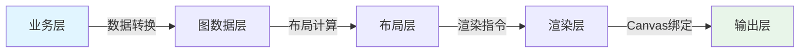
```mermaid
graph LR
    A[业务层] -->|数据转换| B[图数据层]
    B -->|布局计算| C[布局层]
    C -->|渲染指令| D[渲染层]
    D -->|Canvas绑定| E[输出层]
    
    style A fill:#e1f5ff
    style E fill:#e8f5e9
```

**优势说明**：

1. **解耦合**：业务逻辑与渲染逻辑分离
2. **可扩展**：支持多种渲染后端（Konva、X6等）
3. **可维护**：清晰的职责划分，易于定位问题
4. **可测试**：每层可独立测试

### 10.2 工厂模式应用

```typescript
// 类型映射表
NODE_FACTORY_REF_MAP = {
  'module-group': ModuleGroupNode,
  'interface': InterfaceNode,
  'boundary': BoundaryNode,
}

// 工厂函数
createNode(type, config) {
  return new NODE_FACTORY_REF_MAP[type](config);
}
```

**优势**：

- 统一的创建接口
- 易于扩展新节点类型
- 支持动态注册

### 10.3 Diff更新机制

```mermaid
flowchart LR
    A[旧Graph] --> B{Diff比较}
    C[新Graph] --> B
    
    B --> D[交集节点<br/>更新属性]
    B --> E[新增节点<br/>创建实例]
    B --> F[删除节点<br/>销毁实例]
    
    D --> G[重新渲染]
    E --> G
    F --> G
    
    style B fill:#fff3e0
    style G fill:#e8f5e9
```

**实现逻辑**：

```typescript
// 节点Diff
const nodesIntersection = _.intersection(sourceNodes, targetNodes);
const nodesNotInSource = _.xor(targetNodes, nodesIntersection);
const nodesNotInTarget = _.xor(sourceNodes, nodesIntersection);

// 新增节点
nodesNotInSource.forEach(nodeId => {
  sourceGraph.setNode(nodeId, targetGraph.node(nodeId));
});

// 删除节点
nodesNotInTarget.forEach(nodeId => {
  const node = sourceGraph.node(nodeId);
  node.ref?.dispose();  // 销毁Konva实例
  sourceGraph.removeNode(nodeId);
});

// 更新节点
nodesIntersection.forEach(nodeId => {
  const sourceNode = sourceGraph.node(nodeId);
  const targetNode = targetGraph.node(nodeId);
  sourceNode.ref?.update(targetNode);  // 更新属性
});
```

---

## 十一、总结

### 11.1 构建流程总结

1. **数据输入**：接收 modules、interfaces、calls 等参数
2. **业务处理**：
   - 构建边界节点（按 boundaryName 分组）
   - 构建模块节点和接口节点（根据 showInterfaces 参数）
   - 构建调用关系边
3. **图结构**：使用 Graphlib 存储节点和边的图结构
4. **布局计算**：使用 ELK 计算节点位置和边路径
5. **渲染**：
   - 工厂函数创建节点/边实例
   - 节点/边实例创建 Konva 元素
   - 添加到对应的 Layer
   - 批量绘制

### 11.2 核心技术点

- **图数据结构**：Graphlib（支持复合图、多重图）
- **布局算法**：ELK（Eclipse Layout Kernel）
- **渲染引擎**：Konva（2D Canvas 渲染库）
- **设计模式**：工厂模式、观察者模式
- **优化策略**：Diff更新、批量渲染、虚拟化渲染

## 小地图（MiniMap）实现详解

## 一、小地图概述

小地图是拓扑图可视化中的重要辅助工具，它提供了一个全局视图的缩略图，帮助用户快速了解整体布局并进行导航。

### 核心功能

- ✅ 显示拓扑图的整体缩略图
- ✅ 显示当前视口位置（游标窗口）
- ✅ 通过小地图快速定位到指定位置
- ✅ 拖拽游标窗口同步更新主图视口
- ✅ 主图缩放/拖拽时自动同步游标窗口位置和大小

---

## 二、实现原理

### 2.1 整体架构

```mermaid
graph TB
    subgraph UserLayer[用户交互层]
        A[用户操作主图]
        B[用户操作小地图]
    end
    
    subgraph KonvaLayer[Konva渲染层]
        C[KonvaBackendRender<br/>渲染器后端]
        D[graphStage<br/>主画布Stage]
    end
    
    subgraph MiniMapLayer[MiniMap层]
        E[MiniMap<br/>小地图核心类]
        F[wrapper<br/>容器DOM]
        G[imageDomElement<br/>缩略图图片]
        H[cursorWindow<br/>游标窗口]
    end
    
    subgraph SyncLayer[数据同步]
        I[Stage事件监听]
        J[DOM事件监听]
    end
    
    A --> I
    B --> J
    C --> E
    D --> E
    I --> E
    J --> E
    E --> H
    E --> G
    H --> D
    
    style A fill:#fff3e0
    style B fill:#fff3e0
    style E fill:#e1f5ff
    style H fill:#e8f5e9
```

### 2.2 核心设计思路

**1. 双图联动机制**

- 主图使用 Konva Stage 渲染（高性能）
- 小地图使用静态图片（缩略图）
- 通过计算比例关系实现坐标同步

**2. 视口映射算法**

- 计算视图缩放比例：`viewScale = graphSize.width / containerSize.width`
- 游标窗口大小 = 主图视口大小 / viewScale
- 游标窗口位置 = -主图位置 / viewScale

**3. 双向同步**

- 主图变化 → 监听Stage事件 → 更新游标窗口
- 小地图操作 → 监听DOM事件 → 更新主图Stage位置

---

## 三、核心代码实现

### 3.1 MiniMap 类结构

```typescript
/**
 * 图片小地图，用于承载架构图的渲染快速探索
 */
export class MiniMap {
  // DOM 元素
  public wrapper: HTMLElement;              // 容器
  public cursorWindow: HTMLElement;         // 游标窗口
  public resizePointer: HTMLElement;        // 缩放点（预留）
  
  // 图片元素
  public targetDomElement: HTMLElement;     // 目标容器
  public imageDomElement: HTMLImageElement; // 缩略图图片
  public dragEleImgElement: HTMLImageElement; // 拖拽空图片
  
  // Konva Stage 引用
  public graphStage: Stage;                 // 主图Stage
  
  // 尺寸信息
  public graphSize: { width: number; height: number };        // 主图总尺寸
  public containerSize: { width: number; height: number };    // 小地图容器尺寸
  public viewWindowSize: { width: number; height: number };   // 主图视口尺寸
  public viewWindowPosition: { x: number; y: number };        // 主图视口位置
  
  // 状态
  public isCursorOnDrag = false;            // 游标是否在拖拽中
  public dragStartPosition = { x: 0, y: 0 }; // 拖拽起始位置
  
  // 计算属性
  public get viewScale() {
    return this.graphSize.width / this.containerSize.width || 1;
  }
  
  public get cursorViewWindowActualSize() {
    return {
      width: this.viewWindowSize.width / this.viewScale,
      height: this.viewWindowSize.height / this.viewScale,
    };
  }
  
  public get cursorViewWindowActualPosition() {
    return {
      x: this.viewWindowPosition.x / this.viewScale,
      y: this.viewWindowPosition.y / this.viewScale,
    };
  }
}
```

### 3.2 初始化流程

```mermaid
sequenceDiagram
    participant Client as 调用方
    participant Render as KonvaBackendRender
    participant MiniMap as MiniMap
    participant Stage as graphStage
    participant DOM as DOM
    
    Client->>Render: renderMiniMap(targetDomElement)
    Render->>Render: 构建miniMapOptions
    Render->>MiniMap: new MiniMap(options)
    
    MiniMap->>DOM: getBoundingClientRect()
    DOM-->>MiniMap: containerSize
    
    MiniMap->>MiniMap: mountDom()
    Note over MiniMap: 创建DOM结构<br/>wrapper, image, cursorWindow
    MiniMap->>DOM: appendChild()
    
    MiniMap->>MiniMap: listenDragEvent()
    Note over MiniMap: 监听Stage事件<br/>监听DOM事件
    
    Render->>MiniMap: updateMiniMapPreview()
    MiniMap->>Stage: clone()
    MiniMap->>Stage: toDataURL()
    Stage-->>MiniMap: url
    MiniMap->>DOM: imageDomElement.src = url
    
    MiniMap->>MiniMap: initCursorWindowPosition()
```

### 3.3 DOM结构

```html
<div class="architecture-graph-minimap" style="width: 100%; height: 100%;">
  <!-- 缩略图图片 -->
  
  
  <!-- 游标窗口 -->
  <div class="architecture-graph-minimap-cursor-window" draggable="true">
    <!-- 缩放点（预留） -->
    <div class="architecture-graph-minimap-cursor-resize-pointer"></div>
    
    <!-- 拖拽空图片（用于隐藏默认拖拽图标） -->
    
  </div>
</div>
```

### 3.4 核心方法实现

#### 3.4.1 渲染缩略图

```typescript
/**
 * 更新小地图预览
 * 核心思路：克隆Stage并导出为图片
 */
public updateMiniMapPreview() {
  if (!this.targetDomElement) {
    return;
  }

  // 1. 计算缩放比例（将大图缩放到小地图容器大小）
  const scale: number = this.containerSize.width / this.graphSize.width;

  // 2. 克隆Stage（不监听事件）
  const clonedGraphStage = this.graphStage.clone({ listen: false });

  // 3. 重置位置为原点
  clonedGraphStage.position({ x: 0, y: 0 });

  // 4. 设置实际尺寸
  clonedGraphStage.size({
    width: this.graphSize.width,
    height: this.graphSize.height,
  });

  // 5. 导出为DataURL（通过pixelRatio控制导出质量）
  const url = clonedGraphStage.toDataURL({
    pixelRatio: scale,
  });

  // 6. 设置图片src
  this.imageDomElement.setAttribute('src', url);

  // 7. 初始化游标窗口位置和大小
  this.initCursorWindowPosition();
}
```

**关键点说明**：

- 使用 `clone()` 复制Stage，避免影响主图
- 通过 `pixelRatio` 参数控制导出图片的分辨率
- 导出图片后立即初始化游标窗口

#### 3.4.2 初始化游标窗口

```typescript
/**
 * 初始化游标窗口的位置和大小
 */
public initCursorWindowPosition = () => {
  // 1. 获取主图视口尺寸（考虑缩放）
  this.getViewWindowSize();
  
  // 2. 获取主图视口位置（考虑缩放）
  this.getViewWindowPosition();

  // 3. 设置游标窗口大小
  this.setCursorWindowSize();
  
  // 4. 设置游标窗口位置
  this.setCursorWindowPosition();
};

/**
 * 获取主图视口尺寸
 */
public getViewWindowSize() {
  const viewWindowSize = {
    width: this.graphStage.width() / this.graphStage.scaleX(),
    height: this.graphStage.height() / this.graphStage.scaleY(),
  };

  this.viewWindowSize = viewWindowSize;
}

/**
 * 获取主图视口位置
 */
public getViewWindowPosition() {
  const viewWindowPosition = {
    x: this.graphStage.x() / this.graphStage.scaleX(),
    y: this.graphStage.y() / this.graphStage.scaleY(),
  };

  this.viewWindowPosition = viewWindowPosition;
}

/**
 * 设置游标窗口大小
 * 核心公式：游标大小 = 主图视口 / 视图缩放比例
 */
public setCursorWindowSize() {
  this.cursorWindow.style.height = `${this.cursorViewWindowActualSize.height}px`;
  this.cursorWindow.style.width = `${this.cursorViewWindowActualSize.width}px`;
}

/**
 * 设置游标窗口位置
 * 核心公式：游标位置 = -主图位置 / 视图缩放比例
 */
public setCursorWindowPosition() {
  this.cursorWindow.style.left = `${-this.cursorViewWindowActualPosition.x}px`;
  this.cursorWindow.style.top = `${-this.cursorViewWindowActualPosition.y}px`;
}
```

#### 3.4.3 事件监听与双向同步

```typescript
/**
 * 监听拖拽事件
 * 分为两类事件：Stage事件和DOM事件
 */
public listenDragEvent() {
  // ====== 第一类：Stage事件（主图 -> 小地图）======
  
  // 1. 监听缩放变化
  this.graphStage.on('scaleXChange', this.onStageXScaleChange);
  
  // 2. 监听X轴位置变化
  this.graphStage.on('xChange', this.onStageXChange);
  
  // 3. 监听Y轴位置变化
  this.graphStage.on('yChange', this.onStageYChange);
  
  // ====== 第二类：DOM事件（小地图 -> 主图）======
  
  // 4. 游标拖拽开始
  this.cursorWindow.addEventListener('dragstart', this.onCursorWindowDragStart);
  
  // 5. 点击小地图跳转位置
  this.wrapper.addEventListener('click', this.onWrapperClick);
  
  // 6. 游标拖拽中
  this.wrapper.addEventListener('dragover', this.onWrapperDragOver);
  
  // 7. 游标拖拽结束
  this.wrapper.addEventListener('dragend', this.onWrapperDragEnd);
}

/**
 * Stage缩放变化回调（主图 -> 小地图）
 */
public onStageXScaleChange = () => {
  // 拖拽时不更新，避免冲突
  if (this.isCursorOnDrag) {
    return;
  }

  this.initCursorWindowPosition();
};

/**
 * Stage位置变化回调（主图 -> 小地图）
 */
public onStageXChange = () => {
  if (this.isCursorOnDrag) {
    return;
  }

  this.getViewWindowPosition();
  this.setCursorWindowSize();
  this.setCursorWindowPosition();
};

/**
 * 游标拖拽开始（小地图 -> 主图）
 */
public onCursorWindowDragStart = (evt: DragEvent) => {
  // 隐藏默认拖拽图标
  if (evt.dataTransfer) {
    evt.dataTransfer.setDragImage(this.dragEleImgElement, 0, 0);
  }

  // 记录起始位置
  this.dragStartPosition = {
    x: evt.x,
    y: evt.y,
  };

  // 标记拖拽状态
  this.isCursorOnDrag = true;
};

/**
 * 点击小地图跳转（小地图 -> 主图）
 */
public onWrapperClick = (evt: MouseEvent) => {
  // 1. 获取容器位置
  const { x: wrapperX, y: wrapperY } = this.wrapper.getBoundingClientRect();

  // 2. 获取游标窗口尺寸
  const { height: cursorHeight, width: cursorWidth } = 
    this.cursorWindow.getBoundingClientRect();

  // 3. 计算点击位置相对于容器中心的偏移
  const xDiff = evt.x - wrapperX - cursorWidth / 2;
  const yDiff = evt.y - wrapperY - cursorHeight / 2;

  // 4. 更新游标窗口位置
  this.cursorWindow.style.left = `${xDiff}px`;
  this.cursorWindow.style.top = `${yDiff}px`;

  // 5. 更新视口位置（注意取反）
  this.viewWindowPosition.x = -xDiff;
  this.viewWindowPosition.y = -yDiff;

  // 6. 同步到主图
  this.setGraphActualPosition();
};

/**
 * 游标拖拽中（小地图 -> 主图）
 */
public onWrapperDragOver = (evt: DragEvent) => {
  if (this.isCursorOnDrag) {
    const { x: wrapperX, y: wrapperY } = this.wrapper.getBoundingClientRect();
    const { height: cursorHeight, width: cursorWidth } = 
      this.cursorWindow.getBoundingClientRect();

    const xDiff = evt.x - wrapperX - cursorWidth / 2;
    const yDiff = evt.y - wrapperY - cursorHeight / 2;

    // 更新游标位置
    this.cursorWindow.style.left = `${xDiff}px`;
    this.cursorWindow.style.top = `${yDiff}px`;

    // 更新视口位置
    this.viewWindowPosition.x = -xDiff;
    this.viewWindowPosition.y = -yDiff;

    // 实时同步到主图
    this.setGraphActualPosition();
  }
};

/**
 * 游标拖拽结束
 */
public onWrapperDragEnd = (evt: DragEvent) => {
  if (this.isCursorOnDrag) {
    this.isCursorOnDrag = false;
  }

  this.setGraphActualPosition();
};

/**
 * 计算主图实际位置并应用
 * 核心公式：主图位置 = 视口位置 * 视图缩放比例 * 主图缩放比例
 */
public setGraphActualPosition() {
  this.graphStage.position(this.graphStageActualPosition);
}

/**
 * 获取主图实际位置（计算属性）
 */
public get graphStageActualPosition() {
  return {
    x: this.viewWindowPosition.x * this.viewScale * this.graphStage.scaleX(),
    y: this.viewWindowPosition.y * this.viewScale * this.graphStage.scaleY(),
  };
}
```

### 3.5 在渲染器中的使用

```typescript
export class KonvaBackendRender implements BackendRenderService {
  private minimap?: MiniMap;
  private graphWidth: number = 0;
  private graphHeight: number = 0;

  /**
   * 渲染小地图
   * @param targetDomElement 小地图容器元素
   */
  public renderMiniMap(targetDomElement: HTMLElement): void {
    const miniMapOptions = {
      graphSize: {
        width: this.graphWidth,
        height: this.graphHeight,
      },
      graphStage: this.graphStage,
      targetDomElement,
    };

    logger.debug('minimap options -> ', miniMapOptions);

    // 首次渲染创建实例
    if (!this.minimap) {
      this.minimap = new MiniMap(miniMapOptions);
    }

    // 更新缩略图
    this.minimap.updateMiniMapPreview();
  }

  /**
   * 销毁小地图
   */
  public destoryMiniMap() {
    if (!this.minimap) {
      return;
    }

    this.minimap.dispose();
    this.minimap = undefined;
  }
}
```

---

## 四、关键算法详解

### 4.1 坐标转换公式

```mermaid
graph TD
    A[主图 graphStage<br/>尺寸: graphSize.width × graphSize.height<br/>缩放: stage.scaleX, stage.scaleY<br/>位置: stage.x, stage.y]
    
    B[小地图 MiniMap<br/>尺寸: containerSize.width × containerSize.height<br/>视图缩放比例: viewScale = graphSize.width / containerSize.width]
    
    C[游标窗口 cursorWindow<br/>大小: viewWindowSize / viewScale<br/>位置: -viewWindowPosition / viewScale]
    
    A -->|按比例缩小| B
    B -->|映射| C
    
    style A fill:#e1f5ff
    style B fill:#fff3e0
    style C fill:#e8f5e9
```

### 4.2 核心公式汇总

| 项目 | 公式 | 说明 |
|------|------|------|
| 视图缩放比例 | `viewScale = graphSize.width / containerSize.width` | 主图到小地图的缩放比 |
| 主图视口尺寸 | `viewWidth = stage.width() / stage.scaleX()` | 当前视口实际内容大小 |
| 游标窗口大小 | `cursorSize = viewSize / viewScale` | 游标窗口反映视口大小 |
| 主图视口位置 | `viewPos = stage.pos / stage.scale()` | 当前视口左上角在世界坐标系的位置 |
| 游标窗口位置 | `cursorPos = -viewPos / viewScale` | 游标窗口位置与视口位置相反 |
| 主图实际位置 | `actualPos = viewPos × viewScale × stage.scale()` | 反向计算主图应该的位置 |

### 4.3 坐标系说明

```mermaid
graph LR
    A[屏幕坐标系<br/>CSS像素] -->|点击事件| B[容器坐标系<br/>相对位置]
    B -->|除以 viewScale| C[世界坐标系<br/>实际图坐标]
    C -->|乘以 scale| D[Stage坐标系<br/>渲染坐标]
    
    E[Stage.position] -->|除以 scale| C
    C -->|乘以 viewScale| B
    B -->|CSS left/top| F[cursorWindow样式]
    
    style A fill:#fff3e0
    style D fill:#e1f5ff
    style F fill:#e8f5e9
```

---

## 五、交互流程

### 5.1 点击小地图导航

```mermaid
sequenceDiagram
    participant User as 用户
    participant MiniMap as MiniMap
    participant DOM as DOM事件
    participant Stage as graphStage
    
    User->>DOM: 点击小地图
    DOM->>MiniMap: onWrapperClick(evt)
    
    MiniMap->>MiniMap: 计算点击偏移
    Note over MiniMap: xDiff = evt.x - wrapperX<br/>         - cursorWidth / 2
    
    MiniMap->>DOM: 更新cursorWindow样式
    DOM->>User: 游标跳转到点击位置
    
    MiniMap->>MiniMap: 更新viewWindowPosition
    Note over MiniMap: viewWindowPosition.x = -xDiff
    
    MiniMap->>MiniMap: 计算graphStageActualPosition
    Note over MiniMap: x = viewPos × viewScale × scaleX
    
    MiniMap->>Stage: stage.position(actualPos)
    Stage->>User: 主图视口更新
```

### 5.2 拖拽游标导航

```mermaid
stateDiagram-v2
    [*] --> 拖拽开始: dragstart
    拖拽开始 --> 拖拽中: isCursorOnDrag=true
    拖拽中 --> 拖拽中: dragover<br/>持续更新位置
    拖拽中 --> 拖拽结束: dragend
    拖拽结束 --> [*]: isCursorOnDrag=false
    
    state 拖拽中 {
        [*] --> 监听dragover事件
        监听dragover事件 --> 计算新位置
        计算新位置 --> 更新游标样式
        更新游标样式 --> 计算主图位置
        计算主图位置 --> 同步到Stage
        同步到Stage --> 监听dragover事件
    }
```

### 5.3 主图变化同步到小地图

```mermaid
flowchart TD
    A[用户操作主图] --> B{操作类型}
    
    B -->|缩放| C[scaleXChange事件]
    B -->|拖拽| D[xChange / yChange事件]
    
    C --> E[onStageXScaleChange]
    D --> F[onStageXChange / onStageYChange]
    
    E --> G{isCursorOnDrag?}
    F --> G
    
    G -->|否| H[getViewWindowSize]
    G -->|否| I[getViewWindowPosition]
    
    H --> J[setCursorWindowSize]
    I --> K[setCursorWindowPosition]
    
    J --> L[更新DOM样式]
    K --> L
    
    L --> M[游标窗口更新]
    
    G -->|是| N[跳过更新<br/>避免冲突]
    
    style A fill:#fff3e0
    style M fill:#e8f5e9
    style N fill:#ffebee
```

---

## 六、样式定义

```css
.architecture-graph-minimap {
  /* 禁止用户选择文本 */
  -moz-user-select: none;      /* 火狐 */
  -webkit-user-select: none;   /* Webkit浏览器 */
  -ms-user-select: none;       /* IE10 */
  -khtml-user-select: none;    /* 早期浏览器 */
  user-select: none;
  
  /* 隐藏溢出内容 */
  overflow: hidden;
}

.architecture-graph-minimap-cursor-window {
  position: absolute;
  top: 0;
  left: 0;
  width: 10px;
  height: 10px;
  border: 1px solid #dddddd;
}

.architecture-graph-minimap-cursor-resize-pointer {
  position: absolute;
  right: -4px;
  bottom: -4px;
  width: 4px;
  height: 4px;
  background: #dddddd;
  cursor: nwse-resize;  /* 西北-东南调整大小光标 */
}
```

---

## 七、性能优化

### 7.1 拖拽期间禁用同步

```typescript
// 拖拽时禁用Stage事件回调，避免循环更新
public onStageXChange = () => {
  if (this.isCursorOnDrag) {
    return;  // 拖拽期间不响应Stage变化
  }
  
  this.getViewWindowPosition();
  this.setCursorWindowSize();
  this.setCursorWindowPosition();
};
```

### 7.2 克隆时不监听事件

```typescript
// 克隆Stage时不监听事件，提升性能
const clonedGraphStage = this.graphStage.clone({ listen: false });
```

### 7.3 使用透明GIF隐藏拖拽图标

```typescript
// 使用1x1透明GIF隐藏原生拖拽图标
this.dragEleImgElement.setAttribute(
  'src',
  'data:image/gif;base64,R0lGODlhAQABAIAAAAAAAP///yH5BAEAAAAALAAAAAABAAEAAAIBRAA7',
);
evt.dataTransfer.setDragImage(this.dragEleImgElement, 0, 0);
```

---

## 八、使用示例

```typescript
import { CallGraph } from '@tencent/wxpay-topology-diagram-vue3';

// 创建拓扑图实例
const graph = new CallGraph({
  rootElement: document.getElementById('container'),
  modules: [...],
  interfaces: [...],
  calls: [...],
  
  // 指定小地图容器
  miniMapElement: document.getElementById('minimap-container'),
});

// 等待图渲染完成后，小地图会自动渲染
// 也可以手动重新渲染小地图
await graph.renderMiniMap();

// 销毁小地图
graph.destoryMiniMap();
```

```html
<!-- HTML结构 -->
<div style="display: flex;">
  <!-- 主图容器 -->
  <div id="container" style="width: 800px; height: 600px;"></div>
  
  <!-- 小地图容器 -->
  <div id="minimap-container" style="width: 200px; height: 150px; border: 1px solid #ccc;"></div>
</div>
```

---

## 九、扩展点

### 9.1 自定义样式

可以通过修改CSS类名自定义小地图样式：

```css
/* 自定义游标窗口样式 */
.architecture-graph-minimap-cursor-window {
  border: 2px solid #1890ff;
  background: rgba(24, 144, 255, 0.1);
  border-radius: 4px;
}

/* 自定义缩放点样式 */
.architecture-graph-minimap-cursor-resize-pointer {
  background: #1890ff;
  width: 8px;
  height: 8px;
  right: -4px;
  bottom: -4px;
  border-radius: 50%;
}
```

### 9.2 监听小地图事件

可以扩展MiniMap类，添加回调事件：

```typescript
export interface MiniMapOptions {
  graphStage: Stage;
  targetDomElement: HTMLElement;
  graphSize: { width: number; height: number };
  onViewChange?: (position: { x: number; y: number }) => void;
}

export class MiniMap {
  constructor(private opts: MiniMapOptions) {
    // ...
    this.setGraphActualPosition = () => {
      this.opts.graphStage.position(this.graphStageActualPosition);
      this.opts.onViewChange?.(this.viewWindowPosition);
    };
  }
}
```

---

## 十、总结

### 10.1 核心特点

| 特点 | 说明 |
|------|------|
| **轻量级** | 使用DOM + 图片，无额外图形库依赖 |
| **高性能** | 静态缩略图，只在需要时更新 |
| **双向同步** | 主图和小地图实时联动 |
| **易扩展** | 清晰的接口设计，支持自定义 |

### 10.2 技术要点

1. **Konva Stage克隆技术**：使用 `clone({ listen: false })` 避免事件冲突
2. **坐标变换算法**：精确的视图坐标映射
3. **事件冲突处理**：拖拽期间禁用同步避免循环更新
4. **DOM与Canvas结合**：利用Canvas导出，DOM交互

### 10.3 适用场景

- ✅ 大规模拓扑图导航
- ✅ 复杂图表快速定位
- ✅ 地图类应用预览
- ✅ 需要全局视图的场景
